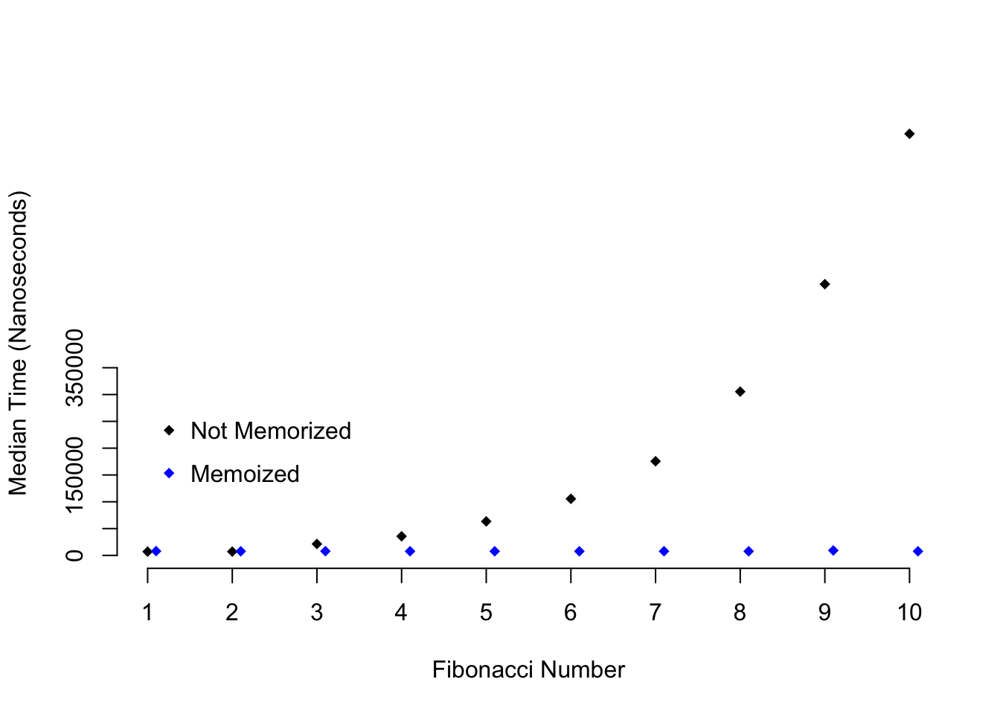
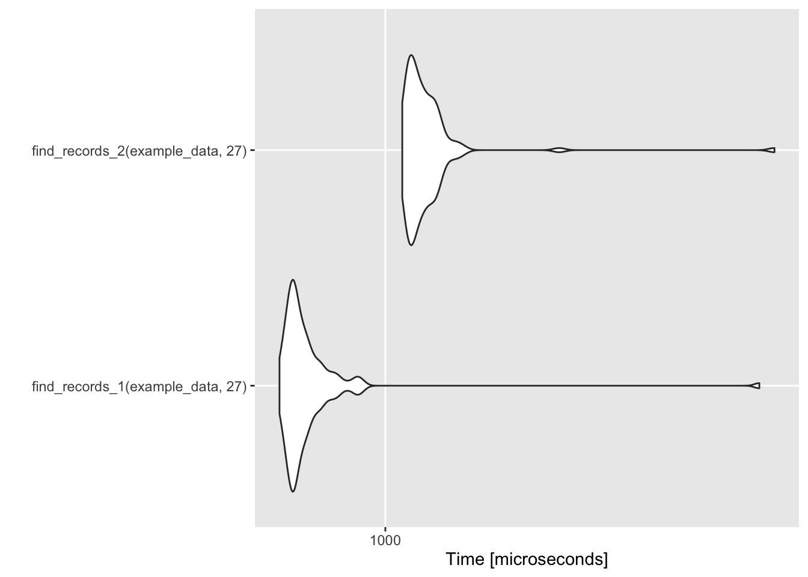
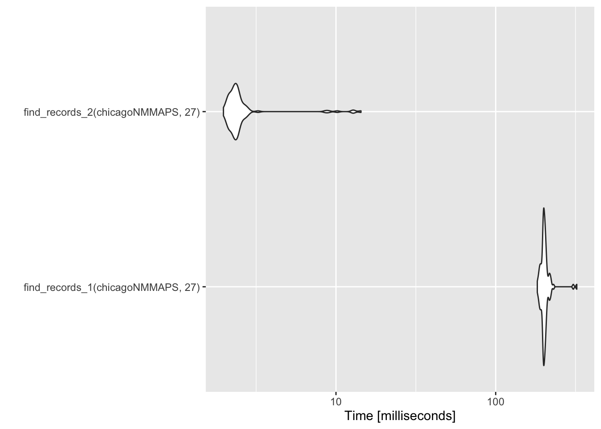

```{r setup}
rm(list = ls(all.names = TRUE))

suppressPackageStartupMessages(library('BBmisc'))
pkgs <- c('knitr', 'kableExtra', 'devtools', 'lubridate', 'data.table', 'tidyquant', 'stringr', 'magrittr', 'tidyverse', 'plyr', 'dplyr', 'broom', 'highcharter', 'formattable', 'DT', 'httr', 'openxlsx', 'microbenchmark')
suppressAll(lib(pkgs))

options(warn=-1)
rm(pkgs)
```

# Introduction

## About this Course

This course covers advanced topics in R programming that are necessary for developing powerful, robust, and reusable data science tools. Topics covered include functional programming in R, robust error handling, object oriented programming, profiling and benchmarking, debugging, and proper design of functions. Upon completing this course you will be able to identify and abstract common data analysis tasks and to encapsulate them in user-facing functions. Because every data science environment encounters unique data challenges, there is always a need to develop custom software specific to your organization’s mission. You will also be able to define new data types in R and to develop a universe of functionality specific to those data types to enable cleaner execution of data science tasks and stronger reusability within a team.

Kindly refer to manual [Mastering Software Development in R (web-base)](https://bookdown.org/rdpeng/RProgDA/). (or [Mastering Software Development in R.pdf](https://github.com/englianhu/Coursera-Mastering-Software-Development-in-R/blob/master/reference/Mastering%20Software%20Development%20in%20R.pdf))

## Syllabus

- Week 1 : Welcome to Advanced R Programming
    - Control Structures
    - Functions
    - swirl Assignment : 
        1. Swirl: R Basics - Automatic Submission
        2. Swirl: R Basics - Manual Submission

- Week 2 : Functional Programming
    - Functional Programming
    - Expressions & Environments
    - Error Handling and Generation
    - Assignment : 
        1. Swirl: Data Manipulation - Automatic Submission
        2. Swirl: Data Manipulation - Manual Submission

- Week 3 : Debugging and Profiling
    - Debugging
    - Profiling
    - Non-standard evaluation
    - Debugging, Profiling, and Non-standard Evaluation Quiz

- Week 4 : Object-Oriented Programming
    - OOP
    - Gaining Your 'tidyverse' Citizenship
    - Summative Assessment
        1. Peer-graded Assignment: Functional and Object-Oriented Programming
        2. Review Your Peer: Functional and Object-Oriented Programming

[Dynamic Documents for R using R Markdown](https://rpubs.com/moviedo/322222) introduce some useful functions and also packages for R users.

Kindly refer to [Mastering Software Development in R Specialization](https://www.coursera.org/specializations/r) to know the whole courses for the R specialization.

# The Swirl Course

## The Swirl Course Network

`swirl::install_course("Advanced R Programming")`

- http://swirlstats.com/scn/arp.html
- https://github.com/swirldev/Advanced_R_Programming

```{r, eval=FALSE}
# 1: Setting Up Swirl_auto <- '61EtV14Lf3oaU3Ak'
# 1: Setting Up Swirl_manual <- 'zlb3MugHovpBYzpz'
# 2: Functions_auto <- 'dkBZigRDrtiBjNfC'Kc8KxAV4iOCiR61i
# 2: Functions_manual <- 'Q6jqbFauTwXqlGPTj97m'
# 3: Functional Programming with purrr <- 'RPAuHcjlpXMhtxfgdSvj'
```

## Quiz

### Debugging and Profiling


Question 10

1. Debugging is the process of

    - writing code that is as fast as possible
    - writing code that uses memory efficiently
    - handling errors in a nonstandard manner
    - <span style='color:green'>**getting your expectations about code behavior to converge with reality**</span>

2. Which of the following functions initiates an interactive debugging environment that allows you to step through code one expression at a time?

    - `try()`
    - `tryCatch()`
    - `stop()`
    - <span style='color:green'>**`browser()`**</span>

3. Which of the following functions allows you to temporarily insert pieces of code into other functions to modify their behavior?

    - `browser()`
    - <span style='color:green'>**`trace()`**</span>
    - `debug()`
    - `recover()`

4. What does the `traceback()` function do?

    - pauses execution of a function
    - <span style='color:red'>evaluates an expression and returns on object of "try-error" if an error occurs</span>
    - returns the state of the function call stack just before an occurred
    - <span style='color:red'>sets the debugging flag for a function</span>

5. When should the `traceback()` function be called?

    - <span style='color:green'>**immediately after an error occurs**</span>
    - any time after an error occurs
    - only while debugging inside a function
    - immediately after a warning occurs.

6. What does calling `trace("f")` for function `"f()"` do?

    - It generates a log file containing debugging information.
    - <span style='color:green'>**Whenever `f()` is called, a message is printed to the console indicating that the function was called.**</span>
    - Whenever `f()` is called, it will enter the interactive debugger.
    - Whenever `f()` is called, the function call stack is written to a file.

7. What is the **microbenchmark** package useful for?

    - interactively debugging functions
    - <span style='color:green'>**comparing the speed of several functions that do the same thing**</span>
    - modifying code in other developers' packages
    - handling warnings and errors in non-standard ways

8. What does the `Rprof()` function do?

    - re-formats your code to adhere to standards
    - visualizes the time behavior of R code
    - <span style='color:green'>**writes out the function call stack at user-specified intervals of time**</span>
    - analyzes your code for potential bugs

9. What does the `profvis()` function do?

    - writes a log file of the function call stack
    - prints debugging information to the console
    - visualizes code that runs quickly (in less than 10 milliseconds)
    - <span style='color:green'>**displays profiling information in an interactive visualization in RStudio**</span>

10. Which function is better for analyzing fast-running functions: `profvis()` or `microbenchmark()`?

    - <span style='color:green'>**`profvis()`**</span>
    - `microbenchmark()`

# Lesson

## Functional Programming

### What is Functional Programming?

Functional programming is a programming philosophy based on [lambda calculus](https://en.wikipedia.org/wiki/Lambda_calculus). Lambda calculus was created by [Alonzo Church](https://en.wikipedia.org/wiki/Alonzo_Church), the PhD adviser to [Alan Turing](https://en.wikipedia.org/wiki/Alan_Turing) who is known for his role in cracking the encryption of the Nazi's Enigma machine during World War Two. Functional programming has been a popular approach ever since it helped bring down the Third Reich.

Functional programming concentrates on four constructs:

- Data (numbers, strings, etc)
- Variables (function arguments)
- Functions
- Function Applications (evaluating functions given arguments and/or data)

By now you're used to treating variables inside of functions as data, whether they're values like numbers and strings, or they’re data structures like lists and vectors. With functional programming you can also consider the possibility that you can provide a function as an argument to another function, and a function can return another function as its result.

If you've used functions like `sapply()` or `args()` then it’s easy to imagine how functions as arguments to other functions can be used. In the case of `sapply()` the provided function is applied to data, and in the case of `args()` information about the function is returned. What’s rarer to see is a function that returns a function when it's evaluated. Let’s look at a small example of how this can work:

```{r eval=FALSE}
adder_maker <- function(n){
  function(x){
    n + x
  }
}

add2 <- adder_maker(2)
add3 <- adder_maker(3)

add2(5)
[1] 7
add3(5)
[1] 8
```

In the example above the function `adder_maker()` returns a function with no name. The function returned adds n to its only argument x.

### Core Functional Programming Functions

There are groups of functions that are essential for functional programming. In most cases they take a function and a data structure as arguments, and that function is applied to that data structure in some way. The purrr library contains many of these functions and we’ll be using it throughout this section. Function programming is concerned mostly with lists and vectors. I may refer to just lists or vectors, but you should know that what applies for lists generally applies for vectors and vice-versa.

### Map

The map family of functions applies a function to the elements of a data structure, usually a list or a vector. The function is evaluated once for each element of the vector with the vector element as the first argument to the function. The return value is the same kind if data structure (a list or vector) but with every element replaced by the result of the function being evaluated with the corresponding element as the argument to the function. In the **purrr** package the `map()` function returns a list, while the `map_lgl()`, `map_chr()`, and `map_dbl()` functions return vectors of logical values, strings, or numbers respectively. Let’s take a look at a few examples:

```{r eval=FALSE}
library(purrr)

map_chr(c(5, 4, 3, 2, 1), function(x){
  c("one", "two", "three", "four", "five")[x]
})
[1] "five"  "four"  "three" "two"   "one"  

map_lgl(c(1, 2, 3, 4, 5), function(x){
  x > 3
})
[1] FALSE FALSE FALSE  TRUE  TRUE
```

Think about evaluating each function above with just one of the arguments in the specified numeric vector, and then combining all of those function results into one vector.

The `map_if()` function takes as its arguments a list or vector containing data, a predicate function, and then a function to be applied. A predicate function is a function that returns `TRUE` or `FALSE` for each element in the provided list or vector. In the case of `map_if()`: if the predicate functions evaluates to `TRUE`, then the function is applied to the corresponding vector element, however if the predicate function evaluates to `FALSE` then the function is not applied. The `map_if()` function always returns a list, so I’m piping the result of `map_if()` to `unlist()` so it look prettier:

```{r eval=FALSE}
map_if(1:5, function(x){
              x %% 2 == 0
            },
            function(y){
              y^2
            }) %>% unlist()
[1]  1  4  3 16  5
```

Notice how only the even numbers are squared, while the odd numbers are left alone.

The `map_at()` function only applies the provided function to elements of a vector specified by their indexes. `map_at()` always returns a list so like before I’m piping the result to `unlist()`:

```{r eval=FALSE}
map_at(seq(100, 500, 100), c(1, 3, 5), function(x){
  x - 10
}) %>% unlist()
[1]  90 200 290 400 490
```

Like we expected to happen the providied function is only applied to the first, third, and fifth element of the vector provided.

In each of the examples above we have only been mapping a function over one data structure, however you can map a function over two data structures with the `map2()` family of functions. The first two arguments should be two vectors of the same length, followed by a function which will be evaluated with an element of the first vector as the first argument and an element of the second vector as the second argument. For example:

```{r eval=FALSE}
map2_chr(letters, 1:26, paste)
 [1] "a 1"  "b 2"  "c 3"  "d 4"  "e 5"  "f 6"  "g 7"  "h 8"  "i 9"  "j 10"
[11] "k 11" "l 12" "m 13" "n 14" "o 15" "p 16" "q 17" "r 18" "s 19" "t 20"
[21] "u 21" "v 22" "w 23" "x 24" "y 25" "z 26"
```

The `pmap()` family of functions is similar to `map2()`, however instead of mapping across two vectors or lists, you can map across any number of lists. The list argument is a list of lists that the function will map over, followed by the function that will applied:

```{r eval=FALSE}
pmap_chr(list(
  list(1, 2, 3),
  list("one", "two", "three"),
  list("uno", "dos", "tres")
), paste)
[1] "1 one uno"    "2 two dos"    "3 three tres"
```

Mapping is a powerful technique for thinking about how to apply computational operations to your data.

### Reduce

List or vector reduction iteratively combines the first element of a vector with the second element of a vector, then that combined result is combined with the third element of the vector, and so on until the end of the vector is reached. The function to be applied should take at least two arguments. Where mapping returns a vector or a list, reducing should return a single value. Some examples using `reduce()` are illustrated below:

```{r eval=FALSE}
reduce(c(1, 3, 5, 7), function(x, y){
  message("x is ", x)
  message("y is ", y)
  message("")
  x + y
})
x is 1
y is 3

x is 4
y is 5

x is 9
y is 7

[1] 16
```

On the first iteration x has the value 1 and y has the value 3, then the two values are combined (they’re added together). On the second iteration x has the value of the result from the first iteration (4) and y has the value of the third element in the provided numeric vector (5). This process is repeated for each iteration. Here’s a similar example using string data:

```{r eval=FALSE}
reduce(letters[1:4], function(x, y){
  message("x is ", x)
  message("y is ", y)
  message("")
  paste0(x, y)
})
x is a
y is b

x is ab
y is c

x is abc
y is d

[1] "abcd"
```

By default `reduce()` starts with the first element of a vector and then the second element and so on. In contrast the `reduce_right()` function starts with the last element of a vector and then proceeds to the second to last element of a vector and so on:

```{r eval=FALSE}
reduce_right(letters[1:4], function(x, y){
  message("x is ", x)
  message("y is ", y)
  message("")
  paste0(x, y)
})
x is d
y is c

x is dc
y is b

x is dcb
y is a

[1] "dcba"
```

### Search

You can search for specific elements of a vector using `thecontains()` and `detect()` functions. `contains()` will returnTRUE if a specified element is present in a vector, otherwise it returnsFALSE:

```{r eval=FALSE}
contains(letters, "a")
[1] TRUE
contains(letters, "A")
[1] FALSE
```

The `detect()` function takes a vector and a predicate function as arguments and it returns the first element of the vector for which the predicate function returns TRUE:

```{r eval=FALSE}
detect(20:40, function(x){
  x > 22 && x %% 2 == 0
})
[1] 24
```

The `detect_index()` function takes the same arguments, however it returns the index of the provided vector which contains the first element that satisfies the predicate function:

```{r eval=FALSE}
detect_index(20:40, function(x){
  x > 22 && x %% 2 == 0
})
[1] 5
```

### Filter

The group of functions that includes `keep()`, `discard()`, `every()`, and `some()` are known as filter functions. Each of these functions takes a vector and a predicate function. For `keep()` only the elements of the vector that satisfy the predicate function are returned while all other elements are removed:

```{r eval=FALSE}
keep(1:20, function(x){
  x %% 2 == 0
})
 [1]  2  4  6  8 10 12 14 16 18 20
```

The `discard()` function works similarly, it only returns elements that don't satisfy the predicate function:

```{r eval=FALSE}
discard(1:20, function(x){
  x %% 2 == 0
})
 [1]  1  3  5  7  9 11 13 15 17 19
```

The `every()` function returns `TRUE` only if every element in the vector satisfies the predicate function, while the `some()` function returns `TRUE` if at least one element in the vector satisfies the predicate function:

```{r eval=FALSE}
every(1:20, function(x){
  x %% 2 == 0
})
 [1] FALSE

some(1:20, function(x){
  x %% 2 == 0
})
 [1] TRUE
```

### Compose

Finally, the `compose()` function combines any number of functions into one function:

```{r eval=FALSE}
n_unique <- compose(length, unique)
# The composition above is the same as:
# n_unique <- function(x){
#   length(unique(x))
# }

rep(1:5, 1:5)
 [1] 1 2 2 3 3 3 4 4 4 4 5 5 5 5 5

n_unique(rep(1:5, 1:5))
 [1] 5
```

### Partial Application

Partial application of functions can allow functions to behave a little like data structures. Using the `partial()` function from the **purrr** package you can specify some of the arguments of a function, and then `partial()` will return a function that only takes the unspecified arguments. Let’s take a look at a simple example:

```{r eval=FALSE}
library(purrr)

mult_three_n <- function(x, y, z){
  x * y * z
}

mult_by_15 <- partial(mult_three_n, x = 3, y = 5)

mult_by_15(z = 4)
[1] 60
```

By using partial application you can bind some data to the arguments of a function before using that function elsewhere.

### Side Effects

Side effects of functions occur whenever a function interacts with the “outside world” – reading or writing data, printing to the console, and displaying a graph are all side effects. The results of side effects are one of the main motivations for writing code in the first place! Side effects can be tricky to handle though, since the order in which functions with side effects are executed often matters and there are variables that are external to the program (the relative location of some data). If you want to evaluate a function across a data structure you should use the `walk()` function from purrr. Here's a simple example:

```{r eval=FALSE}
library(purrr)

walk(c("Friends, Romans, countrymen,",
       "lend me your ears;",
       "I come to bury Caesar,", 
       "not to praise him."), message)
Friends, Romans, countrymen,
lend me your ears;
I come to bury Caesar,
not to praise him.
```

### Recursion

Recursion is very powerful tool, both mentally and in software development, for solving problems. Recursive functions have two main parts: a few easy to solve problems called “base cases,” and then a case for more complicated problems where the function is called inside of itself. The central philosophy of recursive programming is that problems can be broken down into simpler parts, and then combining those simple answers results in the answer to a complex problem.

Imagine you wanted to write a function that adds together all of the numbers in a vector. You could of course accomplish this with a loop:

```{r eval=FALSE}
vector_sum_loop <- function(v){
  result <- 0
  for(i in v){
    result <- result + i
  }
  result
}

vector_sum_loop(c(5, 40, 91))
[1] 136
```

You could also think about how to solve this problem recursively. First ask yourself: what’s the base case of finding the sum of a vector? If the vector only contains one element, then the sum is just the value of that element. In the more complex case the vector has more than one element. We can remove the first element of the vector, but then what should we do with the rest of the vector? Thankfully we have a function for computing the sum of all of the elements of a vector because we’re writing that function right now! So we’ll add the value of the first element of the vector to whatever the cumulative sum is of the rest of the vector. The resulting function is illustrated below:

```{r eval=FALSE}
vector_sum_rec <- function(v){
  if(length(v) == 1){
    v
  } else {
    v[1] + vector_sum_rec(v[-1])
  }
}

vector_sum_rec(c(5, 40, 91))
[1] 136
```

Another useful exercise for thinking about applications for recursion is computing the Fibonacci sequence. The Fibonacci sequence is a sequence of integers that starts: 0, 1, 1, 2, 3, 5, 8 where each proceeding integer is the sum of the previous two integers. This fits into a recursive mental framework very nicely since each subsequent number depends on the previous two numbers.

Let's write a function to compute the nth digit of the Fibonacci sequence such that the first number in the sequence is 0, the second number is 1, and then all proceeding numbers are the sum of the `n - 1` and the `n - 2` Fibonacci number. It is immediately evident that there are three base cases:

1. n must be greater than 0.
2. When n is equal to 1, return 0.
3. When n is equal to 2, return 1.

And then the recursive case:

- Otherwise return the sum of the `n - 1` Fibonacci number and the `n - 2` Fibonacci number.

Let’s turn those words into code:

```{r eval=FALSE}
fib <- function(n){
  stopifnot(n > 0)
  if(n == 1){
    0
  } else if(n == 2){
    1
  } else {
    fib(n - 1) + fib(n - 2)
  }
}

fib(1)
[1] 0
fib(2)
[1] 1
fib(3)
[1] 1
fib(4)
[1] 2
fib(5)
[1] 3
fib(6)
[1] 5
fib(7)
[1] 8

map_dbl(1:12, fib)
 [1]  0  1  1  2  3  5  8 13 21 34 55 89
```

Looks like it's working well! There is one optimization that we could apply here which comes up in recursive programming often. When you execute the function `fib(6)`, within that function you’ll execute `fib(5)` and `fib(4)`. Then within the execution of `fib(5)`, `fib(4)` will be executed again. An illustration of this phenomenon is below:


This duplication of computation slows down your program significantly as you calculate larger numbers in the Fibonacci sequence. Thankfully you can use a technique called memoization in order to speed this computation up. Memoization stores the value of each calculated Fibonacci number in table so that once a number is calculated you can look it up instead of needing to recalculate it!

Below is an example of a function that can calculate the first 25 Fibonacci numbers. First we’ll create a very simple table which is just a vector containing 0, 1, and then 23 NAs. First the `fib_mem()` function will check if the number is in the table, and if it is then it is returned. Otherwise the Fibonacci number is recursively calculated and stored in the table. Notice that we’re using the complex assignment operator `<<-` in order to modify the table outside the scope of the function. You’ll learn more about the complex operator in the section titled Expressions & Environments.

```{r eval=FALSE}
fib_tbl <- c(0, 1, rep(NA, 23))

fib_mem <- function(n){
  stopifnot(n > 0)
  
  if(!is.na(fib_tbl[n])){
    fib_tbl[n]
  } else {
    fib_tbl[n - 1] <<- fib_mem(n - 1)
    fib_tbl[n - 2] <<- fib_mem(n - 2)
    fib_tbl[n - 1] + fib_tbl[n - 2]
  }
}

map_dbl(1:12, fib_mem)
 [1]  0  1  1  2  3  5  8 13 21 34 55 89
```

It works! But is it any faster than the original `fib()`? Below I’m going to use the **microbenchmark** package in order assess whether `fib()` or `fib_mem()` is faster:

```{r eval=FALSE}
library(purrr)
library(microbenchmark)
library(tidyr)
library(magrittr)
library(dplyr)

fib_data <- map(1:10, function(x){microbenchmark(fib(x), times = 100)$time})
names(fib_data) <- paste0(letters[1:10], 1:10)
fib_data <- as.data.frame(fib_data)

fib_data %<>%
  gather(num, time) %>%
  group_by(num) %>%
  summarise(med_time = median(time))

memo_data <- map(1:10, function(x){microbenchmark(fib_mem(x))$time})
names(memo_data) <- paste0(letters[1:10], 1:10)
memo_data <- as.data.frame(memo_data)

memo_data %<>%
  gather(num, time) %>%
  group_by(num) %>%
  summarise(med_time = median(time))

plot(1:10, fib_data$med_time, xlab = "Fibonacci Number", ylab = "Median Time (Nanoseconds)", pch = 18, bty = "n", xaxt = "n", yaxt = "n")
axis(1, at = 1:10)
axis(2, at = seq(0, 350000, by = 50000))
points(1:10 + .1, memo_data$med_time, col = "blue", pch = 18)
legend(1, 300000, c("Not Memorized", "Memoized"), pch = 18, 
       col = c("black", "blue"), bty = "n", cex = 1, y.intersp = 1.5)
```



As you can see as higher Fibonacci numbers are calculated the time it takes to calculate a number with `fib()` grows exponentially, while the time it takes to do the same task with `fib_mem()` stays constant.

### Summary

- Functional programming is based on lambda calculus.
- This approach concentrates on data, variables, functions, and function applications.
- It's possible for functions to be able to return other functions.
- The core functional programming concepts can be summarized in the following categories: map, reduce, search, filter, and compose.
- Partial application of functions allows functions to be used like data structures.
- Side effects are difficult to debug although they motivate a huge fraction of computer programming.
- The most important part of understanding recursion is understanding recursion.

## Expressions and Environments

### Expressions

Expressions are encapsulated operations that can be executed by R. This may sound complicated, but using expressions allows you manipulate code with code! You can create an expression using the `quote()` function. For that function’s argument, just type whatever you would normally type into the R console. For example:

```{r eval=FALSE}
two_plus_two <- quote(2 + 2)
two_plus_two
2 + 2
```

You can execute this expressions using the `eval()` function:

```{r eval=FALSE}
eval(two_plus_two)
[1] 4
```

You might encounter R code that is stored as a string that you want to evaluate with `eval()`. You can use `parse()` to transform a string into an expression:

```{r eval=FALSE}
tpt_string <- "2 + 2"

tpt_expression <- parse(text = tpt_string)

eval(tpt_expression)
[1] 4
```

You can reverse this process and transform an expression into a string using `deparse()`:

```{r eval=FALSE}
deparse(two_plus_two)
[1] "2 + 2"
```

One interesting feature about expressions is that you can access and modify their contents like you a `list()`. This means that you can change the values in an expression, or even the function being executed in the expression before it is evaluated:

```{r eval=FALSE}
sum_expr <- quote(sum(1, 5))
eval(sum_expr)
[1] 6
sum_expr[[1]]
sum
sum_expr[[2]]
[1] 1
sum_expr[[3]]
[1] 5
sum_expr[[1]] <- quote(paste0)
sum_expr[[2]] <- quote(4)
sum_expr[[3]] <- quote(6)
eval(sum_expr)
[1] "46"
```

You can compose expressions using the `call()` function. The first argument is a string containing the name of a function, followed by the arguments that will be provided to that function.

```{r eval=FALSE}
sum_40_50_expr <- call("sum", 40, 50)
sum_40_50_expr
sum(40, 50)
eval(sum_40_50_expr)
[1] 90
```

You can capture the the expression an R user typed into the R console when they executed a function by including `match.call()` in the function the user executed:

```{r eval=FALSE}
return_expression <- function(...){
  match.call()
}

return_expression(2, col = "blue", FALSE)
return_expression(2, col = "blue", FALSE)
```

You could of course then manipulate this expression inside of the function you’re writing. The example below first uses `match.call()` to capture the expression that the user entered. The first argument of the function is then extracted and evaluated. If the first expressions is a number, then a string is returned describing the first argument, otherwise the string "The first argument is not numeric." is returned.

```{r eval=FALSE}
first_arg <- function(...){
  expr <- match.call()
  first_arg_expr <- expr[[2]]
  first_arg <- eval(first_arg_expr)
  if(is.numeric(first_arg)){
    paste("The first argument is", first_arg)
  } else {
    "The first argument is not numeric."
  }
}

first_arg(2, 4, "seven", FALSE)
[1] "The first argument is 2"

first_arg("two", 4, "seven", FALSE)
[1] "The first argument is not numeric."
```

Expressions are a powerful tool for writing R programs that can manipulate other R programs.

### Environments

Environments are data structures in R that have special properties with regard to their role in how R code is executed and how memory in R is organized. You may not realize it but you’re probably already familiar with one environment called the global environment. Environments formalize relationships between variable names and values. When you enter x <- 55 into the R console what you’re saying is: assign the value of 55 to a variable called x, and store this assignment in the global environment. The global environment is therefore where most R users do most of their programming and analysis.

You can create a new environment using `new.env()`. You can assign variables in that environment in a similar way to assigning a named element of a list, or you can use `assign()`. You can retrieve the value of a variable just like you would retrieve the named element of a list, or you can use `get()`. Notice that `assign()` and `get()` are opposites:

```{r eval=FALSE}
my_new_env <- new.env()
my_new_env$x <- 4
my_new_env$x
[1] 4

assign("y", 9, envir = my_new_env)
get("y", envir = my_new_env)
[1] 9
my_new_env$y
[1] 9
```

You can get all of the variable names that have been assigned in an environment using `ls()`, you can remove an association between a variable name and a value using `rm()`, and you can check if a variable name has been assigned in an environment using `exists()`:

```{r eval=FALSE}
ls(my_new_env)
[1] "x" "y"
rm(y, envir = my_new_env)
exists("y", envir = my_new_env)
[1] TRUE
exists("x", envir = my_new_env)
[1] TRUE
my_new_env$x
[1] 4
my_new_env$y
NULL
```

Environments are organized in parent/child relationships such that every environment keeps track of its parent, but parents are unaware of which environments are their children. Usually the relationships between environments is not something you should try to directly control. You can see the parents of the global environment using the `search()` function:

```{r eval=FALSE}
search()
 [1] ".GlobalEnv"             "package:magrittr"      
 [3] "package:tidyr"          "package:microbenchmark"
 [5] "package:purrr"          "package:dplyr"         
 [7] "package:readr"          "package:stats"         
 [9] "package:graphics"       "package:grDevices"     
[11] "package:utils"          "package:datasets"      
[13] "Autoloads"              "package:base"
```

As you can see package:**magrittr** is the parent of `.GlobalEnv`, and package:**tidyr** is parent of package:magrittr, and so on. In general the parent of `.GlobalEnv` is always the last package that was loaded using `library()`. Notice that after I load the **ggplot2** package, that package becomes the parent of `.GlobalEnv`:

```{r eval=FALSE}
library(ggplot2)
search()
 [1] ".GlobalEnv"             "package:ggplot2"       
 [3] "package:magrittr"       "package:tidyr"         
 [5] "package:microbenchmark" "package:purrr"         
 [7] "package:dplyr"          "package:readr"         
 [9] "package:stats"          "package:graphics"      
[11] "package:grDevices"      "package:utils"         
[13] "package:datasets"       "Autoloads"             
[15] "package:base"
```

### Execution Environments

Although there may be several cases where you need to create a new environment using `new.env()`, you will more often create new environments whenever you execute functions. An execution environment is an environment that exists temporarily within the scope of a function that is being executed. For example if we have the following code:

```{r eval=FALSE}
x <- 10

my_func <- function(){
  x <- 5
  return(x)
}

my_func()
```

What do you think will be the result of `my_func()`? Make your guess and then take a look at the executed code below:

```{r eval=FALSE}
x <- 10

my_func <- function(){
  x <- 5
  return(x)
}

my_func()
[1] 5
```

So what exactly is happening above? First the name x is being assigned the value 10 in the global environment. Then the `namemy_func` is being assigned the value of the function `function(){x <- 5};return(x)}` in the global environment. When `my_func()` is executed, a new environment is created called the execution environment which only exists while `my_func()` is running. Inside of the execution environment the name `x` is assigned the value 5. When `return()` is executed it looks first in the execution environment for a value that is assigned to x. Then the value 5 is returned. In contrast to the situation above, take a look at this variation:

```{r eval=FALSE}
x <- 10

another_func <- function(){
  return(x)
}

another_func()
[1] 10
```

In this situation the execution environment inside of `another_func()` does not contain an assignment for the name x, so R looks for an assignment in the parent environment of the execution environment which is the global environment. Since x is assigned the value 10 in the global environment 10 is returned.

After seeing the cases above you may be curious if it’s possible for an execution environment to manipulate the global environment. You’re already familiar with the assignment operator `<-`, however you should also be aware that there’s another assignment operator called the complex assignment operator which looks like `<<-`. You can use the complex assignment operator to re-assign or even create name-value bindings in the global environment from within an execution environment. In this first example, the function `assign1()` will change the value associated with the name x:

```{r eval=FALSE}
x <- 10
x
[1] 10

assign1 <- function(){
  x <<- "Wow!"
}

assign1()
x
[1] "Wow!"
```

You can see that the value associated with x has been changed from 10 to "Wow!" in the global environment. You can also use `<<-` to assign names to values that have not been yet been defined in the global environment from inside a function:

```{r eval=FALSE}
a_variable_name
Error in eval(expr, envir, enclos): object 'a_variable_name' not found
exists("a_variable_name")
[1] FALSE

assign2 <- function(){
  a_variable_name <<- "Magic!"
}

assign2()
exists("a_variable_name")
[1] TRUE
a_variable_name
[1] "Magic!"
```

If you want to see a case for using `<<-` in action, see the section of this book about functional programming and the discussion there about memoization.

## Error Handling and Generation

### What is an Error

Errors most often occur when code is used in a way that it is not intended to be used. For example adding two strings together produces the following error:

```{r eval=FALSE}
"hello" + "world"
Error in "hello" + "world": non-numeric argument to binary operator
```

The `+` operator is essentially a function that takes two numbers as arguments and finds their sum. Since neither "hello" nor "world" are numbers, the R interpreter produces an error. Errors will stop the execution of your program, and they will (hopefully) print an error message to the R console.

In R there are two other constructs in R which are both related to errors: warnings and messages. Warnings are meant to indicate that something seems to have gone wrong in your program which should be inspected. Here's a simple example of a warning being generated:

```{r eval=FALSE}
as.numeric(c("5", "6", "seven"))
Warning: NAs introduced by coercion
[1]  5  6 NA
```

The `as.numeric()` function attempts to convert each string in `c("5", "6", "seven")` into a number, however it is impossible to convert `"seven"`, so a warning is generated. Execution of the code is not halted, and an `NA` is produced in place of `"seven"` instead of a number.

Messages simply print test to the R console, though they are generated by an underlying mechanism that is similar to how errors and warning are generated. Here's a small function that will generate a message:

```{r eval=FALSE}
f <- function(){
  message("This is a message.")
}

f()
This is a message.
```

### Generating Errors

There are a few essential functions for generating errors, warnings, and messages in R. The `stop()` function will generate an error. Let's generate an error:

```{r eval=FALSE}
stop("Something erroneous has occured!")
Error: Something erroneous has occured!
```

If an error occurs inside of a function then the name of that function will appear in the error message:

```{r eval=FALSE}
name_of_function <- function(){
  stop("Something bad happened.")
}

name_of_function()
Error in name_of_function(): Something bad happened.
```

The `stopifnot()` function takes a series of logical expressions as arguments and if any of them are false an error is generated specifying which expression is false. Let's take a look at an example:

```{r eval=FALSE}
error_if_n_is_greater_than_zero <- function(n){
  stopifnot(n <= 0)
  n
}

error_if_n_is_greater_than_zero(5)
Error: n <= 0 is not TRUE
```

The `warning()` function creates a warning, and the function itself is very similar to the stop() function. Remember that a warning does not stop the execution of a program (unlike an error.)

```{r eval=FALSE}
warning("Consider yourself warned!")
Warning: Consider yourself warned!
```

Just like errors, a warning generated inside of a function will include the name of the function it was generated in:

```{r eval=FALSE}
make_NA <- function(x){
  warning("Generating an NA.")
  NA
}

make_NA("Sodium")
Warning in make_NA("Sodium"): Generating an NA.
[1] NA
```

Messages are simpler than errors or warnings, they just print strings to the R console. You can issue a message with the `message()` function:

```{r eval=FALSE}
message("In a bottle.")
In a bottle.
```

### When to Generate Errors or Warnings

Stopping the execution of your program with `stop()` should only happen in the event of a catastrophe - meaning only if it is impossible for your program to continue. If there are conditions that you can anticipate that would cause your program to create an error then you should document those conditions so whoever uses your software is aware. Common failure conditions like providing invalid arguments to a function should be checked at the beginning of your program so that the user can quickly realize something has gone wrong. This is case of checking function inputs is a typical use of the `stopifnot()` function.

You can think of a function as kind of contract between you and the user: if the user provides specified arguments your program will provide predictable results. Of course it's impossible for you to anticipate all of the potential uses of your program, so the results of executing a function can only be predictable with regard to the type of the result. It's appropriate to create a warning when this contract between you and the user is violated. A perfect example of this situation is the result of `as.numeric(c("5", "6", "seven"))` which we saw before. The user expects a vector of numbers to be returned as the result of `as.numeric()` but "seven" is coerced into being NA, which is not completely intuitive.

R has largely been developed according to the Unix Philosophy (which is further discussed in Chapter 3) which generally discourages printing text to the console unless something unexpected has occurred. Languages than commonly run on Unix systems like C, C++, and Go are rarely used interactively, meaning that they usually underpin computer infrastructure (computers "talking" to other computers). Messages printed to the console are therefore not very useful since nobody will ever read them and it's not straightforward for other programs to capture and interpret them. In contrast R code is frequently executed by human beings in the R console which serves as an interactive environment between the computer and person at the keyboard. If you think your program should produce a message, make sure that the output of the message is primarily meant for a human to read. You should avoid signaling a condition or the result of your program to another program by creating a message.

### How should Errors be Handled

Imagine writing a program that will take a long time to complete because of a complex calculation or because you're handling a large amount of data. If an error occurs during this computation then you're liable to lose all of the results that were calculated before the error, or your program may not finish a critical task that a program further down your pipeline is depending on. If you anticipate the possibility of errors occuring during the execution of your program then you can design your program to handle them appropriately.

The `tryCatch()` function is the workhorse of handling errors and warnings in R. The first argument of this function is any R expression, followed by conditions which specify how to handle an error or a warning. The last argument finallyspecifies a function or expression that will be executed after the expression no matter what, even in the event of an error or a warning.

Let's construct a simple function I'm going to call beera that catches errors and warnings gracefully.

```{r eval=FALSE}
beera <- function(expr){
  tryCatch(expr,
         error = function(e){
           message("An error occurred:\n", e)
         },
         warning = function(w){
           message("A warning occured:\n", w)
         },
         finally = {
           message("Finally done!")
         })
}
```

This function takes an expression as an argument and tries to evaluate it. If the expression can be evaluated without any errors or warnings then the result of the expression is returned and the message Finally done! is printed to the R console. If an error or warning is generated then the functions that are provided to the error or warning arguments are printed. Let's try this function out with a few examples.

```{r eval=FALSE}
beera({
  2 + 2
})
Finally done!
[1] 4

beera({
  "two" + 2
})
An error occurred:
Error in "two" + 2: non-numeric argument to binary operator

Finally done!

beera({
  as.numeric(c(1, "two", 3))
})
A warning occured:
simpleWarning in doTryCatch(return(expr), name, parentenv, handler): NAs introduced by coercion

Finally done!
```

Notice that we've effectively transformed errors and warnings into messages.

Now that you know the basics of generating and catching errors you'll need to decide when your program should generate an error. My advice to you is to limit the number of errors your program generates as much as possible. Even if you design your program so that it's able to catch and handle errors, the error handling process slows down your program by orders of magnitude. Imagine you wanted to write a simple function that checks if an argument is an even number. You might write the following:

```{r eval=FALSE}
is_even <- function(n){
  n %% 2 == 0
}

is_even(768)
[1] TRUE

is_even("two")
Error in n%%2: non-numeric argument to binary operator
```

You can see that providing a string causes this function to raise an error. You could imagine though that you want to use this function across a list of different data types, and you only want to know which elements of that list are even numbers. You might think to write the following:

```{r eval=FALSE}
is_even_error <- function(n){
  tryCatch(n %% 2 == 0,
           error = function(e){
             FALSE
           })
}

is_even_error(714)
[1] TRUE

is_even_error("eight")
[1] FALSE
```

This appears to be working the way you intended, however when applied to more data this function will be seriously slow compared to alternatives. For example I could do a check that n is numeric before treating n like a number:

```{r eval=FALSE}
is_even_check <- function(n){
  is.numeric(n) && n %% 2 == 0
}

is_even_check(1876)
[1] TRUE

is_even_check("twelve")
[1] FALSE
```

Notice that by using `is.numeric()` before the "AND" operator (`&&`) the expression `n %% 2 == 0` is never evaluated. This is a programming language design feature called "short circuiting." The expression can never evaluate to `TRUE` if the left hand side of `&&` evaluates to `FALSE`, so the right hand side is ignored.

To demonstrate the difference in the speed of the code we'll use the microbenchmark package to measure how long it takes for each function to be applied to the same data.

```{r eval=FALSE}
library(microbenchmark)
microbenchmark(sapply(letters, is_even_check))
Unit: microseconds
                     expr    min      lq     mean  median      uq     max neval
 sapply(letters, is_even_check) 46.224 47.7975 61.43616 48.6445 58.4755 167.091   100
```

```{r eval=FALSE}
microbenchmark(sapply(letters, is_even_error))
Unit: microseconds
                expr     min       lq     mean   median       uq      max neval
 sapply(letters, is_even_error) 640.067 678.0285 906.3037 784.4315 1044.501 2308.931   100
```

The error catching approach is nearly 15 times slower!

Proper error handling is an essential tool for any software developer so that you can design programs that are error tolerant. Creating clear and informative error messages is essential for building quality software. One closing tip I recommend is to put documentation for your software online, including the meaning of the errors that your software can potentially throw. Often a user's first instinct when encountering an error is to search online for that error message, which should lead them to your documentation!

### Summary

- Expressions are a powerful tool for manipulating and executing R code.
- Environments record associations between names and values.
- Execution environments create a scope for variable names inside of functions.

## Debugging

### Debugging Overview

Debugging is the process of getting your expectations to converge with reality. When writing software in any language, we develop a certain set of expectations about how the software should behave and what it should do. But inevitably, when we run the software, it does something different from what we expected. In these situations, we need to engage in a process to determine if

1. Our expectations were incorrect, based on the documented behavior of the software; or
2. There is a problem with the code, such that the programming is not done in a way that will match expectations.

This is the process of debugging.

In the previous section, we discussed what to do when software generates conditions (errors, warnings, messages) in a manner that is completely expected. In those cases, we know that certain functions will generate errors and we want to handle them in a manner that is not the usual way.

This section describes the tools for debugging your software in R. R comes with a set of built-in tools for interactive debugging that can be useful for tracking down the source of problems. These functions are

- `browser()`: an interactive debugging environment that allows you to step through code one expression at a time
- `debug()` / `debugonce()`: a function that initiates the browser within a function
- `trace()`: this function allows you to temporarily insert pieces of code into other functions to modify their behavior
- `recover()`: a function for navigating the function call stack after a function has thrown an error
- `traceback()`: prints out the function call stack after an error occurs; does nothing if there’s no error

### Traceback

If an error occurs, the easiest thing to do is to immediately call the `traceback()` function. This function returns the function call stack just before the error occurred so that you can see what level of function calls the error occurred. If you have many functions calling each other in succeeding, the `traceback()` output can be useful for identifying where to go digging first.

For example, the following code gives an error.

```{r eval=FALSE}
check_n_value <- function(n) {
        if(n > 0) {
                stop("n should be <= 0")
        }
}
error_if_n_is_greater_than_zero <- function(n){
        check_n_value(n)
        n
}
error_if_n_is_greater_than_zero(5)
Error in check_n_value(n): n should be <= 0
```

Running the `traceback()` function immediately after getting this error would give us

```{r eval=FALSE}
traceback()
3: stop("n should be <= 0") at #2
2: check_n_value(n) at #2
1: error_if_n_is_greater_than_zero(5)
```

From the traceback, we can see that the error occurred in the `check_n_value()` function. Put another way, the `stop()` function was called from within the `check_n_value()` function.

### Browsing a Function Environment

From the traceback output, it is often possible to determine in which function and on which line of code an error occurs. If you are the author of the code in question, one easy thing to do is to insert a call to the `browser()` function in the vicinity of the error (ideally, before the error occurs). The `browser()` function takes now arguments and is just placed wherever you want in the function. Once it is called, you will be in the browser environment, which is much like the regular R workspace environment except that you are inside a function.

```{r eval=FALSE}
check_n_value <- function(n) {
        if(n > 0) {
                browser()  ## Error occurs around here
                stop("n should be <= 0")
        }
}
```

Now, when we call error_if_n_is_greater_than_zero(5), we will see the following.

```{r eval=FALSE}
error_if_n_is_greater_than_zero(5)
Called from: check_n_value(n)
Browse[1]> 
```

### Tracing Functions

If you have easy access to the source code of a function (and can modify the code), then it’s usually easiest to insert `browser()` calls directly into the code as you track down various bugs. However, if you do not have easy access to a function’s code, or perhaps a function is inside a package that would require rebuilding after each edit, it is sometimes easier to make use of the `trace()` function to make temporary code modifications.

The simplest use of `trace()` is to just call `trace()` on a function without any other arguments.

```{r eval=FALSE}
trace("check_n_value")
```

Now, whenever `check_n_value()` is called by any other functions, you will see a message printed to the console indicating that the function was called.

```{r eval=FALSE}
error_if_n_is_greater_than_zero(5)
trace: check_n_value(n)
Error in check_n_value(n): n should be <= 0
```

Here we can see that `check_n_value()` was called once before the error occurred. But we can do more with `trace()`, such as inserting a call to `browser()` in a specific place, such as right before the call to `stop()`.

We can obtain the expression numbers of each part of a function by calling `as.list()` on the `body()` of a function.

```{r eval=FALSE}
as.list(body(check_n_value))
[[1]]
`{`

[[2]]
if (n > 0) {
    stop("n should be <= 0")
}
```

Here, the if statement is the second expression in the function (the first “expression” being the very beginning of the function). We can further break down the second expression as follows.

```{r eval=FALSE}
as.list(body(check_n_value)[[2]])
[[1]]
`if`

[[2]]
n > 0

[[3]]
{
    stop("n should be <= 0")
}
```

Now we can see the call to `stop()` is the third sub-expression within the second expression of the overall function. We can specify this to `trace()` by passing an integer vector wrapped in a list to the at argument.

```{r eval=FALSE}
trace("check_n_value", browser, at = list(c(2, 3)))
[1] "check_n_value"
```

The `trace()` function has a side effect of modifying the function and converting into a new object of class “functionWithTrace”.

```{r eval=FALSE}
check_n_value
Object with tracing code, class "functionWithTrace"
Original definition: 
function(n) {
        if(n > 0) {
                stop("n should be <= 0")
        }
}

## (to see the tracing code, look at body(object))
```

You can see the internally modified code by calling

```{r eval=FALSE}
body(check_n_value)
{
    if (n > 0) {
        .doTrace(browser(), "step 2,3")
        {
            stop("n should be <= 0")
        }
    }
}
```

Here we can see that the code has been altered to add a call to `browser()` just before the call to `stop()`.

We can add more complex expressions to a function by wrapping them in a call to `quote()` within the the `trace()` function. For example, we may only want to invoke certain behaviors depending on the local conditions of the function.

```{r eval=FALSE}
trace("check_n_value", quote({
        if(n == 5) {
                message("invoking the browser")
                browser()
        }
}), at = 2)
[1] "check_n_value"
```

Here, we only invoke the `browser()` if n is specifically 5.

```{r eval=FALSE}
body(check_n_value)
{
    {
        .doTrace({
            if (n == 5) {
                message("invoking the browser")
                browser()
            }
        }, "step 2")
        if (n > 0) {
            stop("n should be <= 0")
        }
    }
}
```

Debugging functions within a package is another key use case for `trace()`. For example, if we wanted to insert tracing code into the `glm()` function within the stats package, the only addition to the `trace()` call we would need is to provide the namespace information via the where argument.

```{r eval=FALSE}
trace("glm", browser, at = 4, where = asNamespace("stats"))
Tracing function "glm" in package "namespace:stats"
[1] "glm"
```

Here we show the first few expressions of the modified `glm()` function.

```{r eval=FALSE}
body(stats::glm)[1:5]
{
    call <- match.call()
    if (is.character(family)) 
        family <- get(family, mode = "function", envir = parent.frame())
    {
        .doTrace(browser(), "step 4")
        if (is.function(family)) 
            family <- family()
    }
    if (is.null(family$family)) {
        print(family)
        stop("'family' not recognized")
    }
}
```

### Using Debug and Debugonce

The `debug()` and `debugonce()` functions can be called on other functions to turn on the “debugging state” of a function. Calling `debug()` on a function makes it such that when that function is called, you immediately enter a browser and can step through the code one expression at a time.

```{r eval=FALSE}
## Turn on debugging state for 'lm' function
debug(lm)
```

A call to `debug(f)` where f is a function is basically equivalent totrace(f, browser) which will call the `browser()` function upon entering the function.

The debugging state is persistent, so once a function is flagged for debugging, it will remain flagged. Because it is easy to forget about the debugging state of a function, the `debugonce()` function turns on the debugging state the next time the function is called, but then turns it off after the browser is exited.

### Recover

The `recover()` function is not often used but can be an essential tool when debugging complex code. Typically, you do not call `recover()` directly, but rather set it as the function to invoke anytime an error occurs in code. This can be done via the `options()` function.

```{r eval=FALSE}
options(error = recover)
```

Usually, when an error occurs in code, the code stops execution and you are brought back to the usual R console prompt. However, when `recover()` is in use and an error occurs, you are given the function call stack and a menu.

```{r eval=FALSE}
error_if_n_is_greater_than_zero(5)
Error in check_n_value(n) : n should be <= 0

Enter a frame number, or 0 to exit   

1: error_if_n_is_greater_than_zero(5)
2: #2: check_n_value(n)

Selection:
```

Selecting a number from this menu will bring you into that function on the call stack and you will be placed in a browser environment. You can exit the browser and then return to this menu to jump to another function in the call stack.

The `recover()` function is very useful if an error is deep inside a nested series of function calls and it is difficult to pinpoint exactly where an error is occurring (so that you might use `browser()` or `trace()`). In such cases, the `debug()` function is often of little practical use because you may need to step through many many expressions before the error actually occurs. Another scenario is when there is a stochastic element to your code so that errors occur in an unpredictable way. Using `recover()` will allow you to browse the function environment only when the error eventually does occur.

### Final Thoughts on Debugging

The debugging tools in any programming language can be essential for tracking down problems in code, especially when the code becomes complex and spans many lines. However, one should not lean on them too heavily so that they become a regular part of the programming process. It is easy to get into a situation where you “throw some code out there” and then let the debugger catch it before something bad happens. If you find yourself coding up a function and then immediately calling `debug()` on it, you are in this situation.

A better approach is to think carefully about what a function should do and then consider how to code it up. A few minutes of careful forethought can often save the hapless programmer hours of debugging.

### Summary

- Debugging in R is facilitated with the functions browser,debug, trace, recover, and traceback.
- These debugging tools should not be used as a crutch when developing functions.

## Profiling

### Profiling Overview

Some of the R code that you write will be slow. Slow code often isn’t worth fixing in a script that you will only evaluate a few times, as the time it will take to optimize the code will probably exceed the time it takes the computer to run it. However, if you are writing functions that will be used repeatedly, it is often worthwhile to identify slow sections of the code so you can try to improve speed in those sections.

In this section, we will introduce the basics of profiling R code, using functions from two packages, microbenchmark and profvis. Theprofvis package is fairly new and requires recent versions of both R (version 3.0 or higher) and RStudio. If you are having problems running either package, you should try updating both R and RStudio (the Preview version of RStudio, which will provide full functionality forprofvis, is available for download [here](https://www.rstudio.com/products/rstudio/download/preview-release-notes/)).

### Microbenchmark

The **microbenchmark** package is useful for running small sections of code to assess performance, as well as for comparing the speed of several functions that do the same thing. The microbenchmarkfunction from this package will run code multiple times (100 times is the default) and provide summary statistics describing how long the code took to run across those iterations. The process of timing a function takes a certain amount of time itself. The `microbenchmark` function adjusts for this overhead time by running a certain number of “warm-up” iterations before running the iterations used to time the code.

You can use the times argument in microbenchmark to customize how many iterations are used. For example, if you are working with a function that is a bit slow, you might want to run the code fewer times when benchmarking (although with slower or more complex code, it likely will make more sense to use a different tool for profiling, like profvis).

You can include multiple lines of code within a single call tomicrobenchmark. However, to get separate benchmarks of line of code, you must separate each line by a comma:

```{r eval=FALSE}
library(microbenchmark)
microbenchmark(a <- rnorm(1000), 
               b <- mean(rnorm(1000)))
Unit: microseconds
                   expr    min      lq     mean median      uq     max neval
       a <- rnorm(1000) 74.489 75.2365 77.30950 75.656 76.9050  92.557   100
 b <- mean(rnorm(1000)) 80.306 81.1345 86.85133 81.873 88.7785 129.834   100
```

The `microbenchmark` function is particularly useful for comparing functions that take the same inputs and return the same outputs. As an example, say we need a function that can identify days that meet two conditions: (1) the temperature equals or exceeds a threshold temperature (27 degrees Celsius in the examples) and (2) the temperature equals or exceeds the hottest temperature in the data before that day. We are aiming for a function that can input a data frame that includes a column named temp with daily mean temperature in Celsius, like this data frame:

```{r eval=FALSE}
date          temp
2015-07-01    26.5
2015-07-02    27.2
2015-07-03    28.0
2015-07-04    26.9
2015-07-05    27.5
2015-07-06    25.9
2015-07-07    28.0
2015-07-08    28.2
```

and outputs a data frame that has an additional binary record_tempcolumn, specifying if that day meet the two conditions, like this:

```{r eval=FALSE}
date          temp    record_temp
2015-07-01    26.5    FALSE   
2015-07-02    27.2    TRUE    
2015-07-03    28.0    TRUE    
2015-07-04    26.9    FALSE   
2015-07-05    27.5    FALSE   
2015-07-06    25.9    FALSE   
2015-07-07    28.0    TRUE    
2015-07-08    28.2    TRUE
```

Below are two example functions that can perform these actions. Since the record_temp column depends on temperatures up to that day, one option is to use a loop to create this value. The first function takes this approach. The second function instead uses **tidyverse** functions to perform the same tasks.

```{r eval=FALSE}
# Function that uses a loop 
find_records_1 <- function(datafr, threshold){
  highest_temp <- c()
  record_temp <- c()
  for(i in 1:nrow(datafr)){
    highest_temp <- max(highest_temp, datafr$temp[i])
    record_temp[i] <- datafr$temp[i] >= threshold & 
      datafr$temp[i] >= highest_temp
  }
  datafr <- cbind(datafr, record_temp)
  return(datafr)
}

# Function that uses tidyverse functions
find_records_2 <- function(datafr, threshold){
  datafr <- datafr %>%
    mutate_(over_threshold = ~ temp >= threshold,
            cummax_temp = ~ temp == cummax(temp),
            record_temp = ~ over_threshold & cummax_temp) %>%
    select_(.dots = c("-over_threshold", "-cummax_temp"))
  return(as.data.frame(datafr))
}
```

If you apply the two functions to the small example data set, you can see that they both create the desired output:

```{r eval=FALSE}
example_data <- data_frame(date = c("2015-07-01", "2015-07-02",
                                    "2015-07-03", "2015-07-04",
                                    "2015-07-05", "2015-07-06",
                                    "2015-07-07", "2015-07-08"),
                           temp = c(26.5, 27.2, 28.0, 26.9, 
                                    27.5, 25.9, 28.0, 28.2))

(test_1 <- find_records_1(example_data, 27))
        date temp record_temp
1 2015-07-01 26.5       FALSE
2 2015-07-02 27.2        TRUE
3 2015-07-03 28.0        TRUE
4 2015-07-04 26.9       FALSE
5 2015-07-05 27.5       FALSE
6 2015-07-06 25.9       FALSE
7 2015-07-07 28.0        TRUE
8 2015-07-08 28.2        TRUE

(test_2 <- find_records_2(example_data, 27))
        date temp record_temp
1 2015-07-01 26.5       FALSE
2 2015-07-02 27.2        TRUE
3 2015-07-03 28.0        TRUE
4 2015-07-04 26.9       FALSE
5 2015-07-05 27.5       FALSE
6 2015-07-06 25.9       FALSE
7 2015-07-07 28.0        TRUE
8 2015-07-08 28.2        TRUE

all.equal(test_1, test_2)
[1] TRUE
```

The performance of these two functions can be compared using `microbenchmark`:

```{r eval=FALSE}
record_temp_perf <- microbenchmark(find_records_1(example_data, 27), 
                                   find_records_2(example_data, 27))
record_temp_perf
Unit: microseconds
                             expr      min        lq     mean   median
 find_records_1(example_data, 27)  674.628  704.5445  770.646  719.366
 find_records_2(example_data, 27) 1064.935 1095.5015 1183.014 1131.834
       uq      max neval
  753.949 4016.827   100
 1190.596 4249.408   100
```

This output gives summary statistics (min, lq, mean, median,uq, and max) describing the time it took to run the two function over the 100 iterations of each function call. By default, these times are given in a reasonable unit, based on the observed profiling times (units are given in microseconds in this case).

It’s useful to check next to see if the relative performance of the two functions is similar for a bigger data set. The chicagoNMMAPS data set from the **dlnm** package includes temperature data over 15 years in Chicago, IL. Here are the results when we benchmark the two functions with that data (note, this code takes a minute or two to run):

```{r eval=FALSE}
library(dlnm)
data("chicagoNMMAPS")

record_temp_perf_2 <- microbenchmark(find_records_1(chicagoNMMAPS, 27), 
                                     find_records_2(chicagoNMMAPS, 27))
record_temp_perf_2
Unit: milliseconds
                              expr        min         lq       mean
 find_records_1(chicagoNMMAPS, 27) 182.226569 197.540354 203.531151
 find_records_2(chicagoNMMAPS, 27)   1.974453   2.197642   2.884933
     median         uq       max neval
 200.767944 205.575326 321.96972   100
   2.343669   2.477938  14.34087   100
```

While the function with the loop (find_records_1) performed better with the very small sample data, the function that uses tidyverse functions (find_records_2) performs much, much better with a larger data set.

The `microbenchmark` function returns an object of the “microbenchmark” class. This class has two methods for plotting results, `autoplot.microbenchmark` and `boxplot.microbenchmark`. To use the autoplot method, you will need to have **ggplot2** loaded in your R session.

```{r eval=FALSE}
library(ggplot2)
# For small example data
```



```{r eval=FALSE}
# For larger data set
autoplot(record_temp_perf_2)
```



By default, this plot gives the “Time” axis on a log scale. You can change this with the argument `log = FALSE`.

### Profvis

Once you’ve identified slower code, you’ll likely want to figure out which parts of the code are causing bottlenecks. The profvisfunction from the profvis package is very useful for this type of profiling. This function uses the RProf function from base R to profile code, and then displays it in an interactive visualization in RStudio. This profiling is done by sampling, with the RProf function writing out the call stack every 10 milliseconds while running the code.

To profile code with profvis, just input the code (in braces if it is mutli-line) into profvis within RStudio. For example, we found that the find_records_1 function was slow when used with a large data set. To profile the code in that function, run:

```{r eval=FALSE}
library(profvis)
datafr <- chicagoNMMAPS
threshold <- 27

profvis({
  highest_temp <- c()
  record_temp <- c()
  for(i in 1:nrow(datafr)){
    highest_temp <- max(highest_temp, datafr$temp[i])
    record_temp[i] <- datafr$temp[i] >= threshold & 
      datafr$temp[i] >= highest_temp
  }
  datafr <- cbind(datafr, record_temp)
})
```

The profvis output gives you two options for visualization: “Flame Graph” or “Data” (a button to toggle between the two is given in the top left of the profvis visualization created when you profile code). The “Data” output defaults to show you the time usage of each first-level function call. Each of these calls can be expanded to show deeper and deeper functions calls within the call stack. This expandable interface allows you to dig down within a call stack to determine what calls are causing big bottlenecks. For functions that are part of a package you have loaded with devtools::load_all, this output includes a column with the file name where a given function is defined. This functionality makes this “Data” output pane particularly useful in profiling functions in a package you are creating.

The “Flame Graph” view in profvis output gives you two panels. The top panel shows the code called, with bars on the right to show memory use and time spent on the line. The bottom panel also visualizes the time used by each line of code, but in this case it shows time use horizontally and shows the full call stack at each time sample, with initial calls shown at the bottom of the graph, and calls deeper in the call stack higher in the graph. Clicking on a block in the bottom panel will show more information about a call, including which file it was called from, how much time it took, how much memory it took, and its depth in the call stack.

[Figure 2.3](http://rdpeng.github.io/RProgDA/profiling-benchmarking.html#fig:profvisexample) shows example output from profiling the code in the `find_records_1` function defined earlier in this section.


Based on this visualization, most of the time is spent on line 6, filling in the record_temp vector. Now that we know this, we could try to improve the function, for example by doing a better job of initializing vectors before running the loop.

The profvis visualization can be used to profile code in functions you’re writing as part of a package. If some of the functions in the code you are profiling are in a package currently loaded with loaded with devtools::load_all, the top panel in the Flame Graph output will include the code defining those functions, which allows you to explore speed and memory use within the code for each function. You can also profile code within functions from other packages– for more details on the proper set-up, see the “FAQ” section of RStudio’sprofvis documentation.

The profvis function will not be able to profile code that runs to quickly. Trying to profile functions that are too fast will give you the following error message:

```{r eval=FALSE}
Error in parse_rprof(prof_output, expr_source) : 
  No parsing data available. Maybe your function was too fast?
```

You can use the argument interval in profvis to customize the sampling interval. The default is to sample every 10 milliseconds (interval = 0.01), but you can decrease this sampling interval. In some cases, you may be able to use this option to profile faster-running code. However, you should avoid using an interval smaller than about 5 milliseconds, as below that you will get inaccurate estimates with profvis. If you are running very fast code, you’re better off profiling with microbenchmark, which can give accurate estimates at finer time intervals.

Here are some tips for optimizing your use of profvis:

- You may find it convenient to use the “Show in new window” button on the RStudio pane with profiling results to expand this window while you are interpreting results.
- An “Options” button near the top right gives different options for how to display the profiling results, including whether to include memory profiling results and whether to include lines of code with zero time.
- You can click-and-drag results in the bottom visualization panel, as well as pan in and out.
- You may need to update your version of RStudio to be able to use the full functionality of profvis. You can download a Preview version of RStudio [here](https://www.rstudio.com/products/rstudio/download/preview-release-notes/).
- If you’d like to share code profiling results from profvis publicly, you can do that by using the “Publish” button on the top right of the rendered profile visualization to publish the visualization to RPubs. The “FAQ” section of RStudio’s profvis documentation includes more tips for sharing a code profile visualization online.
- If you get a lot of blocks labeled “<Anonymous>”, try updating your version of R. In newer versions of R, functions called `usingpackage::function()` syntax or `list$function()` syntax are labeled in profiling blocks in a more meaningful way. This is likely to be a particular concern if you are profiling code in a package you are developing, as you will often be `usingpackage::function()` syntax extensively to pass CRAN checks.

### Find Out More

If you’d like to learn more about profiling R code, or improving performance of R code once you’ve profiled, you might find these resources helpful:

- [RStudio’s profvis documentation](https://rstudio.github.io/profvis/index.html)
- [Section on performant code](http://adv-r.had.co.nz/Performance.html) in Hadley Wickham’s *Advanced R* book
- [“FasteR! HigheR! StrongeR! - A Guide to Speeding Up R Code for Busy People”](http://www.noamross.net/blog/2013/4/25/faster-talk.html), an article by Noam Ross

### Summary

- Profiling can help you identify bottlenecks in R code.
- The **microbenchmark** package helps you profile short pieces of code and compare functions with each other. It runs the code many times and provides summary statistics across the iterations.
- The profvis package allows you to visualize performance across more extensive code. It can be used to profile code within functions being developed for a package, as long as the package source code has been loaded locally using `devtools::load_all`.

## Non-Standard Evaluation

### Non-Standard Evaluation

Functions from packages like dplyr, tidyr, and ggplot2 are excellent for creating efficient and easy-to-read code that cleans and displays data. However, they allow shortcuts in calling columns in data frames that allow some room for ambiguity when you move from evaluating code interactively to writing functions for others to use. The non-standard evaluation used within these functions mean that, if you use them as you would in an interactive session, you’ll get a lot of “no visible bindings” warnings when you run CRAN checks on your package. These warnings will look something like this:

```{r eval=FALSE}
map_counties: no visible binding for global variable ‘fips’
map_counties: no visible binding for global variable ‘storm_dist’
map_counties: no visible binding for global variable ‘tot_precip’
Undefined global functions or variables:
  fips storm_dist tot_precip
```

When you write a function for others to use, you need to avoid non-standard evaluation and so avoid all of these functions (culprits include many **dplyr** and **tidyr** functions– including `mutate`, `select`, `filter`, `group_by`, `summarize`, `gather`, `spread`– but also some functions in **ggplot2**, including `aes`). Fortunately, these functions all have standard evaluation alternatives, which typically have the same function name followed by an underscore (for example, the standard evaluation version of mutate is `mutate_`).

The input to the function call will need to be a bit different for standard evaluation versions of these functions. In many cases, this change is as easy as using formula notation (`~`) within the call, but in some cases it requires something more complex, including using the .dotsargument.

Here is a table with examples of non-standard evaluation calls and their standard evaluation alternatives (these are all written assuming that the function is being used as a step in a piping flow, where the input data frame has already been defined earlier in the piping sequence):

| Non-standard evaluation version	    | Standard evaluation version                    |
| :----------------------------------:|:----------------------------------------------:|
| filter(fips %in% counties)	        | filter_(~ fips %in% counties)                  |
| mutate(max_rain = max(tot_precip)	  | mutate_(max_rain = ~ max(tot_precip)           |
| summarize(tot_precip = sum(precip))	| summarize_(tot_precip = ~ sum(precip))         |
| group_by(storm_id, fips)	          | group_by_(~ storm_id, ~ fips)                  |
| aes(x = long, y = lat)	            | aes_(x = ~ long, y = ~ lat)                    |
| select(-start_date, -end_date)	    | select_(.dots = c('start_date', 'end_date'))   |
| select(-start_date, -end_date)	    | select_(.dots = c('-start_date', '-end_date')) |
| spread(key, mean)	                  | spread_(key_col = 'key', value_col = 'mean')   |
| gather(key, mean)	                  | gather_(key_col = 'key', value_col = 'mean')   |

If you have any non-standard evaluation in your package code (which you’ll notice because of the “no visible bindings” warnings you’ll get when you check the package), go through and change any instances to use standard evaluation alternatives. This change prevents these warnings when you check your package and will also ensure that the functions behave like you expect them to when they are run by other users in their own R sessions.

In this section, we’ve explained only how to convert from functions that use non-standard evaluation to those that use standard evaluation, to help in passing CRAN checks as you go from coding scripts to writing functions for packages. If you would like to learn more about non-standard evaluation in R, you should check out thechapter on non-standard evaluation in Hadley Wickham’s *Advanced R* book.

### Summary

- Functions that use non-standard evaluation can cause problems within functions written for a package.
- The NSE functions in tidyverse packages all have standard evaluation analogues that should be used when writing functions that will be used by others.

## OOP

### OOP Overview

Object oriented programming is one of the most successful and widespread philosophies of programming and is a cornerstone of many programming languages including Java, Ruby, Python, and C++. R has three object oriented systems because the roots of R date back to 1976, when the idea of object oriented programming was barely four years old. New object oriented paradigms were added to R as they were invented, so some of the ideas in R about object oriented programming have gone stale in the years since. It’s still important to understand these older systems since a huge amount of R code is written with them, and they’re still useful and interesting! Long time object oriented programmers reading this book may find these old ideas refreshing.

The two older object oriented systems in R are called S3 and S4, and the modern system is called RC which stands for “reference classes.” Programmers who are already familiar with object oriented programming will feel at home using RC.

### Object Oriented Principles

There a several key principles in object oriented programming which span across R’s object systems and other programming languages. The first are the ideas of a class and an object. The world is made up of physical objects - the chair you’re sitting in, the clock next to your bed, the bus you ride every day, etc. Just like the world is full of physical objects, your programs can be made of objects as well. A class is a blueprint for an object: it describes the parts of an object, how to make an object, and what the object is able to do. If you were to think about a class for a bus (as in the public buses that roam the roads) this class would describe attributes for the bus like the number of seats on the bus, the number of windows, the top speed of the bus, and the maximum distance the bus can drive on one tank of gas.

Buses in general can perform the same actions, and these actions are also described in the class: a bus can open and close its doors, the bus can steer, and the accelerator or the brake can be used to slow down or speed up the bus. Each of these actions can be described as a method which is a function that is associated with a particular class. We’ll be using this class in order to create individual bus objects, so we should provide a constructor which is a method where we can specify attributes of the bus as arguments. This constructor method will then return an individual bus object with the attributes that we specified.

You could also imagine that after making the bus class you might want to make a special kind of class for a party bus. Party buses have all of the same attributes and methods as our bus class, but they also have additional attributes and methods like the number of refrigerators, window blinds that can be opened and closed, and smoke machines that can be turned on and off. Instead of rewriting the entire bus class and then adding new attributes and methods, it is possible for the party bus class to inherit all of the attributes and methods from the bus class. In this framework of inheritance, we talk about the bus class as the super-class of the party bus, and the party bus is the sub-class of the bus. What this relationship means is that the party bus has all of the same attributes and methods as the bus class plus additional attributes and methods.

### S3

Conveniently everything in R is an object. By “everything” I mean every single “thing” in R including numbers, functions, strings, data frames, lists, etc. If you want to know the class of an object in R you can simply use the `class()` function:

```{r eval=FALSE}
class(2)
[1] "numeric"
class("is in session.")
[1] "character"
class(class)
[1] "function"
```

Now it’s time to wade into some of the quirks of R’s object oriented systems. In the S3 system you can arbitrarily assign a class to any object, which goes against most of what we discussed in the Object Oriented Principles section. Class assignments can be made using the `structure()` function, or you can assign the class using `class()` and `<-`:

```{r eval=FALSE}
special_num_1 <- structure(1, class = "special_number")
class(special_num_1)
[1] "special_number"

special_num_2 <- 2
class(special_num_2)
[1] "numeric"
class(special_num_2) <- "special_number"
class(special_num_2)
[1] "special_number"
```

This is completely legal R code, but if you want to have a better behaved S3 class you should create a constructor which returns an S3 object. The `shape_S3()` function below is a constructor that returns a shape_S3 object:

```{r eval=FALSE}
shape_s3 <- function(side_lengths){
  structure(list(side_lengths = side_lengths), class = "shape_S3")
}

square_4 <- shape_s3(c(4, 4, 4, 4))
class(square_4)
[1] "shape_S3"

triangle_3 <- shape_s3(c(3, 3, 3))
class(triangle_3)
[1] "shape_S3"
```

We’ve now made two shape_S3 objects: square_4 and triangle_3, which are both instantiations of the shape_S3 class. Imagine that you wanted to create a method that would return TRUE if a shape_S3 object was a square, FALSE if a shape_S3 object was not a square, and NA if the object provided as an argument to the method was not a shape_s3 object. This can be achieved using R’s generic methods system. A generic method can return different values based depending on the class of its input. For example `mean()` is a generic method that can find the average of a vector of number or it can find the “average day” from a vector of dates. The following snippet demonstrates this behavior:

```{r eval=FALSE}
mean(c(2, 3, 7))
[1] 4
mean(c(as.Date("2016-09-01"), as.Date("2016-09-03")))
[1] "2016-09-02"
```

Now let’s create a generic method for identifying shape_S3 objects that are squares. The creation of every generic method uses the `UseMethod()` function in the following way with only slight variations:

```{r eval=FALSE}
[name of method] <- function(x) UseMethod("[name of method]")
```

Let’s call this method is_square:

```{r eval=FALSE}
is_square <- function(x) UseMethod("is_square")
```

Now we can add the actual function definition for detecting whether or not a shape is a square by specifying is_square.shape_S3. By putting a dot (.) and then the name of the class after is_squre, we can create a method that associates is_squre with the shape_S3class:

```{r eval=FALSE}
is_square.shape_S3 <- function(x){
  length(x$side_lengths) == 4 &&
    x$side_lengths[1] == x$side_lengths[2] &&
    x$side_lengths[2] == x$side_lengths[3] &&
    x$side_lengths[3] == x$side_lengths[4]
}

is_square(square_4)
[1] TRUE
is_square(triangle_3)
[1] FALSE
```

Seems to be working well! We also want `is_square()` to return NAwhen its argument is not a shape_S3. We can specifyis_square.default as a last resort if there is not method associated with the object passed to `is_square()`.

```{r eval=FALSE}
is_square.default <- function(x){
  NA
}

is_square("square")
[1] NA
is_square(c(1, 1, 1, 1))
[1] NA
```

Let’s try printing square_4:

```{r eval=FALSE}
print(square_4)
$side_lengths
[1] 4 4 4 4

attr(,"class")
[1] "shape_S3"
```

Doesn’t that look ugly? Lucky for us `print()` is a generic method, so we can specify a print method for the shape_S3 class:

```{r eval=FALSE}
print.shape_S3 <- function(x){
  if(length(x$side_lengths) == 3){
    paste("A triangle with side lengths of", x$side_lengths[1], 
          x$side_lengths[2], "and", x$side_lengths[3])
  } else if(length(x$side_lengths) == 4) {
    if(is_square(x)){
      paste("A square with four sides of length", x$side_lengths[1])
    } else {
      paste("A quadrilateral with side lengths of", x$side_lengths[1],
            x$side_lengths[2], x$side_lengths[3], "and", x$side_lengths[4])
    }
  } else {
    paste("A shape with", length(x$side_lengths), "slides.")
  }
}

print(square_4)
[1] "A square with four sides of length 4"
print(triangle_3)
[1] "A triangle with side lengths of 3 3 and 3"
print(shape_s3(c(10, 10, 20, 20, 15)))
[1] "A shape with 5 slides."
print(shape_s3(c(2, 3, 4, 5)))
[1] "A quadrilateral with side lengths of 2 3 4 and 5"
```

Since printing an object to the console is one of the most common things to do in R, nearly every class has an assocaited print method! To see all of the methods associated with a generic like `print()` use the `methods()` function:

```{r eval=FALSE}
head(methods(print), 10)
 [1] "print,ANY-method"            "print,diagonalMatrix-method"
 [3] "print,sparseMatrix-method"   "print.acf"                  
 [5] "print.AES"                   "print.anova"                
 [7] "print.anova.gam"             "print.anova.lme"            
 [9] "print.aov"                   "print.aovlist"
```

One last note on S3 with regard to inheritance. In the previous section we discussed how a sub-class can inherit attributes and methods from a super-class. Since you can assign any class to an object in S3, you can specify a super class for an object the same way you would specify a class for an object:

```{r eval=FALSE}
class(square_4)
[1] "shape_S3"
class(square_4) <- c("shape_S3", "square")
class(square_4)
[1] "shape_S3" "square"
```

To check if an object is a sub-class of a specified class you can use the `inherits()` function:

```{r eval=FALSE}
inherits(square_4, "square")
[1] TRUE
```

### S4

The S4 system is slightly more restrictive than S3, but it’s similar in many ways. To create a new class in S4 you need to use the `setClass()` function. You need to specify two or three arguments for this function: Class which is the name of the class as a string, slots, which is a named list of attributes for the class with the class of those attributes specified, and optionally contains which includes the super-class of they class you’re specifying (if there is a super-class). Take look at the class definition for a bus_S4 and aparty_bus_S4 below:

```{r eval=FALSE}
setClass("bus_S4",
         slots = list(n_seats = "numeric", 
                      top_speed = "numeric",
                      current_speed = "numeric",
                      brand = "character"))
setClass("party_bus_S4",
         slots = list(n_subwoofers = "numeric",
                      smoke_machine_on = "logical"),
         contains = "bus_S4")
```

Now that we’ve created the bus_S4 and the party_bus_S4 classes we can create bus objects using the new() function. The `new()` function’s arguments are the name of the class and values for each “slot” in our S4 object.

```{r eval=FALSE}
my_bus <- new("bus_S4", n_seats = 20, top_speed = 80, 
              current_speed = 0, brand = "Volvo")
my_bus
An object of class "bus_S4"
Slot "n_seats":
[1] 20

Slot "top_speed":
[1] 80

Slot "current_speed":
[1] 0

Slot "brand":
[1] "Volvo"
my_party_bus <- new("party_bus_S4", n_seats = 10, top_speed = 100,
                    current_speed = 0, brand = "Mercedes-Benz", 
                    n_subwoofers = 2, smoke_machine_on = FALSE)
my_party_bus
An object of class "party_bus_S4"
Slot "n_subwoofers":
[1] 2

Slot "smoke_machine_on":
[1] FALSE

Slot "n_seats":
[1] 10

Slot "top_speed":
[1] 100

Slot "current_speed":
[1] 0

Slot "brand":
[1] "Mercedes-Benz"
```

You can use the `@` operator to access the slots of an S4 object:

```{r eval=FALSE}
my_bus@n_seats
[1] 20
my_party_bus@top_speed
[1] 100
```

This is essentially the same as using the `$` operator with a list or an environment.

S4 classes use a generic method system that is similar to S3 classes. In order to implement a new generic method you need to use the `setGeneric()` function and the `standardGeneric()` function in the following way:

```{r eval=FALSE}
setGeneric("new_generic", function(x){
  standardGeneric("new_generic")
})
```

Let’s create a generic function called `is_bus_moving()` to see if a bus_S4 object is in motion:

```{r eval=FALSE}
setGeneric("is_bus_moving", function(x){
  standardGeneric("is_bus_moving")
})
[1] "is_bus_moving"
```

Now we need to actually define the function which we can to with `setMethod()`. The `setMethod()` functions takes as arguments the name of the method as a string, the method signature which specifies the class of each argument for the method, and then the function definition of the method:

```{r eval=FALSE}
setMethod("is_bus_moving",
          c(x = "bus_S4"),
          function(x){
            x@current_speed > 0
          })
[1] "is_bus_moving"

is_bus_moving(my_bus)
[1] FALSE
my_bus@current_speed <- 1
is_bus_moving(my_bus)
[1] TRUE
```

In addition to creating your own generic methods, you can also create a method for your new class from an existing generic. First use the `setGeneric()` function with the name of the existing method you want to use with your class, and then use the `setMethod()` function like in the previous example. Let’s make a `print()` method for the bus_S4 class:

```{r eval=FALSE}
setGeneric("print")
[1] "print"

setMethod("print",
          c(x = "bus_S4"),
          function(x){
            paste("This", x@brand, "bus is traveling at a speed of", x@current_speed)
          })
[1] "print"

print(my_bus)
[1] "This Volvo bus is traveling at a speed of 1"
print(my_party_bus)
[1] "This Mercedes-Benz bus is traveling at a speed of 0"
```

### Reference Classes

With reference classes we leave the world of R’s old object oriented systems and enter the philosophies of other prominent object oriented programming languages. We can use the `setRefClass()` function to define a class’ fields, methods, and super-classes. Let’s make a reference class that represents a student:

```{r eval=FALSE}
Student <- setRefClass("Student",
                      fields = list(name = "character",
                                    grad_year = "numeric",
                                    credits = "numeric",
                                    id = "character",
                                    courses = "list"),
                      methods = list(
                        hello = function(){
                          paste("Hi! My name is", name)
                        },
                        add_credits = function(n){
                          credits <<- credits + n
                        },
                        get_email = function(){
                          paste0(id, "@jhu.edu")
                        }
                      ))
```

To recap: we’ve created a class definition called Student which defines the student class. This class has five fields and three methods. To create a Student object use the `new()` method:

```{r eval=FALSE}
brooke <- Student$new(name = "Brooke", grad_year = 2019, credits = 40,
                    id = "ba123", courses = list("Ecology", "Calculus III"))
roger <- Student$new(name = "Roger", grad_year = 2020, credits = 10,
                    id = "rp456", courses = list("Puppetry", "Elementary Algebra"))
```

You can access the fields and methods of each object using the `$operator`:

```{r eval=FALSE}
brooke$credits
[1] 40
roger$hello()
[1] "Hi! My name is Roger"
roger$get_email()
[1] "rp456@jhu.edu"
```

Methods can change the state of an object, for instance in the case of the `add_credits()` function:

```{r eval=FALSE}
brooke$credits
[1] 40
brooke$add_credits(4)
brooke$credits
[1] 44
```

Notice that the `add_credits()` method uses the complex assignment operator (`<<-`). You need to use this operator if you want to modify one of the fields of an object with a method. You’ll learn more about this operator in the Expressions & Environments section.

Reference classes can inherit from other classes by specifying the contains argument when they’re defined. Let’s create a sub-class of Student called Grad_Student which includes a few extra features:

```{r eval=FALSE}
Grad_Student <- setRefClass("Grad_Student",
                            contains = "Student",
                            fields = list(thesis_topic = "character"),
                            methods = list(
                              defend = function(){
                                paste0(thesis_topic, ". QED.")
                              }
                            ))

jeff <- Grad_Student$new(name = "Jeff", grad_year = 2021, credits = 8,
                    id = "jl55", courses = list("Fitbit Repair", 
                                                "Advanced Base Graphics"),
                    thesis_topic = "Batch Effects")

jeff$defend()
[1] "Batch Effects. QED."
```

### Summary

- R has three object oriented systems: S3, S4, and Reference Classes.
- Reference Classes are the most similar to classes and objects in other programming languages.
- Classes are blueprints for an object.
- Objects are individual instances of a class.
- Methods are functions that are associated with a particular class.
- Constructors are methods that create objects.
- Everything in R is an object.
- S3 is a liberal object oriented system that allows you to assign a class to any object.
- S4 is a more strict object oriented system that build upon ideas in S3.
- Reference Classes are a modern object oriented system that is similar to Java, C++, Python, or Ruby.

## Gaining Your 'tidyverse' Citizenship

### Overview

Many of the tools that we discuss in this book revolve around the so-called “tidyverse” set of tools. These tools, largely developed by Hadley Wickham but also including a diverse community of developers, have a set of principles that are adhered to when they are being developed. Hadley Wicham laid out these principles in his [Tidy Tools Manifesto](https://cran.r-project.org/web/packages/tidyverse/vignettes/manifesto.html), a vignette within the **tidyverse** package.

### Reuse Existing Data Structures

R has a number of data structures (data frames, vectors, etc.) that people have grown accustomed to over the many years of R’s existence. While it is often tempting to develop custom data structures, for example, by using S3 or S4 classes, it is often worthwhile to consider reusing a commonly used structure. You’ll notice that many tidyverse functions make heavy use of the data frame (typically as their first argument), because the data frame is a well-known, well-understood structure used by many analysts. Data frames have a well-known and reasonably standardized corresponding file format in the CSV file.

While common data structures like the data frame may not be perfectly suited to your needs as you develop your own software, it is worth considering using them anyway because the enormous value to the community that is already familiar with them. If the user community feels familiar with the data structures required by your code, they are likely to adopt them more quickly.

### Compose Simple Functions with the Pipe

One of the original principles of the Unix operating system was that every program should do “one thing well”. The limitation of only doing one thing (but well!) was removed by being able to easily pipe the output of one function to be the input of another function (the pipe operator on Unix was the | symbol). Typical Unix commands would contain long strings commands piped together to (eventually) produce some useful output. On Unix systems, the unifying concept that allowed programs to pipe to each other was the use of [textual formats]. All data was rendered in textual formats so that if you wrote a new program, you would not need to worry about decoding some obscure proprietary format.

Much like the original Unix systems, the tidyverse eschews building monolithic functions that have many bells and whistles. Rather, once you are finished writing a simple function, it is better to start afresh and work off the input of another function to produce new output (using the %>% operator, for example). The key to this type of development is having clean interfaces between functions and an expectation that the output of every function may serve as the input to another function. This is why the first principle (reuse existing data structures) is important, because the reuse of data structures that are well-understood and characterized lessens the burden on other developers who are developing new code and would prefer not to worry about new-fangled data structures at every turn.

### Embrace Functional Programming

This can be a tough principle for people coming from other non-functional programming languages. But the reality is, R is a functional programming language (with its roots in Scheme) and it’s best not to go against the grain. In our section on Functional Programming, we outlined many of the principles that are fundamental to functional-style programming. In particular, the purrr package implements many of those ideas.

One benefit to functional programming is that it can at times be easier to reason about when simply looking at the code. The inability to modify arguments enables us to predict what the output of a function will be given a certain input, allowing for things like memoization. Functional programming also allows for simple parallelization, so that we can quickly parallelize any code that uses `lapply()` or `map()`.

### Design for Humans

Making your code readable and usable by people is goal that is overlooked surprisingly often. The result is things like function names that are obscure and do not actually communicate what they do. When writing code, using things like good, explicit, function names, with descriptive arguments, can allow for users to quickly learn your API. If you have a set of functions with a similar purpose, they might share a prefix (see e.g. `geom_point()`, `geom_line()`, etc.). If you have an argument like color that could either take arguments1, 2, and 3, or black, red, and green, think about which set of arguments might be easier for humans to handle.

# Assignment (Question)

**Important Information**

It is especially important to submit this assignment before the deadline, November 11, 10:59 PM PST, because it must be graded by others. If you submit late, there may not be enough classmates around to review your work. This makes it difficult - and in some cases, impossible - to produce a grade. Submit on time to avoid these risks.

## Instruction

The overall purpose of this assessment is to evaluate your ability to apply functional programming and object oriented programming concepts in R. There are two parts to this assignment. The first part compares different functional programming techniques and benchmarks their performance. The second part uses object-oriented programming techniques to define a class to represent longitudinal data and provide a set of functions for interacting with such data.

**Review criteria**

For both parts of this assignment you are required to write R code and to produce some analysis or output. You will be assessed on both the R code and the quality/accuracy of the output.

Please note that **you should never execute someone else's R code**. Evaluation of R code should be done via inspecting the code itself and by making your best assessment as to whether the code satisfies the rubric provided.

For each part you will need to prepare a script file and an output file. The script file contains your code (i.e. functions, definitions) and the output file contains the output/analysis obtained by running your code. You will be evaluated on both the quality of the code and the appropriateness of the output.

**Step-By-Step Assignment Instructions**

- Part 1: Factorial Function
- Part 2: Longitudinal Data Class and Methods

### Part 1: Factorial Function

The objective of Part 1 is to write a function that computes the factorial of an integer greater than or equal to 0. Recall that the factorial of a number n is n * (n-1) * (n - 2) * … * 1. The factorial of 0 is defined to be 1. Before taking on this part of the assignment, you may want to review the section on Functional Programming in this course (you can also read that section here).

For this Part you will need to write four different versions of the Factorial function:

1. `Factorial_loop`: a version that computes the factorial of an integer using looping (such as a for loop)
2. `Factorial_reduce`: a version that computes the factorial using the `reduce()` function in the **purrr** package. Alternatively, you can use the `Reduce()` function in the base package.
3. `Factorial_func`: a version that uses recursion to compute the factorial.
4. `Factorial_mem`: a version that uses memoization to compute the factorial.

After writing your four versions of the Factorial function, use the microbenchmark package to time the operation of these functions and provide a summary of their performance. In addition to timing your functions for specific inputs, make sure to show a range of inputs in order to demonstrate the timing of each function for larger inputs.

In order to submit this assignment, please prepare two files:

1. `factorial_code.R`: an R script file that contains the code implementing your classes, methods, and generics for the longitudinal dataset.

2. `factorial_output.txt`: a text file that contains the results of your comparison of the four different implementations.

### Part 2: Longitudinal Data Class and Methods

The purpose of this part is to create a new class for representing longitudinal data, which is data that is collected over time on a given subject/person. This data may be collected at multiple visits, in multiple locations. You will need to write a series of generics and methods for interacting with this kind of data.

The data for this part come from a small study on indoor air pollution on 10 subjects. Each subject was visited 3 times for data collection. Indoor air pollution was measured using a high-resolution monitor which records pollutant levels every 5 minutes and the monitor was placed in the home for about 1 week. In addition to measuring pollutant levels in the bedroom, a separate monitor was usually placed in another room in the house at roughly the same time.

Before doing this part you may want to review the section on object oriented programming (you can also [read that section here](https://bookdown.org/rdpeng/RProgDA/functional-programming.html)).

The data are available as a CSV file and here:

[`data.zip`](https://d3c33hcgiwev3.cloudfront.net/_257dbf6be13177cd110e3ef91b34ff67_data.zip?Expires=1541462400&Signature=bFtca6Qx8856wrDJc8Ale3XG4QdQNzRb4~SjMgerHe79D1PSkuVgSj~yMSj7lcVG-cem4tEwlNyjVpPw~fc7N2sngPTB2FsljnDTcy75BkaJHx73xbbLApTl-iIYr5CaVoAmu1KWAmgv3yUIK8S~bthpI-GWkl7JJDNaA3y3I~c_&Key-Pair-Id=APKAJLTNE6QMUY6HBC5A)

The variables in the dataset are

- id: the subject identification number
- visit: the visit number which can be 0, 1, or 2
- room: the room in which the monitor was placed
- value: the level of pollution in micrograms per cubic meter
- timepoint: the time point of the monitor value for a given visit/room

You will need to design a class called “LongitudinalData” that characterizes the structure of this longitudinal dataset. You will also need to design classes to represent the concept of a “subject”, a “visit”, and a “room”.

In addition you will need to implement the following functions

1. make_LD: a function that converts a data frame into a “LongitudinalData” object
2. subject: a generic function for extracting subject-specific information
3. visit: a generic function for extracting visit-specific information
4. room: a generic function for extracting room-specific information

For each generic/class combination you will need to implement a method, although not all combinations are necessary (see below). You will also need to write print and summary methods for some classes (again, see below).

To complete this Part, you can use either the S3 system, the S4 system, or the reference class system to implement the necessary functions. It is probably not wise to mix any of the systems together, but you should be able to compete the assignment using any of the three systems. The amount of work required should be the same when using any of the systems.

For this assessment, you will need to implement the necessary functions to be able to execute the code in the following script file:

[`oop_output.R`](https://d3c33hcgiwev3.cloudfront.net/_424966c4b406744adea2270b3bc5c9a0_oop_output.R?Expires=1541462400&Signature=DPAHChcHNbjiWw-~j3zNa8ggNL-NGvGjP-zs6VEYBvXQO1v0F4kGi2Ys9R1fEGSuuNjCEtx91Hu1IUq~lg-ETn-ylZ6BJsn-H15OrCqRMxHDmUDyfI1dQfEztxae1acYnJziDvfqbO1oIJwTchOBNGuMlBxe2R8QnqGwwSMdFao_&Key-Pair-Id=APKAJLTNE6QMUY6HBC5A)

```
## Read in the data
library(readr)
library(magrittr)
source("oop_code.R")
## Load any other packages that you may need to execute your code

data <- read_csv("data/MIE.csv")
x <- make_LD(data)
print(class(x))
print(x)

## Subject 10 doesn't exist
out <- subject(x, 10)
print(out)

out <- subject(x, 14)
print(out)

out <- subject(x, 54) %>% summary
print(out)

out <- subject(x, 14) %>% summary
print(out)

out <- subject(x, 44) %>% visit(0) %>% room("bedroom")
print(out)

## Show a summary of the pollutant values
out <- subject(x, 44) %>% visit(0) %>% room("bedroom") %>% summary
print(out)

out <- subject(x, 44) %>% visit(1) %>% room("living room") %>% summary
print(out)
```

The output should appear similar to the output in the following file:

```
> ## Read in the data
> library(readr)
> library(magrittr)
> source("oop_code.R")
> ## Load any other packages that you may need to execute your code
> 
> data <- read_csv("data/MIE.csv")
> x <- make_LD(data)
> print(class(x))
[1] "LongitudinalData"
> print(x)
Longitudinal dataset with 10 subjects 
> 
> ## Subject 10 doesn't exist
> out <- subject(x, 10)
> print(out)
NULL
> 
> out <- subject(x, 14)
> print(out)
Subject ID: 14 
> 
> out <- subject(x, 54) %>% summary
> print(out)
ID: 54 
  visit  bedroom       den living room    office
1     0       NA        NA    2.792601 13.255475
2     1       NA 13.450946          NA  4.533921
3     2 4.193721  3.779225          NA        NA
> 
> out <- subject(x, 14) %>% summary
> print(out)
ID: 14 
  visit   bedroom family  room living room
1     0  4.786592           NA     2.75000
2     1  3.401442     8.426549          NA
3     2 18.583635           NA    22.55069
> 
> out <- subject(x, 44) %>% visit(0) %>% room("bedroom")
> print(out)
ID: 44 
Visit: 0 
Room: bedroom 
> 
> ## Show a summary of the pollutant values
> out <- subject(x, 44) %>% visit(0) %>% room("bedroom") %>% summary
> print(out)
ID: 44 
   Min. 1st Qu.  Median    Mean 3rd Qu.    Max. 
    8.0    30.0    51.0    88.8    80.0   911.0 
> 
> out <- subject(x, 44) %>% visit(1) %>% room("living room") %>% summary
> print(out)
ID: 44 
   Min. 1st Qu.  Median    Mean 3rd Qu.    Max. 
   2.75   14.00   24.00   41.37   37.00 1607.00
```

[`oop_output.txt`](https://d3c33hcgiwev3.cloudfront.net/_6fcb9d2497a51c26f4b0574b63866e21_oop_output.txt?Expires=1541462400&Signature=FYbD-ZWywX~4J7Gbeg0lEOxK-VO5bkdKSPPiEcay4qBn9k7jJr~y1ItxVciKLzF1WC3NB9wwkyUS~8003mSXYxp3AJeeVsz3r7qb1CIKiFHgOodyduNmsEwBWJLrs0uFE4crWkxZxkb4AR1~Oh4JSiHuWFKH5NL~rMoZbRlyJ9Y_&Key-Pair-Id=APKAJLTNE6QMUY6HBC5A)

The output of your function does not need to match exactly, but it should convey the same information.

In order to submit this assignment, please prepare two files:

1. `oop_code.R`: an **R script file** that contains the code implementing your classes, methods, and generics for the longitudinal dataset.
2. `oop_output.txt`: a text file containing the output of running the above input code.

## My submission

Please upload the file "factorial_code.R", which contains the code for your implementations of the four different factorial functions as described in the instructions.

Please upload the file "factorial_output.txt" which contains the results of using the **microbenchmark** package to time the four versions of the factorial function.

Please upload the file "oop_code.R" which contains your implementation of the "LongitudinalData" class as well as any generic functions, methods, or other functions (or classes) needed to execute the example code.

Please upload the file "oop_output.txt" which contains the results of running the example script (provided in the instructions) while using your implementation of the code.

# Assignment (Answer)

## Part 1: Factorial Function

### Factorial Loop

```{r warning=FALSE}
Factorial_loop1 <- function (x) {
  result <- 1
  if (x == 0) return(1)
  for (i in 1:x) {
    result <- result * i
  }
  return(result)
}

Factorial_loop2 <- function(x) {
  if (x == 0 || x == 1)
    return(1)
  for (i in (x - 1):1) {
    x <- x * i
  }
  x
}
```

### Factorial Reduce

```{r warning=FALSE}
Factorial_reduce1 <- function (x){
        if (x == 0) return(1)
        result <- reduce(as.numeric(1:x), `*`)
        return(result)
}

Factorial_reduce2 <- function(x) {
  if (x == 0)
    return(1)
  reduce(as.numeric(1:x), `*`)
}
```

### Factorial Func

```{r warning=FALSE}
Factorial_func1 <- function (x) {
        if (x == 0) return(1)
        result <- x * Factorial_func1(x-1)
        return(result)
}

Factorial_func2 <- function(x) {
  if (x == 0)
    return(1)
  x * Factorial_func2(x - 1)
}
```

### Factorial Memoization

```{r}
Factorial_mem1 <- function(x) {
        if (x == 0) {
                return(1)
        } 
        fact_tbl[x] <<- x * Factorial_mem1(x-1)
        return(fact_tbl[x])
}

Factorial_mem2 <- function(x) {
  if (x == 0)
    return(1)
  if (!is.na(fact_tbl)[x])
    return(fact_tbl[x])
  fact_tbl[x] <<- x * Factorial_mem2(x - 1)
  fact_tbl[x]
}

fact_tbl <- c(rep(NA, 100))
```

### Comparison

```{r}
smp <- 100
factorial(100)

smp %>% 
  l_ply(function(x) {
    cat('Factorial_loop1   is', x %>% Factorial_loop1, '\n')
    cat('Factorial_reduce1 is', x %>% Factorial_reduce1, '\n')
    cat('Factorial_func1   is', x %>% Factorial_func1, '\n')
    cat('Factorial_mem1    is', x %>% Factorial_mem1, '\n')
    cat('Factorial_loop2   is', x %>% Factorial_loop2, '\n')
    cat('Factorial_reduce2 is', x %>% Factorial_reduce2, '\n')
    cat('Factorial_func2   is', x %>% Factorial_func2, '\n')
    cat('Factorial_mem2    is', x %>% Factorial_mem2, '\n')
    })

all.equal(
  smp %>% Factorial_loop1,
  smp %>% Factorial_reduce1, 
  smp %>% Factorial_func1, 
  smp %>% Factorial_mem1, 
  smp %>% Factorial_loop2, 
  smp %>% Factorial_reduce2, 
  smp %>% Factorial_func2, 
  smp %>% Factorial_mem2)

microbenchmark(
  smp %>% Factorial_loop1,
  smp %>% Factorial_reduce1, 
  smp %>% Factorial_func1, 
  smp %>% Factorial_mem1, 
  smp %>% Factorial_loop2, 
  smp %>% Factorial_reduce2, 
  smp %>% Factorial_func2, 
  smp %>% Factorial_mem2)

## fatorial 1000
fact_tbl <- c(rep(NA, 1000))
microbenchmark(
  1000 %>% Factorial_loop1,
  1000 %>% Factorial_reduce1, 
  1000 %>% Factorial_func1, 
  1000 %>% Factorial_mem1, 
  1000 %>% Factorial_loop2, 
  1000 %>% Factorial_reduce2, 
  1000 %>% Factorial_func2, 
  1000 %>% Factorial_mem2)
```

## Part 2: Longitudinal Data Class and Methods

### Read Data

```{r}
#'@ source('function/factorial_code.R')
## Read file

microbenchmark(
  (data1 <- read_csv('data/MIE.csv', 
           col_types = list(
             id = col_integer(), 
             visit = col_integer(), 
             room = col_factor(NULL), 
             value = col_double(), 
             timepoint = col_integer()))), 
  (data2 <- read.csv('data/MIE.csv', stringsAsFactors=TRUE)), 
  (data3 <- fread('data/MIE.csv', stringsAsFactors=TRUE)))

data <- list(data1 = data1, 
             data2 = data2, 
             data3 = data3)
```

```{r}
data %>% 
  lapply(class)
```


```{r}
data %>% 
  lapply(summary)
```

### Transformation in Object

```{r}
## Effiency function and S3/S4 comparison
## https://www.brodieg.com/2014/04/18/datatable-vs-dplyr-in-split-apply-comgine/
## https://www.brodieg.com/2014/04/03/performance-impact-of-s3-and-s4-dispatch/

subject <- function(data, id) UseMethod('subject')
visit <- function(subject, visit_id) UseMethod('visit')
room <- function(visit, room) UseMethod('room')


# Define methods for LongitudionalData objects
make_LD <- function(df) {
  data <- df %>% nest(-id)
  structure(data, class = c('LongitudinalData'))
}

print.LongitudinalData <- function(x) {
  cat('Longitudinal dataset with', length(x[['id']]), 'subjects')
  invisible(x)
}

subject.LongitudinalData <- function(data, id) {
  index <- which(data[['id']] == id)
  if (length(index) == 0)
    return(NULL)
  structure(list(id = id, data = data[['data']][[index]]), class = 'Subject')
}


# Define methods for Subject objects
print.Subject <- function(x) {
  cat('Subject ID:', x[['id']])
  invisible(x)
}

summary.Subject <- function(object) {
  output <- object[['data']] %>% 
    group_by(visit, room) %>%
    dplyr::summarise(value = mean(value)) %>% 
    spread(room, value) %>% 
    as.data.frame
  structure(list(id = object[['id']],
                 output = output), class = 'Summary')
}

visit.Subject <- function(subject, visit_id) {
  if (!visit_id %in% 0:2)
    stop('The visit number must be 0, 1 or 2')
  data <- subject[['data']] %>% 
    filter(visit == visit_id) %>% 
    select(-visit)
  structure(list(id = subject[['id']],
                 visit_id = visit_id,
                 data = data), class = 'Visit')
}


# Define methods for Visit objects
room.Visit <- function(visit, room) {
  if (!room %in% visit[['data']][['room']])
    stop('Please provide a room name which was part of the visit')
  data <- visit[['data']] %>% 
    filter(room == room) %>% 
    select(-room)
  structure(list(id = visit[['id']],
            visit_id = visit[['visit_id']],
            room = room,
            data = data), class = 'Room')
}


# Define methods for Room objects
print.Room <- function(x) {
  cat('ID:', x[['id']], '\n')
  cat('Visit:', x[['visit_id']], '\n')
  cat('Room:', x[['room']])
  invisible(x)
}

summary.Room <- function(object) {
  output <- summary(object[['data']][['value']])
  structure(list(id = object[['id']],
                 output = output), class = 'Summary')
}


# Define methods for Summary objects
print.Summary <- function(x) {
  cat('ID:', x[[1]], '\n')
  print(x[[2]])
  invisible(x)
}
```

### Code Output

```{r}
data <- read_csv("data/MIE.csv")
x <- make_LD(data)
print(class(x))
print(x)

## Subject 10 doesn't exist
out <- subject(x, 10)
print(out)

out <- subject(x, 14)
print(out)

out <- subject(x, 54) %>% summary
print(out)

out <- subject(x, 14) %>% summary
print(out)

out <- subject(x, 44) %>% visit(0) %>% room("bedroom")
print(out)

## Show a summary of the pollutant values
out <- subject(x, 44) %>% visit(0) %>% room("bedroom") %>% summary
print(out)

out <- subject(x, 44) %>% visit(1) %>% room("living room") %>% summary
print(out)
```

# Peer-graded Assignment: Functional and Object-Oriented Programming

**Ready to review your classmates?**

Reviewing another person's work is a valuable way to learn and providing quality feedback is a useful skill to master. Here are some tips to help you provide the most helpful, accurate, and consistent feedback possible:

- Remember, English isn't everyone's native language. Focus primarily on how well the work meets the grading criteria.
- When writing critical feedback, use a constructive and polite tone.

Everyone enrolled in the course must review at least 3 other submissions to ensure everyone receives a grade; however, many learners complete more to help their classmates who are still waiting. Ready to get started?

## 1st Peer

### factorial_code.R

**PROMPT**

Please upload the file "factorial_code.R", which contains the code for your implementations of the four different factorial functions as described in the instructions.

```{r}
library(microbenchmark)
library(purrr)

#1 - Factorial_loop: 
#2 - Factorial_reduce:
#3 - Factorial_func :
#4 - Factorial_mem: 
#5 - Test function

#1 - Factorial_loop

Factorial_loop <- function(x){
  factorial = 1
  if (x == 0)
    return(factorial)
  for (i in 1:x)
    factorial = factorial* i
  return(factorial)
}

#2 - Factorial_reduce:

Factorial_reduce <- function(x){
  reduce(1:x, `*`)
}

#3 - Factorial_func :

Factorial_func <- function(x){
  if (x == 0)
    return(1)
  factorial = x * Factorial_func(x-1)
  return(factorial)
}

#4 - Factorial_mem
fact_tabel <- c(rep(NA, 5))

Factorial_mem <- function(x){
  fact_tabel <- c(rep(NA, x))
  if (x == 0)
    return(1)
  fact_tabel[x] <<- x * Factorial_mem(x-1)
  return(fact_tabel[x])
}

#5 - Test function

compare <- function (value) {
  microbenchmark(
    comparison <- Factorial_loop(value),
    
    comparison <- Factorial_reduce(value),
    
    comparison <- Factorial_func(value),
    
    comparison <- Factorial_mem(value)
  )
}

for (i in seq(0,500,100)){
  cat("Factorial of", i,"\n")   
  print(compare(i))
}
```

**Marking**

```{r error=TRUE}
value <- seq(0,500,100)

llply(value, function(x) {
  all.equal(Factorial_loop(x), 
          Factorial_reduce(x), 
          Factorial_func(x), 
          Factorial_mem(x))
})
```

**RUBRIC**

Is there an implementation of the factorial function that uses looping to compute the result?

  - <span style='color:green'>**`5 pts` Yes**</span>
  - `0 pts` No

Is there an implementation of the factorial function that uses recursion to compute the result?

  - <span style='color:green'>**`5 pts` Yes**</span>
  - `0 pts` No

Is there an implementation of the factorial function that uses 'reduce()' or 'Reduce()' to compute the result?

  - `5 pts` Yes
  - <span style='color:red'>**`0 pts` No**</span>

Is there an implementation of the factorial function that uses memoization to compute the result?

  - <span style='color:green'>**`10 pts` Yes**</span>
  - `0 pts` No

Do the implementations of the factorial function all appear to produce the correct result?

NOTE: Please do not execute another learner's code on your computer.

  - `0 pts` None of the functions appear to produce the correct answer.
  - <span style='color:green'>**`5 pts` Some of the functions appear to produce the correct answer.**</span>
  - `10 pts` All of the functions appear to produce the correct answer.

### factorial_output.txt

**PROMPT**

Please upload the file "factorial_output.txt" which contains the results of using the microbenchmark package to time the four versions of the factorial function.

```{r eval=FALSE}
Factorial of 0 
Unit: nanoseconds
                                  expr   min      lq      mean  median      uq     max neval
   comparison <- Factorial_loop(value)   360   413.5  33670.21   554.5   645.5 3311094   100
 comparison <- Factorial_reduce(value) 77864 81237.5 103887.90 83462.5 86347.5 1535667   100
   comparison <- Factorial_func(value)   326   368.0  28964.72   445.5   543.0 2847851   100
    comparison <- Factorial_mem(value)   780   924.5  42134.43  1453.0  1796.5 4068652   100
Factorial of 100 
Unit: microseconds
                                  expr     min       lq      mean   median       uq     max neval
   comparison <- Factorial_loop(value)   3.056   3.7335   4.54389   4.1425   4.4880  21.656   100
 comparison <- Factorial_reduce(value) 181.732 199.3465 234.79501 212.2780 234.0605 461.193   100
   comparison <- Factorial_func(value)  41.777  45.3820  49.68499  48.5235  50.7310  96.000   100
    comparison <- Factorial_mem(value) 125.909 137.6385 156.79488 147.5610 157.6645 372.305   100
Factorial of 200 
Unit: microseconds
                                  expr     min       lq      mean   median       uq      max neval
   comparison <- Factorial_loop(value)   5.437   5.9295   7.04776   6.5035   7.2995   27.152   100
 comparison <- Factorial_reduce(value) 230.354 251.2545 323.81040 278.7135 328.5970 1054.770   100
   comparison <- Factorial_func(value)  84.001  87.3225  99.93535  92.3555 102.9035  183.665   100
    comparison <- Factorial_mem(value) 290.730 305.7355 398.78515 348.8330 440.0300 1085.197   100
Factorial of 300 
Unit: microseconds
                                  expr     min       lq      mean   median       uq       max neval
   comparison <- Factorial_loop(value)   7.900   8.3185   8.83424   8.6585   8.9690    16.164   100
 comparison <- Factorial_reduce(value) 269.558 282.4070 313.31360 294.3630 316.2555   610.130   100
   comparison <- Factorial_func(value) 123.363 127.6790 139.81975 130.5970 135.3610   305.708   100
    comparison <- Factorial_mem(value) 477.554 499.3800 658.72580 522.4470 609.8075 10137.080   100
Factorial of 400 
Unit: microseconds
                                  expr     min       lq       mean   median        uq      max neval
   comparison <- Factorial_loop(value)  10.585  11.5055   14.47863  12.3665   13.6780  108.010   100
 comparison <- Factorial_reduce(value) 329.077 376.0860  460.96470 429.5880  498.3365 1262.146   100
   comparison <- Factorial_func(value) 176.094 189.0490  236.66574 205.7370  258.9650  533.935   100
    comparison <- Factorial_mem(value) 724.533 788.6790 1158.81035 868.0575 1034.3985 9331.188   100
Factorial of 500 
Unit: microseconds
                                  expr     min      lq       mean    median        uq      max neval
   comparison <- Factorial_loop(value)  12.704  13.555   14.71968   14.0550   14.6985   44.169   100
 comparison <- Factorial_reduce(value) 366.871 403.234  452.82114  428.3635  472.8715  974.123   100
   comparison <- Factorial_func(value) 211.748 218.005  252.70149  224.9835  247.8720  825.015   100
    comparison <- Factorial_mem(value) 929.038 963.524 1275.51027 1013.2065 1123.4955 6391.222   100
There were 50 or more warnings (use warnings() to see the first 50)
```

**RUBRIC**

Does the output file contain a benchmark comparison of the performance of each implementation of the factorial function using the same input so that one can determine which implementation is faster?

  - <span style='color:green'>**`5 pts` Yes**</span>
  - `0 pts` No

Does the output file contain a benchmark comparison of the performance of each implementation of the factorial function using different inputs so that one can see how each function performs with increasing input values?

  - <span style='color:green'>**`10 pts` Yes**</span>
  - `0 pts` No

### oop_code.R

**PROMPT**

Please upload the file "oop_code.R" which contains your implementation of the "LongitudinalData" class as well as any generic functions, methods, or other functions (or classes) needed to execute the example code.

```{r}
library(microbenchmark)
library(purrr)
library(readr)
library(magrittr)
library(data.table)
library(dplyr)
library(tidyr)


make_LD <- function(x){
  structure(x, class = "LongitudinalData")
}

## generic functions

subject <- function(x,y) UseMethod("subject")

visit <- function(x,y) UseMethod("visit")

room <- function(x,y) UseMethod("room")

## subject methods 
subject.LongitudinalData = function (data,idx) {
  idx_list = which(data$id %in% idx)
  if(length(idx_list) == 0)
    return(NULL)
  new_list = lapply(data, function (data) data[idx_list] )
  structure (new_list, class = "Subject")
}

print.Subject <- function(obj) {
  print(paste0("Subject ID: ",obj[["id"]][1]))
}

summary.Subject <- function(obj) {
  data.frame(id = obj$id, visit = obj$visit, room = obj$room, value = obj$value,
             timepoint = obj$timepoint ) %>%
  group_by(visit, room) %>% summarise(value = mean(value)) %>% spread(room, value)
  }


visit.Subject <- function(obj, number){
  idx_list = which(obj$visit %in% number)
  if(length(idx_list) == 0)
    return(NULL)
  new_list = lapply(obj, function (obj) obj[idx_list] )
  structure (new_list, class = "Visit")
}

## visit methods

room.Visit <- function(obj,rooom){
  idx_list = which(obj$room %in% rooom)
  if(length(idx_list) == 0)
    return(NULL)
  new_list = lapply(obj, function (obj) obj[idx_list] )
  structure(new_list, class ="Room")
}

## room methods

print.Room <- function(obj){
  print(paste0("ID: ",obj[["id"]][1]))
  print(paste0("Visit: ",obj[["visit"]][1]))
  print(paste0("Room: ",obj[["room"]][1]))
}

summary.Room <- function(obj){
  sum <- summary(obj[["value"]])
}
```

**Marking**

```{r error=TRUE}
x <- make_LD(data)
print(class(x))
print(x)

## Subject 10 doesn't exist
out <- subject(x, 10)
print(out)

out <- subject(x, 14)
print(out)

out <- subject(x, 54) %>% summary
print(out)

out <- subject(x, 14) %>% summary
print(out)

out <- subject(x, 44) %>% visit(0) %>% room("bedroom")
print(out)

## Show a summary of the pollutant values
out <- subject(x, 44) %>% visit(0) %>% room("bedroom") %>% summary
print(out)

out <- subject(x, 44) %>% visit(1) %>% room("living room") %>% summary
print(out)
```

**RUBRIC**

Does the code presented contain an implementation of the 'make_LD()' function?

  - <span style='color:green'>**`3 pts` Yes**</span>
  - `0 pts` No

Does the code presented contain an implementation of the 'subject()' generic function AND at least one method?

  - `3 pts` Yes
  - <span style='color:red'>**`0 pts` No**</span>

Does the code presented contain an implementation of the 'visit()' generic function AND at least one method?

  - <span style='color:green'>**`2 pts` Yes**</span>
  - `0 pts` No

Does the code presented contain an implementation of the 'room()' generic function AND at least one method?

  - <span style='color:green'>**`2 pts` Yes**</span>
  - `0 pts` No

Does the code contain an implementation of at least one print method?

  - <span style='color:green'>**`2 pts` Yes**</span>
  - `0 pts` No

Does the code appear to be correctly implemented, to the best of your ability to assess?

NOTE: Please do not execute another learner's code on your computer.

  - <span style='color:green'>**`3 pts` Yes**</span>
  - `0 pts` No

### oop_output.txt

**PROMPT**

Please upload the file "oop_output.txt" which contains the results of running the example script (provided in the instructions) while using your implementation of the code.

```{r eval=FALSE}
NULL
[1] "Subject ID: 14"
# A tibble: 3 x 5
# Groups:   visit [3]
  visit  bedroom       den `living room`    office
  <int>    <dbl>     <dbl>         <dbl>     <dbl>
1     0       NA        NA      2.792601 13.255475
2     1       NA 13.450946            NA  4.533921
3     2 4.193721  3.779225            NA        NA
# A tibble: 3 x 4
# Groups:   visit [3]
  visit   bedroom `family  room` `living room`
  <int>     <dbl>          <dbl>         <dbl>
1     0  4.786592             NA       2.75000
2     1  3.401442       8.426549            NA
3     2 18.583635             NA      22.55069
[1] "ID: 44"
[1] "Visit: 0"
[1] "Room: bedroom"
   Min. 1st Qu.  Median    Mean 3rd Qu.    Max. 
    8.0    30.0    51.0    88.8    80.0   911.0 
   Min. 1st Qu.  Median    Mean 3rd Qu.    Max. 
   2.75   14.00   24.00   41.37   37.00 1607.00
```

**RUBRIC**

Does the output generated but the learner's code appear to match the expected output, as shown by the sample file provided in the instructions?

NOTE: The learner's output does not need to match exactly, but should convey the same information as the sample file.

  - `0 pts` The output does not match the sample file at all.
  - <span style='color:green'>**`5 pts` The output partially matches the sample file.**</span>
  - `10 pts` The output almost completely matches the sample file.

## 2nd Peer

### factorial_code.R

**PROMPT**

Please upload the file "factorial_code.R", which contains the code for your implementations of the four different factorial functions as described in the instructions.

```{r}
## factorial calculations


## 1. factorial_loop
factorial_loop <- function(n){
  stopifnot(n >= 0)
  if(n == 0){
    factorial_loop = 1
  } else {
    for (i in 1:n) {
      if (i == 1) {factorial_loop = 1
      } else {
      factorial_loop = factorial_loop * i
      }
    }
  }
  factorial_loop
}  
factorial_loop(5)


## 2. factorial_reduce
library(purrr)
factorial_reduce <- function(n){
  reduce(1:n, function(x,y){
    if (x < 0) {stop("X should not be less than 0")}
    if (x == 0) {
      x = 1
      print("The factorial of 0 is 1")
    } 
    as.double(x * y)
  })
}
factorial_reduce(5)


## 3. factorial_func
factorial_func <- function(n){
  stopifnot(n >= 0)
  if(n == 0){1}
  else{factorial_func(n-1)*n}
}
factorial_func(5) 


## 4. factorial_mem
factorial_tbl <- c(1, rep(NA))
factorial_mem <- function(n){
  stopifnot(n >= 0)

  if(!is.na(factorial_tbl[n])) {
    factorial_tbl[n]
  } else {
    factorial_tbl[n-1] <<- factorial_mem(n-1)
    factorial_tbl[n-1] * n
  }
}
factorial_mem(5)


## timing performance comparison
library(microbenchmark)
timing_perf_sm <- microbenchmark(factorial_loop(5), factorial_reduce(5), factorial_func(5), factorial_mem(5))
timing_perf_sm

timing_perf_lg <- microbenchmark(factorial_loop(200), factorial_reduce(200), factorial_func(200), factorial_mem(200))
timing_perf_lg
```

**Marking**

```{r error=TRUE}
value <- seq(1,5,200)
llply(value, function(x) {
  all.equal(factorial_loop(x), 
          factorial_reduce(x), 
          factorial_func(x), 
          factorial_mem(x))
})

value <- seq(0,500,100)
llply(value, function(x) {
  all.equal(factorial_loop(x), 
          factorial_reduce(x), 
          factorial_func(x), 
          factorial_mem(x))
})
```

**RUBRIC**

Is there an implementation of the factorial function that uses looping to compute the result?

  - <span style='color:green'>**`5 pts` Yes**</span>
  - `0 pts` No

Is there an implementation of the factorial function that uses recursion to compute the result?

  - <span style='color:green'>**`5 pts` Yes**</span>
  - `0 pts` No

Is there an implementation of the factorial function that uses 'reduce()' or 'Reduce()' to compute the result?

  - <span style='color:green'>**`5 pts` Yes**</span>
  - `0 pts` No

Is there an implementation of the factorial function that uses memoization to compute the result?

  - `10 pts` Yes
  - <span style='color:red'>**`0 pts` No**</span>

Do the implementations of the factorial function all appear to produce the correct result?

NOTE: Please do not execute another learner's code on your computer.

  - `0 pts` None of the functions appear to produce the correct answer.
  - <span style='color:green'>**`5 pts` Some of the functions appear to produce the correct answer.**</span>
  - `10 pts` All of the functions appear to produce the correct answer.

### factorial_output.txt

**PROMPT**

Please upload the file "factorial_output.txt" which contains the results of using the microbenchmark package to time the four versions of the factorial function.

```{r eval=FALSE}
> ## timing performance comparison
> library(microbenchmark)
Warning message:
package ‘microbenchmark’ was built under R version 3.4.4 
> timing_perf_sm <- microbenchmark(factorial_loop(5), factorial_reduce(5), factorial_func(5), factorial_mem(5))
> timing_perf_sm
Unit: microseconds
                expr    min      lq      mean  median      uq       max neval
   factorial_loop(5)  7.868  9.5800  99.27650 10.9480 13.0010  8803.438   100
 factorial_reduce(5) 50.976 54.5685 187.50597 57.4765 59.0155 13019.043   100
   factorial_func(5) 43.792 51.8315  57.00422 55.7650 60.0425    95.794   100
    factorial_mem(5) 15.053 19.3300  23.62687 22.5800 25.8300   113.926   100
> 
> timing_perf_lg <- microbenchmark(factorial_loop(200), factorial_reduce(200), factorial_func(200), factorial_mem(200))
> timing_perf_lg
Unit: microseconds
                  expr      min        lq       mean    median       uq      max neval
   factorial_loop(200)   20.528   24.4615   27.41429   26.6860   28.909   97.162   100
 factorial_reduce(200)  234.010  278.3150  297.29235  294.3945  313.040  470.073   100
   factorial_func(200) 1978.824 2124.9090 2384.19504 2188.3725 2345.235 7463.011   100
    factorial_mem(200)   16.080   22.2380   49.97364   25.4885   29.251 2439.317   100
> 
```

**RUBRIC**

Does the output file contain a benchmark comparison of the performance of each implementation of the factorial function using the same input so that one can determine which implementation is faster?

  - <span style='color:green'>**`5 pts` Yes**</span>
  - `0 pts` No

Does the output file contain a benchmark comparison of the performance of each implementation of the factorial function using different inputs so that one can see how each function performs with increasing input values?

  - <span style='color:green'>**`10 pts` Yes**</span>
  - `0 pts` No

### oop_code.R

**PROMPT**

Please upload the file "oop_code.R" which contains your implementation of the "LongitudinalData" class as well as any generic functions, methods, or other functions (or classes) needed to execute the example code.

```{r}
## oop_code.R to perform Longitudinal data class and methods

library(tidyr)
library(dplyr)


## make_LD converts a data frame into a Longitudinal object
make_LD <- function(rawdata) {
  longdata <- rawdata %>% nest(-id)
  structure(longdata, class = "LongitudinalData")
}


## print method for LongitudinalData object
print.LongitudinalData <- function(y){
  cat("Longitudinal dataset with",length(y[["id"]]), "subjects", "\n")
}


## subject method for LongitudinalData object
subject <- function(longdata, id) UseMethod("subject")
subject.LongitudinalData <- function(longdata, id){
  ind <- which(longdata[["id"]] == id)
  if(length(ind) == 0){return(NULL)}
  structure(list(id = id, data = longdata[["data"]][[ind]]), class = "Subject")
}


## print method for Subject object
print.Subject <- function(y){
  cat("Subject ID:", y[["id"]], "\n")
  invisible(y)
}


## summary method for subject object
summary.Subject <- function(this){
  output <- this[["data"]] %>%
    group_by(visit, room) %>%
    summarize(value = mean(value)) %>%
    spread(room, value) %>%
    as.data.frame
  structure(list(id = this[["id"]], output = output), class = "Summary")
}


## visit method
visit <- function(subject,visitnum) UseMethod("visit")
visit.Subject <- function(subject,visitnum){
  data <- subject[["data"]] %>%
    filter(visit == visitnum) %>%
    select(-visit)
  structure(list(id=subject[["id"]], visitnum = visitnum, data = data), class = "Visit")
}


## room method
room <- function(visit, roomtype) UseMethod("room")
room.Visit <- function(visit, roomtype){
  data <- visit[["data"]] %>%
    filter(room == roomtype) %>%
    select(-room)
  structure(list(id = visit[["id"]], visitnum = visit[["visitnum"]], room = roomtype, data =data), class="Room")
}


## print method for room
print.Room <- function(y){
  cat("ID:", y[["id"]], "\n")
  cat("Visit:", y[["visitnum"]], "\n")
  cat("Room:", y[["room"]], "\n")
  invisible(y)
}


## summary method for room
summary.Room <- function(this){
  out <- summary(this[["data"]][["value"]])
  structure(list(id=this[["id"]], out = out), class = "Summary")
}

## print for summary
print.Summary <- function(y){
  cat("ID:", y[[1]], "\n")
  print(y[[2]])
  invisible(y)
}


```

**Marking**

```{r error=TRUE}
x <- make_LD(data)
print(class(x))
print(x)

## Subject 10 doesn't exist
out <- subject(x, 10)
print(out)

out <- subject(x, 14)
print(out)

out <- subject(x, 54) %>% summary
print(out)

out <- subject(x, 14) %>% summary
print(out)

out <- subject(x, 44) %>% visit(0) %>% room("bedroom")
print(out)

## Show a summary of the pollutant values
out <- subject(x, 44) %>% visit(0) %>% room("bedroom") %>% summary
print(out)

out <- subject(x, 44) %>% visit(1) %>% room("living room") %>% summary
print(out)
```

**RUBRIC**

Does the code presented contain an implementation of the 'make_LD()' function?

  - <span style='color:green'>**`3 pts` Yes**</span>
  - `0 pts` No

Does the code presented contain an implementation of the 'subject()' generic function AND at least one method?

  - `3 pts` Yes
  - <span style='color:red'>**`0 pts` No**</span>

Does the code presented contain an implementation of the 'visit()' generic function AND at least one method?

  - <span style='color:green'>**`2 pts` Yes**</span>
  - `0 pts` No

Does the code presented contain an implementation of the 'room()' generic function AND at least one method?

  - <span style='color:green'>**`2 pts` Yes**</span>
  - `0 pts` No

Does the code contain an implementation of at least one print method?

  - <span style='color:green'>**`2 pts` Yes**</span>
  - `0 pts` No

Does the code appear to be correctly implemented, to the best of your ability to assess?

NOTE: Please do not execute another learner's code on your computer.

  - <span style='color:green'>**`3 pts` Yes**</span>
  - `0 pts` No

### oop_output.txt

**PROMPT**

Please upload the file "oop_output.txt" which contains the results of running the example script (provided in the instructions) while using your implementation of the code.

```{r eval=FALSE}
> library(readr)
> library(magrittr)
> 
> source("R/oop_code.R")
> 
> ## Load any other packages that you may need to execute your code
> 
> data <- read_csv("R/Data/MIE.csv")
Parsed with column specification:
cols(
  id = col_integer(),
  visit = col_integer(),
  room = col_character(),
  value = col_double(),
  timepoint = col_integer()
)
> 
> x <- make_LD(data)
> print(class(x))
[1] "LongitudinalData"
> print(x)
Longitudinal dataset with 10 subjects 
> 
> 
> ## Subject 10 doesn't exist
> out <- subject(x, 10)
> print(out)
NULL
> 
> out <- subject(x, 14)
> print(out)
Subject ID: 14 
> 
> out <- subject(x, 54) %>% summary
> print(out)
ID: 54 
  visit  bedroom       den living room    office
1     0       NA        NA    2.792601 13.255475
2     1       NA 13.450946          NA  4.533921
3     2 4.193721  3.779225          NA        NA
> 
> out <- subject(x, 14) %>% summary
> print(out)
ID: 14 
  visit   bedroom family  room living room
1     0  4.786592           NA     2.75000
2     1  3.401442     8.426549          NA
3     2 18.583635           NA    22.55069
> 
> out <- subject(x, 44) %>% visit(0) %>% room("bedroom")
> print(out)
ID: 44 
Visit: 0 
Room: bedroom 
> 
> ## Show a summary of the pollutant values
> out <- subject(x, 44) %>% visit(0) %>% room("bedroom") %>% summary
> print(out)
ID: 44 
   Min. 1st Qu.  Median    Mean 3rd Qu.    Max. 
    8.0    30.0    51.0    88.8    80.0   911.0 
> 
> out <- subject(x, 44) %>% visit(1) %>% room("living room") %>% summary
> print(out)
ID: 44 
   Min. 1st Qu.  Median    Mean 3rd Qu.    Max. 
   2.75   14.00   24.00   41.37   37.00 1607.00 
> 
```

**RUBRIC**

Does the output generated but the learner's code appear to match the expected output, as shown by the sample file provided in the instructions?

NOTE: The learner's output does not need to match exactly, but should convey the same information as the sample file.

  - `0 pts` The output does not match the sample file at all.
  - <span style='color:green'>**`5 pts` The output partially matches the sample file.**</span>
  - `10 pts` The output almost completely matches the sample file.

## 3rd Peer

### factorial_code.R

**PROMPT**

Please upload the file "factorial_code.R", which contains the code for your implementations of the four different factorial functions as described in the instructions.

```{r error=TRUE}


library(microbenchmark)
library(purrr)


# function definitions


Factorial_loop <- function(x) {
  stopifnot(x >= 0)
  if (x == 0 || x==1){
    return (1)
  }
  
  else {
    product = 1
    for (i in x:1){
        product = product * i
    }
  }
  
  product
}


Factorial_reduce <- function(x) {
  
  stopifnot(x >= 0)
  if (x == 0 || x ==1){
    return (1)
  }
  
  else {
    return (reduce(1:x, `*`))
  }
  

  
}

  


Factorial_func <- function(x) {
  
  stopifnot(x >= 0)
  if (x == 0 ){
    return (1)
  }
  
  else {
    return (x * Factorial_func(x-1))
  }
  
}


fib_tbl <- c(1, rep(NA, 99))


Factorial_mem <- function(x) {
  
  stopifnot(x >= 0)
  
  if (!is.na(fib_tbl[x])) {
    return (fib_tbl[x])
  }
  else {
    for (i in 2:x) {
      fib_tbl[i] = i * fib_tbl[i-1]
    }
    return (fib_tbl[x])
  }
  
}


# Use microbenchmark compare performances across different functions by different input ranges 

sink("fact_output.txt")

cat("=========  Performance Comparison across different functions and input ranges=========\n")


get_output <- function(x) {
  
  fact_tbl <<- c(rep(NA, 200))
  
  microbenchmark(map_dbl(x, Factorial_loop),
                 map_dbl(x, Factorial_reduce),
                 map_dbl(x, Factorial_func),
                 map_dbl(x, Factorial_mem))
}

inputs <- list(`input range 1:25` = 1:25,
               `input range 1:50` = 1:50,
               `input range 1:100` = 1:100)

results <- map(inputs, get_output)

results

```

**Marking**

```{r error=TRUE}
value <- seq(0,500,100)

llply(value, function(x) {
  all.equal(Factorial_loop(x), 
          Factorial_reduce(x), 
          Factorial_func(x), 
          Factorial_mem(x))
})
```

**RUBRIC**

Is there an implementation of the factorial function that uses looping to compute the result?

  - <span style='color:green'>**`5 pts` Yes**</span>
  - `0 pts` No

Is there an implementation of the factorial function that uses recursion to compute the result?

  - <span style='color:green'>**`5 pts` Yes**</span>
  - `0 pts` No

Is there an implementation of the factorial function that uses 'reduce()' or 'Reduce()' to compute the result?

  - <span style='color:green'>**`5 pts` Yes**</span>
  - `0 pts` No

Is there an implementation of the factorial function that uses memoization to compute the result?

  - `10 pts` Yes
  - <span style='color:red'>**`0 pts` No**</span>

Do the implementations of the factorial function all appear to produce the correct result?

NOTE: Please do not execute another learner's code on your computer.

  - `0 pts` None of the functions appear to produce the correct answer.
  - <span style='color:green'>**`5 pts` Some of the functions appear to produce the correct answer.**</span>
  - `10 pts` All of the functions appear to produce the correct answer.

### factorial_output.txt

**PROMPT**

Please upload the file "factorial_output.txt" which contains the results of using the microbenchmark package to time the four versions of the factorial function.

```{r eval=FALSE}
=========  Performance Comparison across different functions and input ranges=========
$`input range 1:25`
Unit: microseconds
                         expr      min       lq      mean   median        uq       max neval
   map_dbl(x, Factorial_loop)  374.154  397.676  520.1835  425.208  474.0745  4297.661   100
 map_dbl(x, Factorial_reduce) 3355.713 3521.639 4454.3420 3685.011 4083.4155 41272.123   100
   map_dbl(x, Factorial_func) 4793.980 5152.452 6253.6337 5418.845 6573.3965 13974.962   100
    map_dbl(x, Factorial_mem)  421.926  440.342  553.0003  462.405  508.3535  5626.891   100

$`input range 1:50`
Unit: microseconds
                         expr       min         lq       mean     median        uq       max neval
   map_dbl(x, Factorial_loop)   747.578   794.0745   907.7495   823.7950   879.954  3062.516   100
 map_dbl(x, Factorial_reduce)  7832.791  8313.4295  9188.5617  8635.7995  9854.351 18411.927   100
   map_dbl(x, Factorial_func) 19205.818 20205.7485 21468.7027 21430.1355 21938.123 29080.772   100
    map_dbl(x, Factorial_mem)   873.390   923.1680  1055.8429   962.9175  1024.000  2701.126   100

$`input range 1:100`
Unit: milliseconds
                         expr       min        lq       mean    median         uq        max neval
   map_dbl(x, Factorial_loop)  1.564809  1.707031   2.252945  2.015725   2.514414   5.474822   100
 map_dbl(x, Factorial_reduce) 18.666104 20.297099  24.404316 23.694930  28.061332  39.970608   100
   map_dbl(x, Factorial_func) 82.017658 86.430919 102.752957 94.494729 117.579380 170.036723   100
    map_dbl(x, Factorial_mem)  1.928751  2.101241   2.634173  2.452238   2.952386   5.076965   100
```

**RUBRIC**

Does the output file contain a benchmark comparison of the performance of each implementation of the factorial function using the same input so that one can determine which implementation is faster?

  - <span style='color:green'>**`5 pts` Yes**</span>
  - `0 pts` No

Does the output file contain a benchmark comparison of the performance of each implementation of the factorial function using different inputs so that one can see how each function performs with increasing input values?

  - <span style='color:green'>**`10 pts` Yes**</span>
  - `0 pts` No

### oop_code.R

**PROMPT**

Please upload the file "oop_code.R" which contains your implementation of the "LongitudinalData" class as well as any generic functions, methods, or other functions (or classes) needed to execute the example code.

```{r}
library(tidyr)
library(dplyr)


# generic functions
subject <- function(longintudinal_df, id) UseMethod("subject")

visit <- function(subject, num_v) UseMethod("visit")

room <- function(visit, room_name) UseMethod("room")


# LongitudinalData object methods

make_LD <- function(longitudinaldata_df) {
  # constructor
  
  longitudinaldata_df <- longitudinaldata_df %>% nest(-id)
  structure(longitudinaldata_df, class = c("LongitudinalData"))
  
}

print.LongitudinalData <- function(x) {
  cat("Longitudinal dataset with", length(x$id), "subjects \n")
  invisible(x) # suppress undesired output
}

subject.LongitudinalData <- function(longitudinaldata_df, id) {

  if (length(which(longitudinaldata_df$id == id)) == 0)
    return(NULL)
  
  else {
    structure(list(id = id, 
                   data = longitudinaldata_df[["data"]][[which(longitudinaldata_df$id == id)]]), 
              class = "Subject")
  }
  
}


# Summary objects methods

print.Summary <- function(x) {
  cat("ID:", x[[1]], "\n")
  x[[2]]
  
}


# Subject object methods
print.Subject <- function(x) {
  cat("ID:", x$id, " \n")
  
  invisible(x)
}

summary.Subject <- function(o) {
  
  output <- o$data %>% 
    group_by(visit, room) %>%
    summarise(value = mean(value)) %>% 
    spread(room, value) %>% 
    as.data.frame
  
  structure(list(id = o$id,
                 output = output),
            class = "Summary")
}

visit.Subject <- function(subject, num_v) {

  
  df <- filter(subject$data, visit == num_v) 

  structure(list(id = subject$id,
                 num_v = num_v,
                 data = df), 
            class = "Visit")
}


# Room object methods
print.Room <- function(x) {
  
  cat("ID:", x$id, "\n")
  cat("Visit:", x$num_v, "\n")
  cat("Room:", x$room, "\n")
  

}

summary.Room <- function(o) {
  output <- summary(o[["data"]]$value)
  
  structure(list(id = o$id,
                 output = output), 
            class = "Summary")
}


# Visit object methods

room.Visit <- function(visit, r) {
  
  df <- filter(visit$data, room == r)
  
  structure(list(id = visit$id,
                 visit_num = visit$num_v,
                 room = r,
                 data = df), 
            class = "Room")
}


```

**Marking**

```{r error=TRUE}
x <- make_LD(data)
print(class(x))
print(x)

## Subject 10 doesn't exist
out <- subject(x, 10)
print(out)

out <- subject(x, 14)
print(out)

out <- subject(x, 54) %>% summary
print(out)

out <- subject(x, 14) %>% summary
print(out)

out <- subject(x, 44) %>% visit(0) %>% room("bedroom")
print(out)

## Show a summary of the pollutant values
out <- subject(x, 44) %>% visit(0) %>% room("bedroom") %>% summary
print(out)

out <- subject(x, 44) %>% visit(1) %>% room("living room") %>% summary
print(out)
```

**RUBRIC**

Does the code presented contain an implementation of the 'make_LD()' function?

  - <span style='color:green'>**`3 pts` Yes**</span>
  - `0 pts` No

Does the code presented contain an implementation of the 'subject()' generic function AND at least one method?

  - `3 pts` Yes
  - <span style='color:red'>**`0 pts` No**</span>

Does the code presented contain an implementation of the 'visit()' generic function AND at least one method?

  - <span style='color:green'>**`2 pts` Yes**</span>
  - `0 pts` No

Does the code presented contain an implementation of the 'room()' generic function AND at least one method?

  - <span style='color:green'>**`2 pts` Yes**</span>
  - `0 pts` No

Does the code contain an implementation of at least one print method?

  - `2 pts` Yes
  - <span style='color:red'>**`0 pts` No**</span>

Does the code appear to be correctly implemented, to the best of your ability to assess?

NOTE: Please do not execute another learner's code on your computer.

  - <span style='color:green'>**`3 pts` Yes**</span>
  - `0 pts` No

### oop_output.txt

**PROMPT**

Please upload the file "oop_output.txt" which contains the results of running the example script (provided in the instructions) while using your implementation of the code.

```{r eval=FALSE}

> x <- make_LD(data)
> print(class(x))
[1] "LongitudinalData"
> print(x)
Longitudinal dataset with 10 subjects 
> 
> ## Subject 10 doesn't exist
> out <- subject(x, 10)
> print(out)
NULL
> 
> out <- subject(x, 14)
> print(out)
ID: 14  
> 
> out <- subject(x, 54) %>% summary
> print(out)
ID: 54 
  visit  bedroom       den living room    office
1     0       NA        NA    2.792601 13.255475
2     1       NA 13.450946          NA  4.533921
3     2 4.193721  3.779225          NA        NA
> 
> out <- subject(x, 14) %>% summary
> print(out)
ID: 14 
  visit   bedroom family  room living room
1     0  4.786592           NA     2.75000
2     1  3.401442     8.426549          NA
3     2 18.583635           NA    22.55069
> 
> out <- subject(x, 44) %>% visit(0) %>% room("bedroom")
> print(out)
ID: 44 
Visit: 
Room: bedroom 
> 
> ## Show a summary of the pollutant values
> out <- subject(x, 44) %>% visit(0) %>% room("bedroom") %>% summary
> print(out)
ID: 44 
   Min. 1st Qu.  Median    Mean 3rd Qu.    Max. 
    8.0    30.0    51.0    88.8    80.0   911.0 
> 
> out <- subject(x, 44) %>% visit(1) %>% room("living room") %>% summary
> print(out)
ID: 44 
   Min. 1st Qu.  Median    Mean 3rd Qu.    Max. 
   2.75   14.00   24.00   41.37   37.00 1607.00 
```

**RUBRIC**

Does the output generated but the learner's code appear to match the expected output, as shown by the sample file provided in the instructions?

NOTE: The learner's output does not need to match exactly, but should convey the same information as the sample file.

  - `0 pts` The output does not match the sample file at all.
  - <span style='color:green'>**`5 pts` The output partially matches the sample file.</span>
  - `10 pts` The output almost completely matches the sample file.

## 4th Peer

### factorial_code.R

**PROMPT**

Please upload the file "factorial_code.R", which contains the code for your implementations of the four different factorial functions as described in the instructions.

```{r error=TRUE}
library(purrr)
library(microbenchmark)

factorial_loop<-function(x){
    if (x==0){
        temp<-1;
    }
    else{
        temp<-1;
        for (i in 1:x){
            temp<-temp*i;
        }
    }
    temp;
}


factorial_reduce<-function(x){
    if(x==0){
        temp<-1;
    }
    else{
        temp<-Reduce('*',1:x);
    }
    
    temp;
}


factorial_func<-function(x){
    if(x==0||x==1){
        return(1)
    }
    else{
        return(x*factorial(x-1))
    }
}


table<-c(rep(NA, 70))

factorial_mem<-function(x){
    if(x==0){
        return(1)
    }
    if(!is.na(table[x])){
        return(table[x])
    }
    table[x]<<-x*factorial_mem(x-1)
    table[x]
}


#set input to test

input<-c(1,5,10,30,60)


factorial(input)
map_dbl(input, factorial_loop)
map_dbl(input, factorial_reduce)
map_dbl(input, factorial_func)
map_dbl(input, factorial_mem)

#measure performance and write into the output file
sink("factorial_output.txt",split=TRUE)

cat("---------First:Performance and comparison of indivudual input values--------\n")
table<-c(rep(NA,70))

individual_results <- map(input, ~ microbenchmark(
    factorial_loop(.),factorial_reduce(.),factorial_func(.),factorial_mem(.)))

names(individual_results) <- as.character(input)
individual_results

cat("---------Second:Performance and comparison of ranges of input values--------\n")


get_benchmark <- function(x) {
    table<-c(rep(NA,70))
    microbenchmark(map_dbl(x, factorial_loop),
                   map_dbl(x, factorial_reduce),
                   map_dbl(x, factorial_func),
                   map_dbl(x, factorial_mem))
}

ranges <- list(`range 1:10` = 1:10,
               `range 1:20` = 1:20,
               `range 1:70` = 1:70)

range_results <- map(ranges, get_benchmark)
range_results

sink()
```

**Marking**

```{r error=TRUE}
value <- seq(0,500,100)

llply(value, function(x) {
  all.equal(factorial_loop(x), 
          factorial_reduce(x), 
          factorial_func(x), 
          factorial_mem(x))
})
```

**RUBRIC**

Is there an implementation of the factorial function that uses looping to compute the result?

  - <span style='color:green'>**`5 pts` Yes**</span>
  - `0 pts` No

Is there an implementation of the factorial function that uses recursion to compute the result?

  - <span style='color:green'>**`5 pts` Yes**</span>
  - `0 pts` No

Is there an implementation of the factorial function that uses 'reduce()' or 'Reduce()' to compute the result?

  - <span style='color:green'>**`5 pts` Yes**</span>
  - `0 pts` No

Is there an implementation of the factorial function that uses memoization to compute the result?

  - <span style='color:green'>**`10 pts` Yes**</span>
  - `0 pts` No

Do the implementations of the factorial function all appear to produce the correct result?

NOTE: Please do not execute another learner's code on your computer.

  - `0 pts` None of the functions appear to produce the correct answer.
  - <span style='color:green'>**`5 pts` Some of the functions appear to produce the correct answer.**</span>
  - `10 pts` All of the functions appear to produce the correct answer.

### factorial_output.txt

**PROMPT**

Please upload the file "factorial_output.txt" which contains the results of using the microbenchmark package to time the four versions of the factorial function.

```{r eval=FALSE}
---------First:Performance and comparison of indivudual input values--------
$`1`
Unit: nanoseconds
                expr  min    lq     mean  median    uq   max neval
   factorial_loop(.)  428  1284  1600.04  1711.0  1711  5560   100
 factorial_reduce(.) 5988 11119 12316.70 11760.5 12402 53456   100
   factorial_func(.)    0   856  1108.27   856.0  1284 12830   100
    factorial_mem(.)  428  1284  1942.04  1711.0  2139 21382   100

$`5`
Unit: nanoseconds
                expr  min   lq    mean median   uq   max neval
   factorial_loop(.)  428  856  979.93    856  856  4705   100
 factorial_reduce(.) 8125 8553 9306.08   8981 8981 44903   100
   factorial_func(.)  855  856 1219.45   1283 1284  4277   100
    factorial_mem(.)  428  856  945.77    856  856 12403   100

$`10`
Unit: nanoseconds
                expr   min    lq     mean median    uq   max neval
   factorial_loop(.)   856   856  1497.46   1284  1284 13685   100
 factorial_reduce(.) 11119 11547 14040.28  11975 12403 41482   100
   factorial_func(.)   856   856  1441.86   1284  1284  5133   100
    factorial_mem(.)   428   856  1155.26    856   856 13258   100

$`30`
Unit: microseconds
                expr     min       lq      mean   median      uq     max neval
   factorial_loop(.)   3.422   4.2770   5.26495   5.1325   5.988   9.836   100
 factorial_reduce(.) 170.630 174.0515 195.18551 177.2585 187.522 720.151   100
   factorial_func(.)   2.138   2.1390   4.28991   2.9945   4.277  96.220   100
    factorial_mem(.)   1.283   1.7120   8.50219   2.9940   3.849 509.324   100

$`60`
Unit: nanoseconds
                expr    min     lq      mean median     uq     max neval
   factorial_loop(.)   3421   4277   6855.75   6843   8553   44903   100
 factorial_reduce(.) 105629 112257 213296.25 216816 226437 1107596   100
   factorial_func(.)    856   2138   3443.13   2566   4277   42337   100
    factorial_mem(.)    428   1711   3284.88   1712   3849   76977   100

---------Second:Performance and comparison of ranges of input values--------
$`range 1:10`
Unit: microseconds
                         expr     min       lq      mean   median       uq     max neval
   map_dbl(x, factorial_loop)  41.055  42.7650  44.44988  43.6200  44.9030  69.278   100
 map_dbl(x, factorial_reduce) 122.307 125.3005 132.60854 127.0105 128.0795 431.492   100
   map_dbl(x, factorial_func)  43.192  44.9030  47.14825  45.7580  47.2555 107.767   100
    map_dbl(x, factorial_mem)  39.772  41.4820  47.59306  42.7650  44.9030 281.389   100

$`range 1:20`
Unit: microseconds
                         expr     min      lq      mean   median       uq      max neval
   map_dbl(x, factorial_loop)  62.008  65.002  75.57378  67.1410  74.6245  338.266   100
 map_dbl(x, factorial_reduce) 786.009 801.404 865.29392 827.9180 867.6890 1421.487   100
   map_dbl(x, factorial_func)  59.870  62.436  75.80037  64.7885  72.0585  555.082   100
    map_dbl(x, factorial_mem)  53.456  56.450  65.99026  61.1530  68.2095  124.445   100

$`range 1:70`
Unit: microseconds
                         expr      min        lq      mean    median       uq       max neval
   map_dbl(x, factorial_loop)  236.488  243.3290  280.2994  251.2405  263.643   604.260   100
 map_dbl(x, factorial_reduce) 5657.720 5872.1835 6304.2482 6064.8365 6342.804 10849.736   100
   map_dbl(x, factorial_func)  139.412  146.0405  158.7546  152.2415  163.360   331.424   100
    map_dbl(x, factorial_mem)  117.603  124.8725  169.1507  129.1490  138.557  2736.489   100
```

**RUBRIC**

Does the output file contain a benchmark comparison of the performance of each implementation of the factorial function using the same input so that one can determine which implementation is faster?

  - <span style='color:green'>**`5 pts` Yes**</span>
  - `0 pts` No

Does the output file contain a benchmark comparison of the performance of each implementation of the factorial function using different inputs so that one can see how each function performs with increasing input values?

  - <span style='color:green'>**`10 pts` Yes**</span>
  - `0 pts` No

### oop_code.R

**PROMPT**

Please upload the file "oop_code.R" which contains your implementation of the "LongitudinalData" class as well as any generic functions, methods, or other functions (or classes) needed to execute the example code.

```{r}
library(dplyr)
library(tidyr)
#Define genre
subject<-function(lgtdn_df,id) UseMethod("subject")
visit<-function(subject,visit_num) UseMethod("visit")
room<-function(visit,roomname) UseMethod("room")


#Define method for longitudinal
make_LD<-function(x){
    num<-x$id%>%unique%>%length
    structure(list(data=x,numdata=num),class="LongitudinalData")
    
}

print.LongitudinalData<-function(x){
    cat("Longitudinal dataset with",x$numdata,"subjects","\n")
    invisible(x)
}

subject.LongitudinalData<-function(lgtdn_df,id){
    index<-which(lgtdn_df$data$id==id)
    if (length(index)==0){
        temp<-NULL}
    else{
        temp<-structure(list(id=id,data=lgtdn_df[["data"]][index,]),class="Subject")}
    temp
}


#Define method for Subject
print.Subject<-function(x){
    cat("Subject ID:",x$id,"\n")
    invisible(x)
}

summary.Subject<-function(x){
    data<-x[["data"]] %>%  group_by(visit, room) %>%
        summarise(value = mean(value)) %>% 
        spread(room, value) %>% 
        as.data.frame
    structure(list(id=x$id,data=data),class="Summary")
}

visit.Subject<-function(subject,visit_num){
    if (!visit_num %in% 0:2)
        stop("The visit number must be 0, 1 or 2")
    data <- subject$data %>% 
        filter(visit == visit_num) %>% 
        select(-visit)
    structure(list(id = subject[["id"]],visit_num = visit_num,data = data), class = "Visit")
}

#Define method for Visit
room.Visit<-function(visit,roomname){
    data <- visit[["data"]] %>% filter(room == roomname) %>% select(-room)
    structure(list(id = visit[["id"]],
                   visit_num = visit[["visit_num"]],
                   room = roomname,
                   data = data), class = "Room")
}


#Define method for Room
summary.Room<-function(x){
    data<-summary(x$data$value)
    structure(list(id=x$id,data=data),class="Summary")
}
    

print.Room<-function(x){
    cat("ID:",x$id,"\n")
    cat("Visit:",x$visit_num,"\n")
    cat("Room:",x$room,"\n")
    invisible(x)
}

#Define method for Summary
print.Summary<-function(x){
    cat("ID:",x$id,"\n")
    print(x$data)
    invisible(x)
}
```

**Marking**

```{r error=TRUE}
x <- make_LD(data)
print(class(x))
print(x)

## Subject 10 doesn't exist
out <- subject(x, 10)
print(out)

out <- subject(x, 14)
print(out)

out <- subject(x, 54) %>% summary
print(out)

out <- subject(x, 14) %>% summary
print(out)

out <- subject(x, 44) %>% visit(0) %>% room("bedroom")
print(out)

## Show a summary of the pollutant values
out <- subject(x, 44) %>% visit(0) %>% room("bedroom") %>% summary
print(out)

out <- subject(x, 44) %>% visit(1) %>% room("living room") %>% summary
print(out)
```

**RUBRIC**

Does the code presented contain an implementation of the 'make_LD()' function?

  - `3 pts` Yes
  - <span style='color:red'>**`0 pts` No**</span>

Does the code presented contain an implementation of the 'subject()' generic function AND at least one method?

  - `3 pts` Yes
  - <span style='color:red'>**`0 pts` No**</span>

Does the code presented contain an implementation of the 'visit()' generic function AND at least one method?

  - `2 pts` Yes
  - <span style='color:red'>**`0 pts` No**</span>

Does the code presented contain an implementation of the 'room()' generic function AND at least one method?

  - `2 pts` Yes
  - <span style='color:red'>**`0 pts` No**</span>

Does the code contain an implementation of at least one print method?

  - `2 pts` Yes
  - <span style='color:red'>**`0 pts` No**</span>

Does the code appear to be correctly implemented, to the best of your ability to assess?

NOTE: Please do not execute another learner's code on your computer.

  - `3 pts` Yes
  - <span style='color:red'>**`0 pts` No**</span>

### oop_output.txt

**PROMPT**

Please upload the file "oop_output.txt" which contains the results of running the example script (provided in the instructions) while using your implementation of the code.

```{r eval=FALSE}
[1] "LongitudinalData"
Longitudinal dataset with 10 subjects 
NULL
Subject ID: 14 
ID: 54 
  visit  bedroom       den living room    office
1     0       NA        NA    2.792601 13.255475
2     1       NA 13.450946          NA  4.533921
3     2 4.193721  3.779225          NA        NA
ID: 14 
  visit   bedroom family  room living room
1     0  4.786592           NA     2.75000
2     1  3.401442     8.426549          NA
3     2 18.583635           NA    22.55069
ID: 44 
Visit: 0 
Room: bedroom 
ID: 44 
   Min. 1st Qu.  Median    Mean 3rd Qu.    Max. 
    8.0    30.0    51.0    88.8    80.0   911.0 
ID: 44 
   Min. 1st Qu.  Median    Mean 3rd Qu.    Max. 
   2.75   14.00   24.00   41.37   37.00 1607.00 
> 
```

**RUBRIC**

Does the output generated but the learner's code appear to match the expected output, as shown by the sample file provided in the instructions?

NOTE: The learner's output does not need to match exactly, but should convey the same information as the sample file.

  - <span style='color:red'>**`0 pts` The output does not match the sample file at all.</span>
  - `5 pts` The output partially matches the sample file.
  - `10 pts` The output almost completely matches the sample file.

# Conclusion

Final Scores : `xx/100`

```
](figure/certificate.jpg)
```

```{r option, echo = FALSE}
## Set options back to original options
options(warn = 0)
```

# Appendix

## Documenting File Creation 

It's useful to record some information about how your file was created.

- File creation date: 2018-11-04
- File latest updated date: `r today('Asia/Tokyo')`
- `r R.version.string`
- R version (short form): `r getRversion()`
- [**rmarkdown** package](https://github.com/rstudio/rmarkdown) version: `r packageVersion('rmarkdown')`
- File version: 1.0.1
- Author Profile: [®γσ, Eng Lian Hu](https://beta.rstudioconnect.com/content/4352)
- GitHub: [Source Code](https://github.com/englianhu/Coursera-Mastering-Software-Development-in-R)
- Additional session information:

```{r info, echo=FALSE, warning=FALSE, results='asis'}
sys1 <- session_info()$platform %>% 
  unlist %>% 
  data.frame(Category = names(.), session_info = .)
rownames(sys1) <- NULL

sys2 <- data.frame(Sys.info()) %>% 
  mutate(Category = rownames(.)) %>% 
  .[2:1]
names(sys2)[2] <- c('Sys.info')
rownames(sys2) <- NULL

if (nrow(sys1) == 7 & nrow(sys2) == 8) {
  sys1 %<>% rbind(., data.frame(
  Category = 'Current time', 
  session_info = paste(as.character(lubridate::now('Asia/Tokyo')), 'JST')))
} else {
  sys2 %<>% rbind(., data.frame(
  Category = 'Current time', 
  Sys.info = paste(as.character(lubridate::now('Asia/Tokyo')), 'JST')))
}

cbind(sys1, sys2) %>% 
  kable(caption = 'Additional session information:') %>% 
  kable_styling(bootstrap_options = c('striped', 'hover', 'condensed', 'responsive'))

rm(sys1, sys2)
```

## Reference

01. [Mastering Software Development in R (web-base)](https://bookdown.org/rdpeng/RProgDA/). (or [Mastering Software Development in R.pdf](https://github.com/englianhu/Coursera-Mastering-Software-Development-in-R/blob/master/reference/Mastering%20Software%20Development%20in%20R.pdf))
