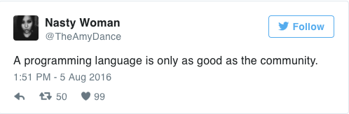
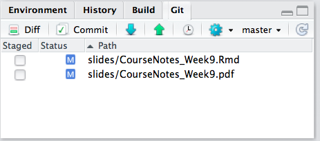
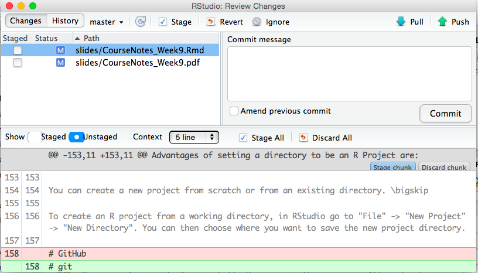
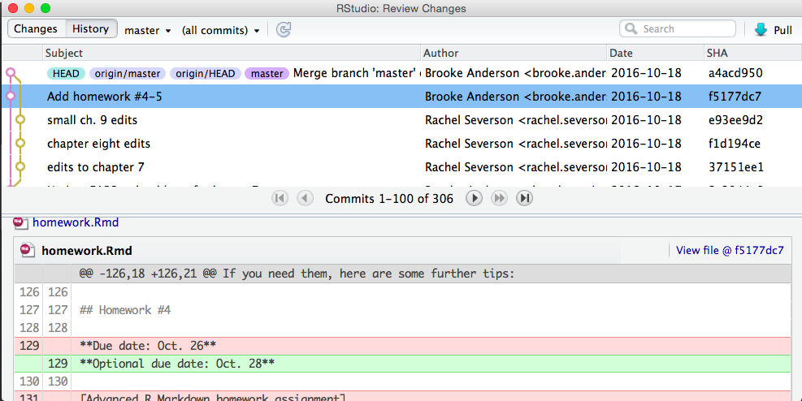

------

# Setting

## SCSS Setup

<style>
pre {
  overflow-x: auto;
}
pre code {
  word-wrap: normal;
  white-space: pre;
}
.table-hover > tbody > tr:hover { 
  background-color: #8D918D;
}
</style>

```{r class.source='bg-success', class.output='bg-primary', message = FALSE, warning = FALSE}
# install.packages("remotes")
library('BBmisc', 'rmsfuns')
#remotes::install_github("rstudio/sass")
lib('sass')
```

```{scss class.source='bg-success', class.output='bg-primary'}
/* https://stackoverflow.com/a/66029010/3806250 */
h1 { color: #002C54; }
h2 { color: #2F496E; }
h3 { color: #375E97; }
h4 { color: #556DAC; }
h5 { color: #92AAC7; }

/* ----------------------------------------------------------------- */
/* https://gist.github.com/himynameisdave/c7a7ed14500d29e58149#file-broken-gradient-animation-less */
.hover01 {
  /* color: #FFD64D; */
  background: linear-gradient(155deg, #EDAE01 0%, #FFEB94 100%);
  transition: all 0.45s;
  &:hover{
    background: linear-gradient(155deg, #EDAE01 20%, #FFEB94 80%);
    }
  }

.hover02 {
  color: #FFD64D;
  background: linear-gradient(155deg, #002C54 0%, #4CB5F5 100%);
  transition: all 0.45s;
  &:hover{
    background: linear-gradient(155deg, #002C54 20%, #4CB5F5 80%);
    }
  }

.hover03 {
  color: #FFD64D;
  background: linear-gradient(155deg, #A10115 0%, #FF3C5C 100%);
  transition: all 0.45s;
  &:hover{
    background: linear-gradient(155deg, #A10115 20%, #FF3C5C 80%);
    }
  }
```

```{r global_options, class.source='hover01', class.output='hover02'}
## https://stackoverflow.com/a/36846793/3806250
options(width = 999)
knitr::opts_chunk$set(class.source = 'hover01', class.output = 'hover02', class.error = 'hover03')
```

<br><br>

## Setup

```{r warning=FALSE, message=FALSE}
if(!suppressPackageStartupMessages(require('BBmisc'))) {
  install.packages('BBmisc', dependencies = TRUE, INSTALL_opts = '--no-lock')
}
suppressPackageStartupMessages(require('BBmisc'))
# suppressPackageStartupMessages(require('rmsfuns'))

pkgs <- c('devtools', 'knitr', 'kableExtra', 'tidyr', 
          'readr', 'lubridate', 'reprex', 'magrittr', 
          'timetk', 'plyr', 'dplyr', 'stringr', 'data.table', 
          'tidyquant', 'plyr', 'dplyr', 'broom', 'highcharter', 
          'formattable', 'DT', 'httr', 'openxlsx', 'formattable', 
          'microbenchmark', 'tdplyr', 'tidyverse', 'echarts4r', 
          'paletteer')

suppressAll(lib(pkgs))
# load_pkg(pkgs)

## Set the timezone but not change the datetime
Sys.setenv(TZ = 'Asia/Tokyo')
## options(knitr.table.format = 'html') will set all kableExtra tables to be 'html', otherwise need to set the parameter on every single table.
options(warn = -1, knitr.table.format = 'html')#, digits.secs = 6)

## https://stackoverflow.com/questions/39417003/long-vectors-not-supported-yet-abnor-in-rmd-but-not-in-r-script
knitr::opts_chunk$set(message = FALSE, warning = FALSE)#, 
                      #cache = TRUE, cache.lazy = FALSE)

rm(pkgs)
```

<br><br>

# Introduction

## About this Course


Kindly refer to manual [Mastering Software Development in R (web-base)](https://bookdown.org/rdpeng/RProgDA/). (or [Mastering Software Development in R.pdf](https://github.com/englianhu/Coursera-Mastering-Software-Development-in-R/blob/master/reference/Mastering%20Software%20Development%20in%20R.pdf))

## Syllabus

- Week 1 : Getting Started with R Packages
    - Introduction
    - R Packages
    - The devtools package
    - Quiz: R Packages and devtools

- Week 2 : Documentation and Testing
    - Documentation
    - Data Within a Package
    - Software Testing Framework for R Packages
    - Passing CRAN checks
    - Documenting Code : 
        1. Peer-graded Assignment: Documenting Code
        2. Review Your Peers: Documenting Code

- Week 3 : Licensing, Version Control, and Software Design
    - Open Source Licensing
    - Why Open Source?
    - Version Control and GitHub
    - Software Design and Philosophy
    - Quiz: Testing, GitHub and Open Source

- Week 4 : Continuous Integration and Cross Platform Development
    - Continuous Integration
    - Cross Platform Development
    - Building an R Package
        1. Peer-graded Assignment: Building an R Package
        2. Review Your Peers: Building an R Package

[Dynamic Documents for R using R Markdown](https://rpubs.com/moviedo/322222) introduce some useful functions and also packages for R users.

Kindly refer to [Mastering Software Development in R Specialization](https://www.coursera.org/specializations/r) to know the whole courses for the R specialization.

# Quiz

## R Package and devtools

Question 10

1. Which of the following are good reasons to build an R Package?

    - Users need to understand how your R functions work in order to use them and providing users with a package allows them to read your R code.
    - <span style='color:green'>**R Packages require documentation and the package structure allows you to distribute functions and documentation together.**</span>
    - <span style='color:green'>**An R package is a good method for distributing functions to users.**</span>
    - R functions are only available for use in other programming languages (Python, C++) if they're included in a package.

2. Which of the following files and folders are required in an R package?

    - An inst/ directory.
    - <span style='color:green'>**A NAMESPACE file.**</span>
    - A README.md file.
    - <span style='color:green'>**The man/ directory.**</span>
    - <span style='color:green'>**The R/ directory.**</span>
    - <span style='color:green'>**A DESCRIPTION file.**</span>

3. Which of the following files and subdirectories will be included in the initial package directory if you create a new package using the `create` function from `devtools`?

    - <span style='color:green'>**.Rbuildignore**</span>
    - <span style='color:green'>**DESCRIPTION**</span>
    - `man/` subdirectory
    - `vignettes/` subdirectory
    - <span style='color:green'>**NAMESPACE**</span>
    - README.md
    - README.Rmd
    - <span style='color:green'>**`R/` subdirectory**</span>
    - <span style='color:green'>**.gitignore**</span>
    - `data/` subdirectory
    - <span style='color:green'>**R project file (package name plus a `.Rproj` extension)**</span>

4. Which of the following functions from the `devtools` package are you likely to use often, rather than just once per package, when building a package?

    - <span style='color:green'>**`load_all`**</span>
    - <span style='color:green'>**`use_readme_rmd`**</span>
    - `document`
    - `create`

5. What is the purpose of the DESCRIPTION file in a package?

    - <span style='color:green'>**It provides metadata on the package, including the package name, version number, authors, and dependencies.**</span>
    - It provides a tutorial overview of how to use the package and is typically written in R Markdown.
    - It describes all the functions that are exported by the package.
    - It describes some of the R project options for the package.

6. Which of the following statements correctly describes how R functions should be defined with the package directory?

    - <span style='color:green'>**They should all be defined in either a single or multiple R scripts in the `R/` subdirectory.**</span>
    - They should all be defined in a single R script, saved as the NAMESPACE file.
    - They should all be defined in separate R scripts in the `man/` subdirectory.
    - They should all be defined in separate R scripts (one per function) in the `R/` subdirectory.

7. What does the `:::` operator do?

    - <span style='color:green'>**It allows access to unexported functions in a package**</span>
    - It exports functions from a package for others to use
    - It hides functions in a package to make them inaccessible to the user
    - It prevents users from modifying the code in a function

8. How is attaching a package namespace different from loading a namespace?

    - Loading a namespace makes unexported functions in a package visible to the user
    - Attaching a namespace makes functions visible only to the package that attached the namespace
    - Loading a namespace places a package's functions in the global environment
    - <span style='color:green'>**Attaching a namespace places the namespace on the search list**</span>

9. For packages that require C code, what should be installed on your system?

    - <span style='color:green'>**A C compiler from Xcode, Rtools, or equivalent package**</span>
    - A Fortran compiler
    - The appropriate header files
    - A perl interpreter

10. What is the purpose of the Imports field in the DESCRIPTION file?

    - to provide a brief description of what your package does
    - to indicate the packages whose functions will be used in your package
    - to indicate the version of R that is required for your package
    - to indicate the license under which your package is made available

- <span style='color:red'>ans: 3</span>
- <span style='color:red'>ans: 1</span>
- <span style='color:red'>ans: 4</span>

## Testing, GitHub and Open Source

1. Which of the following software licenses reserves the fewest rights for the creator of the software?

- The Apple iTunes EULA
- GPL
- <span style='color:green'>**CC0**</span>
- The deal that Faust makes with Mephistopheles
- Artistic-2.0
- MIT

2. Which of the following are good reasons for open sourcing your software?

- The more people that are able to view and submit changes to the code, the more likely that the code will contain fewer bugs.
- Open source licensing ensures that there are no limits to how others can use your software.
- The chance that you'll make money from software you write is so small that you might as well just give it away for free.
- Publishing open source software is a meaningful way to contribute to the community of any programming language.

<span style='color:green'>**ans : 2,3**</span>
<span style='color:green'>**ans : 2,4**</span>

3. How might incorporating testing into your R package have implications for code design?

- a testing framework may affect the indenting of your code
- giving your functions similar sounding names makes it easier to setup a testing framework`
- <span style='color:green'>**dividing your code into smaller functions allows you to test individual pieces more effectively**</span>
- a few large functions makes testing run faster

4. When a test fails in a call to `expect_that()`, what happens?

- The `expect_that()` function returns FALSE
- <span style='color:green'>**An error is thrown**</span>
- The `expect_that()` function returns NULL
- A warning is given

5. What does the `is_a()` function do in the context of testthat?

- <span style='color:green'>**checks the class of an object**</span>
- check for equality with numerical fuzz
- it is like `equals()` but ignores object attributes
- checks that a string matches a regular expression

6. In which sub-directory of an R package should tests be placed?

- `src/`
- <span style='color:green'>**`tests/`**</span>
- `R/`
- `man/`

7. What is Git?

- a web site for hosting source code repositories
- a compiler for R code
- an interactive development environment
- a version control system

<span style='color:green'>**ans : 1**</span>
<span style='color:green'>**ans : 3**</span>

8. What is a pull request on GitHub?

- a way to recreate a repository on your local machine
- <span style='color:green'>**a way to suggest changes to a repository that you do not own**</span>
- a thread in a discussion forum
- a copy of an existing repository

9. How can a merge conflict be resolved?

- clone the repository with the conflicted code
- git can resolve all merge conflicts automatically
- send a pull request for one of your repositories
- <span style='color:green'>**choose the code you want to use and delete everything else**</span>

10. The GNU General Public License is called a copyleft license because

- the GPL prohibits distribution of the software under any circumstances
- <span style='color:green'>**any software that is bundled with or orginates from software licensed under the GPL must also be released under the GPL**</span>
- the software can be modified and distributed without accompanying source code
- the GPL prohibits any modification of the source code of software

# Lesson

## Getting Started with R Packages

### Introduction

#### Before You Start

Building R packages requires a toolchain that must be in place before you begin developing. If you are developing packages that contain only R code, then the tools you need come with R and RStudio. However, if you want to build packages with compiled C or Fortran code (or which to build other people’s packages with such code), then you will need to install additional tools. Which tools you install depends on what platform you are running.

#### Using MAC OS

For developing in Mac OS, you will first need to download the Xcode development environment. While you do not need the IDE that comes with Xcode to develop R packages you need many of the tools that come with it, including the C compiler (clang). Xcode can be obtained from either the [Mac App Store](https://itunes.apple.com/us/app/xcode/id497799835?mt=12) or from Apple’s [Xcode developer’s page](https://developer.apple.com/xcode/). Once this is installed you will have the C compiler as well as a number of additional Unix shell tools. You will also have necessary header files for compiling C code.

While it’s unlikely that you will be building your own packages with Fortran code, many older packages (including R itself) contain Fortran code. Therefore, in order to build these packages, you need a Fortran compiler. Mac OS does not come with on by default and so you can download the [GNU Fortran Compiler](http://r.research.att.com/gfortran-4.2.3.dmg) from the R for Mac tools page.

There are more details provided on the [R for Mac tools package](http://r.research.att.com/tools/) maintained by Simon Urbanek, particularly for older versions of Mac OS.

#### Using Windows

On Windows, the R Core has put together a package of tools that you can download all at once and install via a simple installer tool. The [Rtools](https://cran.r-project.org/bin/windows/Rtools/) package comes in different versions, depending on the version of R that you are using. Make sure to get the version of Rtools that matches your version of R. Once you have installed this, you will have most of the tools needed to build R packages. You can optionally install a few other tools, documented [here](https://cran.r-project.org/bin/windows/Rtools/Rtools.txt).

#### Using Unix Linux

If you are using R on a Unix-like system then you may have already have the tools for building R packages. In particular, if you built R from the sources, then you already have a C compiler and Fortran compiler. If, however, you installed R from a package management system, then you may need to install the compilers, as well as the header files. These usually coming in packages with the suffix -devel. For example, the header files for the readline package may come in the package readline-devel. The catch is that these -devel packages are not needed to run R, only to build R packages from the sources.

### R Packages

#### R Packages

An R package is a mechanism for extending the basic functionality of R. It is the natural extension of writing functions that each do a specific thing well. In the previous chapter, we discussed how writing functions abstracts the behavior of a set of R expressions by providing a defined interface, with inputs (i.e. function arguments) and outputs (i.e. return values). The use of functions simplifies things for the user because the user no longer needs to be knowledgeable of the details of the underlying code. They only need to understand the inputs and outputs.

Once one has developed many functions, it becomes natural to group them in to collections of functions that are aimed at achieving an overall goal. This collection of functions can be assembled into an R package. R packages represent another level of abstraction, where the interface presented to the user is a set of user-facing functions. These functions provide access to the underlying functionality of the package and simplify the user experience because the one does not need to be concerned with the many other helper functions that are required.

R packages are a much better way to distribute code to others because they provide a clean and uniform user experience for people who want to interact with your code. R packages require documentation in a standardized format, and the various tools that come with R (and RStudio) help to check your packages so that they do not contain inconsistencies or errors. R users are already familiar with how to use R packages, and so they will be able to quickly adopt your code if is presented in this format.

This chapter highlights the key elements of building R packages. The fine details of building a package can be found in the [Writing R Extensions](https://cran.r-project.org/doc/manuals/r-release/R-exts.html) manual.

#### Basic Structure of an R Package

An R package begins life as a directory on your computer. This directory has a specific layout with specific files and sub-directories. The two required sub-directories are

- R, which contains all of your R code files
- man, which contains your documentation files.

At the top level of your package directory you will have a DESCRIPTION file and a NAMESPACE file. This represents the minimal requirements for an R package. Other files and sub-directories can be added and will discuss how and why in the sections below.

While RStudio is not required to build R packages, it contains a number of convenient features that make the development process easier and faster. That said, in order to use RStudio for package development, you must setup the environment properly. Details of how to do this can be found in Roger’s [RStudio package development pre-flight check list](https://github.com/rdpeng/daprocedures/blob/master/lists/Rpackage_preflight.md).

#### Description File

The DESCRIPTION file is an essential part of an R package because it contains key metadata for the package that is used by repositories like CRAN and by R itself. In particular, this file contains the package name, the version number, the author and maintainer contact information, the license information, as well as any dependencies on other packages.

As an example, here is the DESCRIPTION file for the mvtsplot package on CRAN. This package provides a function for plotting multivariate time series data.

```
Package:  mvtsplot
Version:  1.0-3
Date:  2016-05-13
Depends:  R (>= 3.0.0)
Imports: splines, graphics, grDevices, stats, RColorBrewer
Title:  Multivariate Time Series Plot
Author:  Roger D. Peng <rpeng@jhsph.edu>
Maintainer:  Roger D. Peng <rpeng@jhsph.edu>
Description:  A function for plotting multivariate time series data.
License:  GPL (>= 2)
URL: https://github.com/rdpeng/mvtsplot
```

#### Namespace File

The NAMESPACE file specifies the interface to the package that is presented to the user. This is done via a series of export() statements, which indicate which functions in the package are exported to the user. Functions that are not exported cannot be called directly by the user (although see below). In addition to exports, the NAMESPACE file also specifies what functions or packages are imported by the package. If your package depends on functions from another package, you must import them via the NAMESPACE file.

Below is the NAMESPACE file for the mvtsplot package described above.

```
export("mvtsplot")

import(splines)
import(RColorBrewer)
importFrom("grDevices", "colorRampPalette", "gray")
importFrom("graphics", "abline", "axis", "box", "image", "layout",
           "lines", "par", "plot", "points", "segments", "strwidth",
           "text", "Axis")
importFrom("stats", "complete.cases", "lm", "na.exclude", "predict",
           "quantile")
```

Here we can see that only a single function is exported from the package (the `mvtsplot()` function). There are two types of import statements:

- `import()`, simply takes a package name as an argument, and the interpretation is that all exported functions from that external package will be accessible to your package
- `importFrom()`, takes a package and a series of function names as arguments. This directive allows you to specify exactly which function you need from an external package. For example, this package imports the `colorRampPalette()` and `gray()` functions from the **grDevices** package.

Generally speaking, it is better to use `importFrom()` and to be specific about which function you need from an external package. However, in some cases when you truly need almost every function in a package, it may be more efficient to simply `import()` the entire package.

With respect to exporting functions, it is important to think through carefully which functions you want to export. First and foremost, exported functions must be documented and supported. Users will generally expect exported functions to be there in subsequent iterations of the package. It’s usually best to limit the number of functions that you export (if possible). It’s always possible to export something later if it is needed, but removing an exported function once people have gotten used to having it available can result in upset users. Finally, exporting a long list of functions has the effect of cluttering a user’s namespace with function names that may conflict with functions from other packages. Minimizing the number of exports reduces the chances of a conflict with other packages (using more package-specific function names is another way).

#### Namespace Function Notation

As you start to use many packages in R, the likelihood of two functions having the same name increases. For example, the commonly used dplyr package has a function named `filter()`, which is also the name of a function in the **stats** package. If one has both packages loaded (a more than likely scenario) how can one specific exactly which `filter()` function they want to call?

In R, every function has a full name, which includes the package namespace as part of the name. This format is along the lines of

```
<package name>::<exported function name>
```

For example, the `filter()` function from the **dplyr** package can be referenced as `dplyr::filter()`. This way, there is no confusion over which `filter()` function we are calling. While in principle every function can be referenced in this way, it can be tiresome for interactive work. However, for programming, it is often safer to reference a function using the full name if there is even a chance that there might be confusion.

It is possible to call functions that are not exported by package by using the namespace notation. The `:::` operator can be used for this purpose, as in `<package name>:::<unexported function name>`. This can be useful for examining the code of an unexported function (e.g. for debugging purposes) or for temporarily accessing some unexported feature of a package. However, it’s not a good idea to make this a habit as such unexported functions may change or even be eliminated in future versions of the package. Furthermore, use of the ::: operator is not allowed for packages that reside on CRAN.

#### Loading and Attaching a Package Namespace

When dealing with R packages, it’s useful to understand the distinction between loading a package namespace and attaching it. When package A imports the namespace of package B, package A loads the namespace of package B in order to gain access to the exported functions of package B. However, when the namespace of package B is loaded, it is only available to package A; it is not placed on the search list and is not visible to the user or to other packages.

Attaching a package namespace places that namespace on the search list, making it visible to the user and to other packages. Sometimes this is needed because certain functions need to be made visible to the user and not just to a given package.

#### The R Sub-directory

The R sub-directory contains all of your R code, either in a single file, or in multiple files. For larger packages it’s usually best to split code up into multiple files that logically group functions together. The names of the R code files do not matter, but generally it’s not a good idea to have spaces in the file names.

#### The man Sub-directory

The man sub-directory contains the documentation files for all of the exported objects of a package. With older versions of R one had to write the documentation of R objects directly into the man directory using a LaTeX-style notation. However, with the development of the **roxygen2** package, we no longer need to do that and can write the documentation directly into the R code files. Therefore, you will likely have little interaction with the man directory as all of the files in there will be auto-generated by the **roxygen2** package.

#### Summary

R packages provide a convenient and standardized mechanism for distributing R code to a wide audience. As part of building an R package you design an interface to a collection of functions that users can access to make use of the functionality you provide. R packages are directories containing R code, documentation files, package metadata, and export/import information. Exported functions are functions that are accessible by the user; imported functions are functions in other packages that are used by your package.

### The devtools Package

#### The devtools Package

R package development has become substantially easier in recent years with the introduction of a package by Hadley Wickham called devtools. As the package name suggests, this includes a variety of functions that facilitate software development in R.

Hands down, the best resource for mastering the devtools package is the book R Packages by Hadley Wickham. The full book is available online for free at http://r-pkgs.had.co.nz. It is also available as a hard copy book published by O’Reilly. If you plan to develop a lot of R packages, it is well worth your time to read this book closely.

Here are some of the key functions included in devtools and what they do, roughly in the order you are likely to use them as you develop an R package:

| Function	        | Use                                                                                                                                                                                                                                                                    |
|:-----------------:|:----------------------------------------------------------------------------------------------------------------------------------------------------------------------------------------------------------------------------------------------------------------------:|
| load_all	        | Load the code for all functions in the package                                                                                                                                                                                                                         |
| document	        | Create \man documentation files and the “NAMESPACE” file from roxygen2 code                                                                                                                                                                                            |
| use_data	        | Save an object in your R session as a dataset in the package                                                                                                                                                                                                           |
| use_vignette      | Set up the package to include a vignette                                                                                                                                                                                                                               |
| use_readme_rmd	  | Set up the package to include a README file in Rmarkdown format                                                                                                                                                                                                        |
| use_build_ignore  |	Specify files that should be ignored when building the R package (for example, if you have a folder where you’re drafting a journal article about the package, you can include all related files in a folder that you set to be ignored during the package build)  |
| check	            | Check the full R package for any ERRORs, WARNINGs, or NOTEs                                                                                                                                                                                                            |
| build_win	        | Build a version of the package for Windows and send it to be checked on a Windows machine. You’ll receive an email with a link to the results.                                                                                                                         |
| use_travis	      | Set the package up to facilitate using Travis CI with the package                                                                                                                                                                                                      |
| use_cran_comments	| Create a file where you can add comments to include with your CRAN submission.                                                                                                                                                                                         |
| submit_cran	      | Submit the package to CRAN                                                                                                                                                                                                                                             |
| use_news_md	      | Add a file to the package to give news on changes in new versions                                                                                                                                                                                                      |

Some of these functions you’ll only need to use once for a package. The one-time (per package) functions are mostly those that set up a certain type of infrastructure for the package. For example, if you want to use R Markdown to create a README file for a package you are posting to GitHub, you can create the proper infrastructure with the use_readme_rmd function. This function adds a starter README file in the main directory of the package with the name “README.Rmd”. You can edit this file and render it to Markdown to provide GitHub users more information about your package. However, you will have problems with your CRAN checks if there is a README file in this top-level directory of the package, so the use_readme_rmd function also adds the files names for the R Markdown README file, and the Markdown file it creates, in the “.Rbuildignore” file, so it is not included when the package is built.

#### Creating a Package

The earliest infrastructure function you will use from the devtools package is create. This function inputs the filepath for the directory where you would like to create the package and creates the initial package structure (as a note, this directory should not yet exist). You will then add the elements (code, data, etc.) for the package within this structure. As an alternative to create, you can also initialize an R package in RStudio by selecting “File” -> “New Project” -> “New Direction” -> “R Package”.

In addition to starting a package using create or by creating a new project in RStudio, you could also create the package by hand, creating and then filling a directory. However, it’s hard to think of any circumstances where there would be a good reason to do that rather than using some of the more convenient tools offered by devtools and RStudio.

Figure 3.1 gives an example of what the new package directory will look like after you create an initial package structure with create or via the RStudio “New Project” interface. This initial package directory includes an R subdirectory, where you will save R scripts with all code defining R functions for the package. It also includes two files that will store metadata and interface information about your package (DESCRIPTION and NAMESPACE), as well as an R project file (.Rproj extension) that saves some project options for the directory. Finally, the initial package structure includes two files that can be used to exclude some files in the directory from either being followed by git (.gitignore) or included when the package is built (.Rbuildignore). These two files have names that start with a dot, so they may not be listed if you look at the package directory structure in a file manager like “Finder” on Macs. These “dot-files” will, however, be listed in the “Files” tab that shows up in one of the RStudio panes when you open an R project like a package directory, as shown in this figure.


#### Other Functions

In contrast to the devtools infrastructure functions that you will only use once per package, there are other devtools functions you’ll use many times as you develop a package. Two of the work horses of devtools are load_all and document. The load_all function loads the entire package (by default, based on the current working directory, although you can also give the filepath to load a directory elsewhere). In addition to loading all R functions, it also loads all package data and compiles and connects C, C++, and FORTRAN code in the package. As you add to a package, you can use load_all to ensure you’re using the latest version of all package functions and data. The document function rewrites the help files and NAMESPACE file based on the latest version of the roxygen2 comments included with each function (writing roxygen2 is covered in more detail in the next section).

RStudio has created a very helpful Package Development Cheatsheet that covers many of the devtools functions. A pdf of this cheatsheet is available [here](https://www.rstudio.com/wp-content/uploads/2015/06/devtools-cheatsheet.pdf).

## Documentation and Testing

### Documentation

#### Documentation

There are two main types of documentation you may want to include with packages:

- Longer documents that give tutorials or overviews for the whole package
- Shorter, function specific help files for each function or group of related functions

You can create the first type of document using package vignettes, README files, or both. For the function-specific help files, the easiest way to create these is with the roxygen2 package.

In this section, we’ll cover why and how to create this documentation. In addition, vignette / README documentation can be done using knitr to create R Markdown documents that mix R code and text, so we’ll include more details on that process.

#### Vignettes and Readme Files

You will likely want to create a document that walks users through the basics of how to use your package. You can do this through two formats:

- Vignette: This document is bundled with your R package, so it becomes locally available to a user once they install your package from CRAN. They will also have it available if they install the package from GitHub, as long as they use the build_vignettes = TRUE when running install_github.
- README file: If you have your package on GitHub, this document will show up on the main page of the repository.

A package likely only needs a README file if you are posting the package to GitHub. For any GitHub repository, if there is a README.md file in the top directory of the repository, it will be rendered on the main GitHub repository page below the listed repository content. For an example, visit https://github.com/leighseverson/countyweather and scroll down. You’ll see a list of all the files and subdirectories included in the package repository and below that is the content in the package’s README.md file, which gives a tutorial on using the package.

If the README file does not need to include R code, you can write it directly as an .md file, using Markdown syntax, which is explained in more detail in the next section. If you want to include R code, you should start with a README.Rmd file, which you can then render to Markdown using knitr. You can use the devtools package to add either a README.md or README.Rmd file to a package directory, using use_readme_md or use_readme_rmd, respectively. These functions will add the appropriate file to the top level of the package directory and will also add the file name to “.Rbuildignore”, since having one of these files in the top level of the package directory could otherwise cause some problems when building the package.

The README file is a useful way to give GitHub users information about your package, but it will not be included in builds of the package or be available through CRAN for packages that are posted there. Instead, if you want to create tutorials or overview documents that are included in a package build, you should do that by adding one or more package vignettes. Vignettes are stored in a vignettes subdirectory within the package directory.

To add a vignette file, saved within this subdirectory (which will be created if you do not already have it), use the use_vignette function from devtools. This function takes as arguments the file name of the vignette you’d like to create and the package for which you’d like to create it (the default is the package in the current working directory). For example, if you are currently working in your package’s top-level directory and you would like to add a vignette called “model_details”, you can do that with the code:

```
use_vignette("model_details")
```

#### Knitr Markdown

Both vignette and README files can be written as R Markdown files, which will allow you to include R code examples and results from your package. One of the most exciting tools in R is the knitr system for combining code and text to create a reproducible document. In terms of the power you get for time invested in learning a tool, knitr probably can’t be beat. Everything you need to know to create and “knit” a reproducible document can be learned in about 20 minutes, and while there is a lot more you can do to customize this process if you want to, probably 80% of what you’ll ever want to do with knitr you’ll learn in those first 20 minutes.

R Markdown files are mostly written using Markdown. To write R Markdown files, you need to understand what markup languages like Markdown are and how they work. In Word and other word processing programs you have used, you can add formatting using buttons and keyboard shortcuts (e.g., “Ctrl-B” for bold). The file saves the words you type. It also saves the formatting, but you see the final output, rather than the formatting markup, when you edit the file (WYSIWYG – what you see is what you get). In markup languages, on the other hand, you markup the document directly to show what formatting the final version should have (e.g., you type **bold** in the file to end up with a document with bold). Examples of markup languages include:

- HTML (HyperText Markup Language)
- LaTex
- Markdown (a “lightweight” markup language)

To write a file in Markdown, you’ll need to learn the conventions for creating formatting. See this table for some common formatting choices: [Table of Markdown Formatting Specifiers](https://bookdown.org/rdpeng/RProgDA/documentation.html#common-markdown-formatting-elements).

Some other simple things you can do in Markdown include:

- Lists (ordered or bulleted)
- Equations
- Tables
- Figures from file
- Block quotes
- Superscripts

The start of a Markdown file gives some metadata for the file (authors, title, format) in a language called YAML. For example, the YAML section of a package vignette might look like this:

```
---
title: "Model Details for example_package"
author: "Jane Doe"
date: "2016-11-08"
output: rmarkdown::html_vignette
vignette: >
  %\VignetteIndexEntry{Model Details for example_package}
  %\VignetteEngine{knitr::rmarkdown}
  %\VignetteEncoding{UTF-8}
---
```

When creating R Markdown documents using the RStudio toolbar, much of this YAML will be automatically generated based on your specifications when opening the initial file. However, this is not the case with package vignettes, for which you’ll need to go into the YAML and add the authors and title yourself. Leave the vignette engine, vignette encoding, output, and date as their default values.

For more Markdown conventions, see RStudio’s R Markdown Reference Guide (link also available through “Help” in RStudio).

R Markdown files work a lot like Markdown files, but add the ability to include R code that will be run before rendering the final document. This functionality is based on literate programming, an idea developed by Donald Knuth, to mix executable code with regular text. The files you create can then be rendered, to run any embedded code. The final output will have results from your code and the regular text.

1. The basic steps of opening and rendering an R Markdown file in RStudio are:
2. To open a new R Markdown file, go to “File” -> “New File” -> “RMarkdown…” -> for now, chose a “Document” in “HTML” format.
3. This will open a new R Markdown file in RStudio. The file extension for R Markdown files is “.Rmd”.
4. The new file comes with some example code and text. You can run the file as-is to try out the example. You will ultimately delete this example code and text and replace it with your own.
5. Once you “knit” the R Markdown file, R will render an HTML file with the output. This is automatically saved in the same directory where you saved your .Rmd file.
6. Write everything besides R code using Markdown syntax.

The knit function from the knitr package works by taking a document in R Markdown format (among a few possible formats), reading through it for any markers of the start of R code, running any of the code between that “start” marker and a marker showing a return to regular Markdown, writing any of the relevant results from R code into the Markdown file in Markdown format, and then passing the entire document, now in Markdown rather than R Markdown format, to software that can render from Markdown to the desired output format (for example, compile a pdf, Word, or HTML document).

This means that all a user needs to do to include R code, that will be run if desired, within a document is to properly separate it from other parts of the document through the appropriate markers. To indicate R code in an RMarkdown document, you need to separate off the code chunk using the following syntax:

```{r error=TRUE}
my_vec <- 1:10
```

This syntax tells R how to find the start and end of pieces of R code when the file is rendered. R will walk through, find each piece of R code, run it and create output (printed output or figures, for example), and then pass the file along to another program to complete rendering (e.g., Tex for pdf files).

You can specify a name for each chunk, if you’d like, by including it after “r” when you begin your chunk. For example, to give the name load_mtcars to a code chunk that loads the mtcars dataset, specify that name in the start of the code chunk:

```{r load_mtcars}
data(mtcars)
```

Here are a couple of tips for naming code chunks:

- Chunk names must be unique across a document.
- Any chunks you don’t name are given ordered numbers by knitr.

You do not have to name each chunk. However, there are some advantages:

- It will be easier to find any errors.
- You can use the chunk labels in referencing for figure labels.
- You can reference chunks later by name.

#### Common Knitr Options

You can also add options when you start a chunk. Many of these options can be set as TRUE / FALSE and include: [Table of Common knitr Options](https://bookdown.org/rdpeng/RProgDA/documentation.html#common-knitr-chunk-options).

To include any of these options, add the option and value in the opening brackets and separate multiple options with commas:

```{r  messages = FALSE, echo = FALSE}
mtcars[1, 1:3]
```

You can set “global” options at the beginning of the document. This will create new defaults for all of the chunks in the document. For example, if you want echo, warning, and message to be FALSE by default in all code chunks, you can run:

```
#```{r global_options}
#knitr::opts_chunk$set(echo = FALSE, message = FALSE,
#  warning = FALSE)
#```
```

If you set both global and local chunk options that you set specifically for a chunk will take precedence over global options. For example, running a document with:

```
#```{r global_options}
#```
```

```{r check_mtcars, echo = TRUE}
head(mtcars, 1)
```

would print the code for the check_mtcars chunk, because the option specified for that specific chunk (echo = TRUE) would override the global option (echo = FALSE).

You can also include R output directly in your text (“inline”) using backticks:

“There are `r nrow(mtcars)` observations in the mtcars data set. The average miles per gallon is `r mean(mtcars$mpg, na.rm = TRUE)`.”

Once the file is rendered, this gives:

“There are 32 observations in the mtcars data set. The average miles per gallon is 20.090625.”

Here are some tips that will help you diagnose some problems rendering R Markdown files:

- Be sure to save your R Markdown file before you run it.
- All the code in the file will run “from scratch”— as if you just opened a new R session.
- The code will run using, as a working directory, the directory where you saved the R Markdown file.

You’ll want to try out pieces of your code as you write an R Markdown document. There are a few ways you can do that:

- You can run code in chunks just like you can run code from a script (Ctrl-Return or the “Run” button).
- You can run all the code in a chunk (or all the code in all chunks) using the different options under the “Run” button in RStudio.
- All the “Run” options have keyboard shortcuts, so you can use those.

You can use this format to create documentation, including vignettes, to give users advice and examples for using your package.

Two excellent books for learning more about creating reproducible documents with R are Dynamic Documents with R and knitr by Yihui Xie (the creator of knitr) and Reproducible Research with R and RStudio by Christopher Gandrud. The first goes into the technical details of how knitr and related code works, which gives you the tools to extensively customize a document. The second provides an extensive view of how to use tools from R and other open source software to conduct, write up, and present research in a reproducible and efficient way. RStudio’s [R Markdown Cheatsheet](https://www.rstudio.com/wp-content/uploads/2015/02/rmarkdown-cheatsheet.pdf) is another very useful reference.

#### Help Files and Roxygen2

In addition to writing tutorials that give an overview of your whole package, you should also write specific documentation showing users how to use and interpret any functions you expect users to directly call.

These help files will ultimately go in a folder called /man of your package, in an R documentation format (.Rd file extensions) that is fairly similar to LaTex. You used to have to write all of these files as separate files. However, the roxygen2 package lets you put all of the help information directly in the code where you define each function.

With roxygen2, you add the help file information directly above the code where you define each functions, in the R scripts saved in the R subdirectory of the package directory. You start each line of the roxygen2 documentation with #' (the second character is an apostrophe, not a backtick). The first line of the documentation should give a short title for the function, and the next block of documentation should be a longer description. After that, you will use tags that start with @ to define each element you’re including. You should leave an empty line between each section of documentation, and you can use indentation for second and later lines of elements to make the code easier to read.

Here is a basic example of how this roxygen2 documentation would look for a simple “Hello world” function:

```
#' Print "Hello world" 
#'
#' This is a simple function that, by default, prints "Hello world". You can 
#' customize the text to print (using the \code{to_print} argument) and add
#' an exclamation point (\code{excited = TRUE}).
#'
#' @param to_print A character string giving the text the function will print
#' @param excited Logical value specifying whether to include an exclamation
#'    point after the text
#' 
#' @return This function returns a phrase to print, with or without an 
#'    exclamation point added. As a side effect, this function also prints out
#'    the phrase. 
#'
#' @examples
#' hello_world()
#' hello_world(excited = TRUE)
#' hello_world(to_print = "Hi world")
#'
#' @export
hello_world <- function(to_print = "Hello world", excited = FALSE){
    if(excited) to_print <- paste0(to_print, "!")
    print(to_print)
}
```

#### Common Roxygen2 Tags

Here are some of the common roxygen2 tags to use in creating this documentation: [Table of common roxygen2 tags](https://bookdown.org/rdpeng/RProgDA/documentation.html#common-roxygen2-tags).

Here are a few things to keep in mind when writing help files using roxygen2:

The tags @example and @examples do different things. You should always use the @examples (plural) tag for example code, or you will get errors when you build the documentation.

The @inheritParams function can save you a lot of time, because if you are using the same parameters in multiple functions in your package, you can write and edit those parameter descriptions just in one place. However, keep in mind that you must point @inheritParams to the function where you originally define the parameters using @param, not another function where you use the parameters but define them using an @inheritParams pointer.

If you want users to be able to directly use the function, you must include @export in your roxygen2 documentation. If you have written a function but then find it isn’t being found when you try to compile a README file or vignette, a common culprit is that you have forgotten to export the function.

You can include formatting (lists, etc.) and equations in the roxygen2 documentation. Here are some of the common formatting tags you might want to use: [Table of common roxygen2 formatting tags](https://bookdown.org/rdpeng/RProgDA/documentation.html#common-roxygen2-formatting-tags).

Some tips on using the R documentation format:

- Usually, you’ll want you use the \link tag only in combination with the \code tag, since you’re linking to another R function. Make sure you use these with \code wrapping \link, not the other way around (\code{\link{other_function}}), or you’ll get an error.
- Some of the equation formatting, including superscripts and subscripts, won’t parse in Markdown-based documentation (but will for pdf-based documentation). With the \eqn and deqn tags, you can include two versions of an equation, one with full formatting, which will be fully compiled by pdf-based documentation, and one with a reduced form that looks better in Markdown-based documentation (for example, \deqn{ \frac{X^2}{Y} }{ X2 / Y }).
- For any examples in help files that take a while to run, you’ll want to wrap the example code in the \dontrun tag.
- The tags \url and \href both include a web link. The difference between the two is that \url will print out the web address in the help documentation, href allows you to use text other than the web address for the anchor text of the link. For example: "For more information, see \url{www.google.com}."; "For more information, \href{www.google.com}{Google it}.".

In addition to document functions, you should also document any data that comes with your package. To do that, create a file in the /R folder of the package called “data.R” to use to documentation all of the package’s datasets. You can use roxygen2 to document each dataset, and end each with the name of the dataset in quotation marks. There are more details on documenting package data using roxygen2 in the next section.

### Data Within a Package

#### Overview

Many R packages are designed to manipulate, visualize, and model data so it may be a good idea for you to include some data in your package. The primary reason most developers include data in their package is to demonstrate how to use the functions included in the package with the included data. Creating a package as a means to distribute data is also a method that is gaining popularity. Additionally you may want to include data that your package uses internally, but is not available to somebody who is using your package. When including data in your package consider the fact that your compressed package file should be smaller than 5MB, which is the largest package size that CRAN allows. If your package is larger than 5MB make sure to inform users in the instructions for downloading and installing your package.

#### Data for Demos

**Data Objects**

Including data in your package is easy thanks to the devtools package. To include datasets in a package, first create the objects that you would like to include in your package inside of the global environment. You can include any R object in a package, not just data frames. Then make sure you’re in your package directory and use the `use_data()` function, listing each object that you want to include in your package. The names of the objects that you pass as arguments to `use_data()` will be the names of the objects when a user loads the package, so make sure you like the variable names that you’re using.

You should then document each data object that you’re including in the package. This way package users can use common R help syntax like ?dataset to find out more information about the included data set. You should create one R file called data.R in the `R/` directory of your package. You can write the data documentation in the data.R file. Let’s take a look at some documentation examples from the minimap package. First we’ll look at the documentation for a data frame called maple:

```
#' Production and farm value of maple products in Canada
#'
#' @source Statistics Canada. Table 001-0008 - Production and farm value of
#'  maple products, annual. \url{http://www5.statcan.gc.ca/cansim/}
#' @format A data frame with columns:
#' \describe{
#'  \item{Year}{A value between 1924 and 2015.}
#'  \item{Syrup}{Maple products expressed as syrup, total in thousands of gallons.}
#'  \item{CAD}{Gross value of maple products in thousands of Canadian dollars.}
#'  \item{Region}{Postal code abbreviation for territory or province.}
#' }
#' @examples
#' \dontrun{
#'  maple
#' }
"maple"
```

Data frames that you include in your package should follow the general schema above where the documentation page has the following attributes:

An informative title describing the object.

A @source tag describing where the data was found.

A @format tag which describes the data in each column of the data frame.

And then finally a string with the name of the object.

The minimap package also includes a few vectors. Let’s look at the documentation for mexico_abb:

```
#' Postal Abbreviations for Mexico
#'
#' @examples
#' \dontrun{
#'  mexico_abb
#' }
"mexico_abb"
```

You should always include a title for a description of a vector or any other object. If you need to elaborate on the details of a vector you can include a description in the documentation or a @source tag. Just like with data frames the documentation for a vector should end with a string containing the name of the object.

**Raw Data**

A common task for R packages is to take raw data from files and to import them into R objects so that they can be analyzed. You might want to include some sample raw data files so you can show different methods and options for importing the data. To include raw data files in your package you should create a directory under inst/extdata in your R package. If you stored a data file in this directory called response.json in inst/extdata and your package is named mypackage then a user could access the path to this file with `system.file("extdata", "response.json", package = "mypackage")`. Include that line of code in the documentation to your package so that your users know how to access the raw data file.

#### Internal Data

Functions in your package may need to have access to data that you don’t want your users to be able to access. For example the **swirl** package contains translations for menu items into languages other than English, however that data has nothing to do with the purpose of the swirl package and so it’s hidden from the user. To add internal data to your package you can use the `use_data()` function from devtools, however you must specify the `internal = TRUE` argument. All of the objects you pass to `use_data(..., internal = TRUE)` can be referenced by the same name within your R package. All of these objects will be saved to one file called `R/sysdata.rda`.

#### Data Packages

There are several packages which were created for the sole purpose of distributing data including [janeaustenr](https://github.com/juliasilge/janeaustenr), [gapminder](https://github.com/jennybc/gapminder), [babynames](https://github.com/hadley/babynames), and [lego](https://github.com/seankross/lego). Using an R package as a means of distributing data has advantages and disadvantages. On one hand the data is extremely easy to load into R, a user only needs to install and load the package. This can be useful for teaching folks who are new to R and may not be familiar with importing and cleaning data. Data packages also allow you document datasets using roxygen2, which provides a much cleaner and more programmer-friendly kind of code book compared to including a file that describes the data. On the other hand data in a data package is not accessible to people who are not using R, though there’s nothing stopping you from distributing the data in multiple ways.

If you decide to create a data package you should document the process that you used to obtain, clean, and save the data. One approach to doing this is to use the use_data_raw() function from devtools. This will create a directory inside of your package called data_raw. Inside of this directory you should include any raw files that the data objects in you package are derived from. You should also include one or more R scripts which import, clean, and save those data objects in your R package. Theoretically if you needed to update the data package with new data files you should be able to just run these scripts again in order to rebuild your package.

#### Summary

Including data in a package is useful for showing new users how to use your package, using data internally, and sharing and documenting datasets. The devtools package includes several useful functions to help you add data to your package including `use_data()` and `use_data_raw()`. You can document data within your package just like you would document a function.

### Software Testing Framework for R Packages

#### Introduction

Once you’ve written code for an R package and have gotten that code to a point where you believe it’s working, it may be a good time to step back and consider a few things about your code.

- How do you know it’s working? Given that you wrote the functions, you have a certain set of expectations about how the functions should behave. Specifically, for a given set of inputs you expect a certain output. Having these expectations clearly in mind is an important aspect of knowing whether code is “working”.
- Have you already tested your code? Chances are, throughout the development of your code, you ran little tests to see if your functions were working. Assuming these tests were valid for the code you were testing, it’s worth keeping these tests on hand and making them part of your package.

Setting up a battery of tests for the code in your package can play a big role in maintaining the ongoing smooth operation of the package in hunting down bugs in the code, should they arise. Over time, many aspects of a package can change. Specifically:

- As you actively develop your code, you may change/break older code without knowing it. For example, modifying a helper function that lots of other functions rely may be better for some functions but may break behavior for other functions. Without a comprehensive testing framework, you might not know that some behavior is broken until a user reports it to you.
- The environment in which your package runs can change. The version of R can change, libraries, web sites and any other external resources, and packages can all change without warning. In such cases, your code may be unchanged, but because of an external change, your code may not produce the expected output given a set of inputs. Having tests in place that are run regularly can help to catch these changes even if your package isn’t under active development.
- As you fix bugs in your code, it’s often a good idea to include a specific test that addresses each bug so that you can be sure that the bug does not “return” in a future version of the package (this is also known as a regression).

Testing your code effectively has some implications for code design. In particular, it may be more useful to divide your code into smaller functions that you can test individual pieces more effectively. For example, if you have one large function that returns TRUE or FALSE, it is easy to test this function, but ultimately it may not be possible to identify problems deep in the code by simply checking if the function returns the correct logical value. It may be better to divide up large function into smaller functions so that core elements of the function can be tested separately to ensure that they are behaving appropriately.

#### The Testthat Package

The testthat package is designed to make it easy to setup a battery of tests for your R package. A nice introduction to the package can bef ound in Hadley Wickham’s article in the R Journal. Essentially, the package contains a suite of functions for testing function/expression output with the expected output. The simplest use of the package is for testing a simple expression:

```{r error=TRUE}
library(testthat)
expect_that(sqrt(3) * sqrt(3), equals(3))
```

Note that the `equals()` function allows for some numerical fuzz, which is why this expression actually passes the test. When a test fails, `expect_that()` throws an error and does not return something.

```{r eval=FALSE}
## Use a strict test of equality (this test fails)
expect_that(sqrt(3) * sqrt(3), is_identical_to(3))

Error: sqrt(3) * sqrt(3) not identical to 3.
Objects equal but not identical
```

The `expect_that()` function can be used to wrap many different kinds of test, beyond just numerical output. The table below provides a brief summary of the types of comparisons that can be made.

| Expectation	         | Description                                           |
|:--------------------:|:-----------------------------------------------------:|
| equals()	           | check for equality with numerical fuzz                |
| is_identical_to()    | strict equality via identical()                       |
| is_equivalent_to()   | like equals() but ignores object attributes           |
| is_a()	             | checks the class of an object (using inherits())      |
| matches()	           | checks that a string matches a regular expression     |
| prints_text()	       | checks that an expression prints to the console       |
| shows_message()	     | checks for a message being generated                  |
| gives_warning()	     | checks that an expression gives a warning             |
| throws_error()	     | checks that an expression (properly) throws an error  |
| is_true()	           | checks that an expression is TRUE                     |

A collection of calls to `expect_that()` can be put together with the `test_that()` function, as in

```{r error=TRUE}
test_that("model fitting", {
        data(airquality)
        fit <- lm(Ozone ~ Wind, data = airquality)
        expect_that(fit, is_a("lm"))
        expect_that(1 + 1, equals(2))
})
```

Typically, you would put your tests in an R file. If you have multiple sets of tests that test different domains of a package, you might put those tests in different files. Individual files can have their tests run with the `test_file()` function. A collection of tests files can be placed in a directory and tested all together with the `test_dir()` function.

In the context of an R package, it makes sense to put the test files in the tests directory. This way, when running R CMD check (see the next section) all of the tests will be run as part of process of checking the entire package. If any of your tests fail, then the entire package checking process will fail and will prevent you from distributing buggy code. If you want users to be able to easily see the tests from an installed package, you can place the tests in the inst/tests directory and have a separate file in the tests directory run all of the tests.

### Passing CRAN Checks

#### Passing CRAN Checks

Before submitting a package to CRAN, you must pass a battery of tests that are run by the R itself via the R CMD check program. In RStudio, if you are in an R Package “Project” you can run R CMD check by clicking the Check button in the build tab. This will run a series of tests that check the metadata in your package, the NAMESPACE file, the code, the documentation, run any tests, build any vignettes, and many others.

Here is an example of the output form R CMD check for the filehash package which currently passes all tests.

```
* using R version 3.3.2 (2016-10-31)
* using platform: x86_64-apple-darwin13.4.0 (64-bit)
* using session charset: UTF-8
* checking for file 'filehash/DESCRIPTION' ... OK
* this is package 'filehash' version '2.3'
* checking package namespace information ... OK
* checking package dependencies ... OK
* checking if this is a source package ... OK
* checking if there is a namespace ... OK
* checking for executable files ... OK
* checking for hidden files and directories ... OK
* checking for portable file names ... OK
* checking for sufficient/correct file permissions ... OK
* checking whether package 'filehash' can be installed ... OK
* checking installed package size ... OK
* checking package directory ... OK
* checking 'build' directory ... OK
* checking DESCRIPTION meta-information ... OK
* checking top-level files ... OK
* checking for left-over files ... OK
* checking index information ... OK
* checking package subdirectories ... OK
* checking R files for non-ASCII characters ... OK
* checking R files for syntax errors ... OK
* checking whether the package can be loaded ... OK
* checking whether the package can be loaded with stated dependencies ... OK
* checking whether the package can be unloaded cleanly ... OK
* checking whether the namespace can be loaded with stated dependencies ... OK
* checking whether the namespace can be unloaded cleanly ... OK
* checking loading without being on the library search path ... OK
* checking dependencies in R code ... OK
* checking S3 generic/method consistency ... OK
* checking replacement functions ... OK
* checking foreign function calls ... OK
* checking R code for possible problems ... OK
* checking Rd files ... OK
* checking Rd metadata ... OK
* checking Rd cross-references ... OK
* checking for missing documentation entries ... OK
* checking for code/documentation mismatches ... OK
* checking Rd \usage sections ... OK
* checking Rd contents ... OK
* checking for unstated dependencies in examples ... OK
* checking line endings in C/C++/Fortran sources/headers ... OK
* checking compiled code ... OK
* checking sizes of PDF files under 'inst/doc' ... OK
* checking installed files from 'inst/doc' ... OK
* checking files in 'vignettes' ... OK
* checking examples ... OK
* checking for unstated dependencies in 'tests' ... OK
* checking tests ...
 OK
* checking for unstated dependencies in vignettes ... OK
* checking package vignettes in 'inst/doc' ... OK
* checking running R code from vignettes ...
   'filehash.Rnw' ... OK
 OK
* checking re-building of vignette outputs ... OK
* checking PDF version of manual ... OK
* DONE
Status: OK
```

Here is an example from the mvtsplot package where we’ve deliberately introduced some problems to the package in order to show the check output. Checks that have passed are not shown below.

```
* checking foreign function calls ... OK
* checking R code for possible problems ... NOTE
drawImage: no visible global function definition for ‘Axis’
drawImageMargin: no visible global function definition for ‘lm’
drawImageMargin: no visible global function definition for ‘Axis’
splineFillIn: no visible global function definition for ‘lm’
Undefined global functions or variables:
  Axis lm
Consider adding
  importFrom("graphics", "Axis")
  importFrom("stats", "lm")
to your NAMESPACE file.
```

Here, it appears that the functions `Axis()` and `lm()` are needed by the package but are not available because they are not imported from their respective packages. In this case, R CMD check provides a suggestion of how youc an modify the NAMESPACE package, but you are probably better off modifying the roxygen2 documentation in the code file instead.

Moving on the rest of the checks, we see:

```
* checking for missing documentation entries ... OK
* checking for code/documentation mismatches ... WARNING
Codoc mismatches from documentation object 'mvtsplot':
mvtsplot
  Code: function(x, group = NULL, xtime = NULL, norm = c("internal",
                 "global"), levels = 3, smooth.df = NULL, margin =
                 TRUE, sort = NULL, main = "", palette = "PRGn",
                 rowstat = "median", xlim, bottom.ylim = NULL,
                 right.xlim = NULL, gcol = 1)
  Docs: function(y, group = NULL, xtime = NULL, norm = c("internal",
                 "global"), levels = 3, smooth.df = NULL, margin =
                 TRUE, sort = NULL, main = "", palette = "PRGn",
                 rowstat = "median", xlim, bottom.ylim = NULL,
                 right.xlim = NULL, gcol = 1)
  Argument names in code not in docs:
    x
  Argument names in docs not in code:
    y
  Mismatches in argument names:
    Position: 1 Code: x Docs: y
```

Here the problem is that the code has the first argument named x while the documentation has the first argument named y.

```
* checking Rd \usage sections ... WARNING
Undocumented arguments in documentation object 'mvtsplot'
  ‘y’
Documented arguments not in \usage in documentation object 'mvtsplot':
  ‘x’

Functions with \usage entries need to have the appropriate \alias
entries, and all their arguments documented.
The \usage entries must correspond to syntactically valid R code.
See chapter 'Writing R documentation files' in the 'Writing R
Extensions' manual.
```

Because of the mismatch in code and documentation for the first argument, we have an argument that is not properly documented (y) and an argument that is documented but not used (x).

In case the checks fly by too quickly, you will receive a summary message the end saying what errors and warnings you got.

```
* DONE
Status: 2 WARNINGs, 1 NOTE
```

## Licensing, Version Control, and Software Design

### Open Source Licensing

#### Overview

You can specify how your R package is licensed in the package DESCRIPTION file under the License: section. How you license your R package is important because it provides a set of constraints for how other R developers use your code. If you’re writing an R package to be used internally in your company then your company may choose to not share the package. In this case licensing your R package is less important since the package belongs to your company. In your package DESCRIPTION you can specify License: file LICENSE, and then create a text file called LICENSE which explains that your company reserves all rights to the package.

However if you (or your company) would like to publicly share your R package you should consider open source licensing. The philosophy of open source revolves around three principles:

1. The source code of the software can be inspected.
2. The source code of the software can be modified.
3. Modified versions of the software can be redistributed.

Nearly all open source licenses provide the protections above. Let’s discuss three of the most popular open source licenses among R packages.

#### The General Public License

Known as the GPL, the GNU GPL, and GPL-3, the General Public License was originally written by Richard Stallman. The GPL is known as a copyleft license, meaning that any software that is bundled with or originates from software licensed under the GPL must also be released under the GPL. The exacting meaning of “bundle” will depend a bit on the circumstances. For example, software distributed with an operating system can be licensed under different licenses even if the operating system itself is licensed under the GPL. You can use the GPL-3 as the license for your R package by specifying License: GPL-3 in the DESCRIPTION file.

It is worth noting that R itself is licensed under version 2 of the GPL, or GPL-2, which is an earlier version of this license.

#### The MIT License

The MIT license is a more permissive license compared to the GPL. MIT licensed software can be modified or incorporated into software that is not open source. The MIT license protects the copyright holder from legal liability that might be incurred from using the software. When using the MIT license in a R package you should specify License: MIT + file LICENSE in the DESCRIPTION file. You should then add a file called LICENSE to your package which uses the following template exactly:

```
YEAR: [The current year]
COPYRIGHT HOLDER: [Your name or your organization's name]
```

#### The CC0 License

The [Creative Commons](https://creativecommons.org/) licenses are usually used for artistic and creative works, however the CC0 license is also appropriate for software. The CC0 license dedicates your R package to the public domain, which means that you give up all copyright claims to your R package. The CC0 license allows your software to join other great works like Pride and Prejudice, The Adventures of Huckleberry Finn, and The Scarlet Letter in the public domain. You can use the CC0 license for your R package by specifying License: CC0 in the DESCRIPTION file.

### Why Open Source?

#### Overview

You’ve put weeks of sweat and mental anguish into writing a new R package, so why should you provide an open source license for software that you or your company owns by default? Let’s discuss a few arguments for why open sourcing your software is a good idea.

#### Paying It Forward

Software development began in academic settings and the first computer programs with code that could be shared and run on multiple computers was shared between academics in the same way that academics share other kinds of scientific discoveries. The R programming language is open source, and there are hundreds of high-quality R packages that are also open source. A programming language can have lots of exciting features but the continued growth and improvement of a language is made possible by the people contributing to software written in that language. My colleague Amy said it succinctly, "A programming language is only as good as the community"



So with that in mind, if you feel that the R language or the R community has contributed to your success or the success of your company consider open sourcing your software so that the greater R community can benefit from its availability.

#### Linuss Law

Now let’s turn off the NPR pledge campaign and move our line of thinking from the Berkeley Kumbaya circle to the Stanford MBA classroom: as a business person why should you open source your software? One great reason is a concept called Linus’s Law which refers to Linus Torvalds, the creator of Linux. The Linux operating system is a huge open source software project involving thousands of people. Linux has a reputation for security and for its lack of bugs which is in part a result of so many people looking at and being able to modify the source code. If the users of your software are able to view and modify the source code of your R package your package will likely be improved because of Linus’s Law.

#### Hiring

Open source software’s relationship with hiring is a two-way street: if you open source your software and other people send you improvements and contributions you can potentially identify job candidates who you know are already familiar with your source code. On the other hand if you’re looking for a job your contributions to open source software can be a part of a compelling portfolio which showcases your software skills.

However there are pitfalls you should be aware of when weighing a candidate’s open source contributions. Many open source contributions are essentially “free work” - work that a candidate was able to do in their spare time. The best candidates often cannot afford to make open source contributions. The most meaningful ways that an individual contributes to their community usually has nothing to do with writing software.

#### Summary

Licensing and copyright laws vary between countries and jurisdictions. You shouldn’t consider any part of this chapter as legal advice. If you have questions about open source licensing software you’re building at work you should consult with your legal department. In most situations software that you write on your own time belongs to you, and software that you write while being paid by somebody else belongs to whoever is paying you. Open source licensing allows you to put restrictions on how your software can be used by others. The open source philosophy does not oppose the commercial sale of software. Many companies offer an open source version of their software that comes with limitations, while also offering a paid license for more expansive commercial use. This business model is used by companies like RStudio and Highcharts.

### Version Control and GitHub

#### Introduction

GitHub allows you to post and interact with online code repositories, where all repositories are under git version control. You can post R packages on GitHub and, with the install_github function from the devtools package, install R packages directly from GitHub. GitHub can be particularly useful for collaborating with others on R packages, as it allows all collaborators to push and pull code between their personal computers and a GitHub repository. While git historically required you to leave R and run git functions at a command line, RStudio now has a number of features that make it easier to interface directly with GitHub.

When using git and GitHub, there are three levels of tasks you’ll need to do:

Initial set-up— these are things you will only need to do once (at least per computer)

- Download git
- Configure git with your user name and email
- Set up a GitHub account
- Set up a SSH key to link RStudio on your personal computer with your GitHub account

Set-up of a specific repository— these are things you will need to do every time you create a new repository, but will only need to do once per repository.

- Initialize the directory on your personal computer as a git repository
- Make an initial commit of files in the repository
- Create an empty GitHub repository
- Add the GitHub repository as a remote branch of the local repository
- Push the local repository to the GitHub remote branch
- (If you are starting from a GitHub repository rather than a local repository, either clone the repository or fork and clone the repository instead.)

Day-to-day workflow for a repository— these are things you will do regularly as you develop the code in a repository.

- Commit changes in files in the repository to save git history locally
- Push committed changes to the GitHub remote branch
- Pull the latest version of the GitHub remote branch to incorporate changes from collaborators into the repository code saved on your personal computer
- Write and resolve “Issues” with the code in the repository
- Fix any merge conflicts that come up between different collaborators’ code edits
- If the repository is a fork, keep up-to-date with changes in the upstream branch

Each of these elements are described in detail in this section. More generally, this section describes how to use git and GitHub for version control and collaboration when building R packages.

#### Git

Git is a version control system. When a repository is under git version control, information about all changes made, saved, and commited on any non-ignored file in a repository is saved. This allows you to revert back to previous versions of the repository and search through the history for all commits made to any tracked files in the repository. If you are working with others, using git version control allows you to see every change made to the code, who made it, and why (through the commit messages).

You will need git on your computer to create local git repositories that you can sync with GitHub repositories. Like R, git is open source. You can [download it](https://git-scm.com/downloads) for different operating systems.

After downloading git but before you use it, you should configure it. For example, you should make sure it has your name and email address. You can configure git from a bash shell (for Macs, you can use “Terminal”, while for PCs you can use GitBash, which comes with the git installation).

You can use git config functions to configure your version of git. Two changes you should make are to include your name and email address as the user.name and user.email. For example, the following code, if run in a bash shell, would configure a git account for a user named “Jane Doe” who has a generic email address:

```
git config --global user.name "Jane Doe"
git config --global user.email "jane.doe@university.edu"
```

Once you’ve installed git, you should restart RStudio so RStudio can identify that git is now available. Often, just restarting RStudio will be enough. However, in some cases, you may need to take some more steps to activate git in RStudio. To do this, go to “RStudio” -> “Preferences” -> “Git/SVN”. Choose “Enable version control”. If RStudio doesn’t automatically find your version of git in the “Git executable” box (you’ll known it hasn’t if that box is blank), browse for your git executable file using the “Browse” button beside that box. If you aren’t sure where your git executable is saved, try opening a bash shell and running which git, which should give you the filepath if you have git installed.

#### Initializing a Git Repository

You can initialize a git repository either using commands from a bash shell or directly from RStudio. First, to initialize a git repository from a bash shell, take the following steps:

1. Use a shell (“Terminal” on Macs) to navigate to to that directory. You can use cd to do that (similar to setwd in R).
2. Once you are in the directory, first check that it is not already a git repository. To do that, run git status. If you get the message fatal: Not a git repository (or any of the parent directories): .git, it is not yet a git repository. If you do not get an error from git status, the directory is already a repository, so you do not need to initialize it.
3. If the directory is not already a git repository, run git init to initialize it as a repository.

For example, if I wanted to make a directory called “example_analysis”, which is a direct subdirectory of my home directory, a git repository, I could open a shell and run:

```
cd ~/example_analysis
git init
```

You can also initialize a directory as a git repository for a directory directory through R Studio.

- Make the directory an R Project. If the directory is an R package, it likely already has an .Rproj file and so is an R Project. If the directory is not an R Project, you can make it one from RStudio by going to “File” -> “New Project” -> “Existing Directory”, and then navigate to the directory you’d like to make an R project.
- Open the R project.
- Go to “Tools” -> “Version Control” -> “Project Setup”.
- In the box for “Version control system”, choose “Git”.
- If you do not see “Git” in the box for “Version control system”, it means either that you do not have git installed on your computer or that RStudio was unable to find it. If so, see the earlier instructions for making sure that RStudio has identified the git executable.

Once you initialize the project as a git repository, you should have a “Git” window in one of your RStudio panes (top right pane by default). As you make and save changes to files, they will show up in this window for you to commit. For example, Figure 3.2 is what the Git window for a git repository for writing a coursebook created with bookdown looks like when there are changes to the Week 9 slides that have not yet been commited.



#### Committing

When you want git to record changes, you commit the files with the changes. Each time you commit, you have to include a short commit message with some information about the changes. You can make commits from a shell. However, the easiest workflow for an R project, including R packages, is to make git commits directly from the RStudio environment.

To make a commit from RStudio, click on the “Commit” button in the Git window. That will open a separate commit window that looks like Figure 3.3.



In this window, to commit changes:

1. Click on the boxes by the filenames in the top left panel to select the files to commit.
2. If you’d like, you can use the bottom part of the window to look through the changes you are committing in each file.
3. Write a message in the “Commit message” box in the top right panel. Keep the message to one line in this box if you can. If you need to explain more, write a short one-line message, skip a line, and then write a longer explanation.
4. Click on the “Commit” button on the right.

Once you commit changes to files, they will disappear from the Git window until you make and save more changes.

#### Browsing History

On the top left of the Commit window, you can toggle to “History”. This window allows you to explore the history of commits for the repository. Figure 3.4 shows an example of this window. The top part of this window lists commits to the repository, from most recent to least. The commit message and author are shown for each commit. If you click on a commit, you can use the bottom panel to look through the changes made to that file with a specific commit.



#### Linking Local Repo to Github Repo

GitHub allows you to host git repositories online. This allows you to:

- Work collaboratively on a shared repository
- Fork someone else’s repository to create your own copy that you can use and change as you want
- Suggest changes to other people’s repositories through pull requests

To do any of this, you will need a GitHub account. You can sign up at https://github.com. A free account is fine as long as you don’t mind all of your repositories being “Public” (viewable by anyone).

The basic unit for working in GitHub is the repository. A repository is a directory of files with some supplemental files saving some additional information about the directory. While R Projects have this additional information saved as an “.RProj” file, git repositories have this information in a directory called “.git”.

Because this pathname of the .git directory starts with a dot, it won’t show up in many of the ways you list files in a directory. From a bash shell, you can see files that start with . by running ls -a from within that directory.

If you have a local directory that you would like to push to GitHub, these are the steps to do it. First, you need to make sure that the directory is under git version control. See the previous notes on initializing a repository. Next, you need to create an empty repository on GitHub to sync with your local repository. To do that:

1. In GitHub, click on the “+” in the upper right corner (“Create new”).
2. Choose “Create new repository”.
3. Give your repository the same name as the local directory you’d like to connect it to. For example, if you want to connect it to a directory called “example_analysis” on your computer, name the repository “example_analysis”. (It is not required for your GitHub repository name to be identical to your local repository name, but it will make things easier.)
4. Leave everything else as-is (unless you’d like to add a short description in the “Description” box). Click on “Create repository” at the bottom of the page.

Now you are ready to connect the two repositories. First, you should change some settings in RStudio so GitHub will recognize that your computer can be trusted, rather than asking for you password every time. Do this by adding an SSH key from RStudio to your GitHub account with the following steps:

1. In RStudio, go to “RStudio” -> “Preferences” -> “Git / svn”. Choose to “Create RSA key”.
2. Click on “View public key”. Copy everything that shows up.
3. Go to your GitHub account and navigate to “Settings”. Click on “SSH and GPG keys”.
4. Click on “New SSH key”. Name the key something like “mylaptop”. Paste in your public key in the “Key box”.

#### Syncing RStudio and Github

Now you’re ready to push your local repository to the empty GitHub repository you created.

1. Open a shell and navigate to the directory you want to push. (You can open a shell from RStudio using the gear button in the Git window.)
2. Add the GitHub repository as a remote branch with the following command (this gives an example for adding a GitHub repository named “ex_repo” in my GitHub account, “geanders”):

```
git remote add origin git@github.com:geanders/ex_repo.git
```

As a note, when you create a repository in GitHub, GitHub will provide suggested git code for adding the GitHub repository as the “origin” remote branch to a repository. That code is similar to the code shown above, but it uses “https://github.com” rather than "git@github.com"; the latter tends to work better with RStudio.

Push the contents of the local repository to the GitHub repository.

```
git push -u origin master
```

To pull a repository that already exists on GitHub and to which you have access (or that you’ve forked and so have access to the forked branch), first use cd from a bash shell on your personal computer to move into the directory where you want to put the repository. Then, use the git clone function to clone the repository locally. For example, to clone a GitHub repository called “ex_repo” posted in a GitHub account with the user name janedoe, you could run:

```
git clone git@github.com:janedoe/ex_repo.git
```

Once you have linked a local R project with a GitHub repository, you can push and pull commits using the blue down arrow (pull from GitHub) and green up arrow (push to GitHub) in the Git window in RStudio (see Figure 3.2 to see examples of these arrows).

GitHub helps you work with others on code. There are two main ways you can do this:

- Collaborating: Different people have the ability to push and pull directly to and from the same repository. When one person pushes a change to the repository, other collaborators can immediately get the changes by pulling the latest GitHub commits to their local repository.
- Forking: Different people have their own GitHub repositories, with each linked to their own local repository. When a person pushes changes to GitHub, it only makes changes to his own repository. The person must issue a pull request to another person’s fork of the repository to share the changes.

#### Issues

Each original GitHub repository (i.e., not a fork of another repository) has a tab for “Issues”. This page works like a Discussion Forum. You can create new “Issue” threads to describe and discuss things that you want to change about the repository.

Issues can be closed once the problem has been resolved. You can close issues on the “Issue” page with the “Close issue” button. If a commit you make in RStudio closes an issue, you can automatically close the issue on GitHub by including “Close #[issue number]” in your commit message and then pushing to GitHub. For example, if issue #5 is “Fix typo in section 3”, and you make a change to fix that typo, you could make and save the change locally, commit that change with the commit message “Close #5”, and then push to GitHub, and issue #5 in “Issues” for that GitHub repository will automatically be closed, with a link to the commit that fixed the issue.

#### Pull Request

You can use a pull request to suggest changes to a repository that you do not own or otherwise have the permission to directly change. Take the following steps to suggest changes to someone else’s repository:

- Fork the repository
- Make changes (locally or on GitHub)
- Save your changes and commit them
- Submit a pull request to the original repository
- If there are not any conflicts and the owner of the original repository likes your changes, he or she can merge them directly into the original repository. If there are conflicts, these need to be resolved before the pull request can be merged.

You can also use pull requests within your own repositories. Some people will create a pull request every time they have a big issue they want to fix in one of their repositories.

In GitHub, each repository has a “Pull requests” tab where you can manage pull requests (submit a pull request to another fork or merge in someone else’s pull request for your fork).

#### Merge Conflicts

At some point, if you are using GitHub to collaborate on code, you will get merge conflicts. These happen when two people have changed the same piece of code in two different ways at the same time.

For example, say two people are both working on local versions of the same repository, and the first person changes a line to mtcars[1, ] while the second person changes the same line to head(mtcars, 1). The second person pushes his commits to the GitHub version of the repository before the first person does. Now, when the first person pulls the latest commits to the GitHub repository, he will have a merge conflict for this line. To be able to commit a final version, the first person will need to decide which version of the code to use and commit a version of the file with that code.

If there are merge conflicts, they’ll show up like this in the file:

```
<<<<<<< HEAD
mtcars[1, ]
=======
head(mtcars, 1)
>>>>>>> remote-branch
```

To fix them, search for all these spots in files with conflicts (Ctrl-F can be useful for this), pick the code you want to use, and delete everything else. For the example conflict, it could be resolved by changing the file from this:

```
<<<<<<< HEAD
mtcars[1, ]
=======
head(mtcars, 1)
>>>>>>> remote-branch
```

To this:

```
head(mtcars, 1)
```

That merge conflict is now resolved. Once you resolve all merge conflicts in all files in the repository, you can save and commit the files.

These merge conflicts can come up in a few situations:

- You pull in commits from the GitHub branch of a repository you’ve been working on locally.
- Someone sends a pull request for one of your repositories, and you have updated some of the code between when the person forked the repository and submitted the pull request.

### Software Design and Philosophy

#### Introduction

Writing and designing software is a creative endeavour and like in other creative arts there are styles are guidelines that you can follow, however revolutions in the field can occur when those dogmas are broken properly. We’re going to cover a few of the prominent ideas in software design in the last century. Above all of these suggestions I suggest one cardinal rule: Have empathy for your fellow human beings. Software is inherently complex, so set up your users to [fall into a pit of success](https://blogs.msdn.microsoft.com/brada/2003/10/02/the-pit-of-success/).

#### The Unix Philosophy

The R programming language is open source software and many open source software packages draw some inspiration from the design of the Unix operating system which macOS and Linux are based on. Ken Thompson - one of the designers of Unix - first laid out this philosophy, and many Unix philosophy principles can be applied to R programs. The overarching philosophical theme of Unix programs is to do one thing well. Sticking to this rule accomplishes several objectives:

1. Since your program only does one thing the chance that your program contains many lines of code is reduced. This means that other’s can more easily read the code for your program so they can understand exactly how it works (if they need to know).
2. Simplicity in your program reduces the chance there will be major bugs in your program since fewer lines of code means fewer opportunities to make a mistake.
3. Your program will be easier for users to understand since the number of inputs and outputs are reduced for a program that only does one thing.
4. Programs built with other small programs have a higher chance of also being small. This ability to string several small programs together to make a more complex (but also small) program is called composability.

Unix command line programs are notable for their use of the pipe operator (|) and so the Unix philosophy also encourages programs to produce outputs that can be piped into program inputs. Recently pipes in R have surged in popularity thanks to projects like the magrittr package. When it makes sense for your function to take data (usually a vector or a data frame) as an argument and then return data, you should consider making the data argument the first argument in your function so that your function can be part of a data pipeline.

One case where many R programs differ from the greater Unix philosophy is in terms of user interaction. Unix programs will usually only print a message to the user if a program produces an error or warning. Although this is a good guideline for your programs, many R programs print messages to the console even if the program works correctly. Many R users only use the language interactively, so showing messages to your users might make sense for your package. One issue with messages is that they produce output which is separate from the results of your program, and therefore messages are harder to capture.

#### Default Values

Every function argument is an opportunity for your function to fail the user by producing an error because of bad or unexpected inputs. Therefore you should provide as many default values for your functions as is reasonable. If there’s an argument in your function that should only be one of a handful of values you should use the `match.arg()` function to check that one of the permitted values is provided:

```{r eval=FALSE}
multiply_by <- function(n, multiplier = c("two", "three", "four")){
  multiplier <- match.arg(multiplier)
  if(multiplier == "two"){
    n * 2
  } else if(multiplier == "three"){
    n * 3
  } else {
    n * 4
  }
}

multiply_by(5, "two")
[1] 10
multiply_by(5, "six")
Error in match.arg(multiplier): 'arg' should be one of "two", "three", "four"
```

Using `match.arg()` ensures that an error is thrown immediately if an erroneous argument value is provided.

#### Naming Things

Naming functions and variables is a challenge that programmers have always struggled with. Here are a few strategies you should use when naming things in R:

1. Use snake case and lowercase. Modern R packages use function and variable names like geom_line(), bind_rows(), and unnest_token() where words are separated by underscores (_) and all characters are lowercase. Once upon a time words were commonly separated by periods (.) but that scheme can cause confusion with regard to generic functions (see the object oriented programming chapter for more information).
2. Names should be short. A short name is faster to type and is more memorable than a long and complicated name. The length of a variable name has to be balanced with the fact that:
3. Names should be meaningful and descriptive. Function names should generally describe the actions they perform. Other object names should describe the data or attributes they encompass. In general you should avoid numbering variable names like apple1, apple2, and apple3. Instead you should create a data structure called apples so you can access each apple with apple[[1]], apple[[2]], and apple[[3]].
4. Be sure that you’re not assigning names that already exist and are common in R. For example mean, summary, and rt are already names of functions in R, so try to avoid overwriting them. You can check if a name is taken using the apropos() function:

```{r eval=FALSE}
apropos("mean")
 [1] ".colMeans"     ".rowMeans"     "colMeans"      "kmeans"       
 [5] "mean"          "mean.Date"     "mean.default"  "mean.difftime"
 [9] "mean.POSIXct"  "mean.POSIXlt"  "rowMeans"      "weighted.mean"
apropos("my_new_function")
character(0)
```

You might want to consider grouping similar functions together in families which all start with the same short prefix. For example in the ggplot2 package the aes_ family of functions set graphing aesthetics, the gs_ family of functions interact with the Google Sheets API in the googlesheets package, and the wq_ family of functions all write questions in the swirlify package.

#### Playing Well with Others

If you write a package with useful functions that are well designed then you may be lucky enough that your package becomes popular! Others may build upon your functions to extend or adapt thier features for other purposes. This means that when you establish a set of arguments for a function you’re implicitly promising some amount of stability for the inputs and outputs of that function. Changing the order or the nature of function arguments or return values can break other people’s code, creating work and causing pain for those who have chosen to use your software. For this reason you should think very carefully about function arguments and outputs to ensure that both can grow and change sustainably. You should seek to strike a balance between frustrating your users by making breaking changes and ensuring that your package follows up to date programming patterns and ideas. If you believe that the functions in a package you’re developing are not yet stable you should make users aware of that fact so that they’re warned if they choose to build on your work.

#### Summary

Most of software design is ensuring that your users stumble into their desired outcome. You may think you’re writing the most intuitive package, but sitting down with a colleague and watching them use your package can teach you volumes about what users want and expect out of your package. There are libraries full of books written about software design and this chapter is only meant to serve as a jumping off point. If you happen to be looking for inspiration I highly recommend this talk Bret Victor called: [The Future of Programming](http://worrydream.com/dbx/).

# Assignment 1 (Question)

**Important Information**

It is especially important to submit this assignment before the deadline, November 4, 10:59 PM PST, because it must be graded by others. If you submit late, there may not be enough classmates around to review your work. This makes it difficult - and in some cases, impossible - to produce a grade. Submit on time to avoid these risks.

## Instruction

The purpose of this assessment is to document some R functions using roxygen2 style comments that would eventually be translated into R documentation files. For this assignment you do NOT need to build an entire package nor do you need to write any R code. You only need to document the functions in the supplied R script. The script containing the functions you need to document is here:

[fars_functions.R](https://d3c33hcgiwev3.cloudfront.net/_d4d3eb5980180587403780aa36de9f2c_fars_functions.R?Expires=1541548800&Signature=lKStC9Ljs4NroSLjTIH~DQ8Dp51d3FuOGERB7i1cP9pe6mGYJegqJ8tz3FxomvY-xwoDxYAZq3e3vTSprI8L3s3r2ay5ha-s0RKkvAVcJ30XNpgKHAuJDdyxv4fF3L49eCakfshKq0aronrhFPK1uHL7U1PZrNNNeA-1PAeW6M8_&Key-Pair-Id=APKAJLTNE6QMUY6HBC5A)

The functions should be documented in the script file itself. Do not create a new script file. Once you have written the documentation, you can upload the entire script file, including the code and the documentation all together.

The functions provided for you in this assignment will be using data from the US National Highway Traffic Safety Administration's [Fatality Analysis Reporting System](http://www.nhtsa.gov/Data/Fatality-Analysis-Reporting-System-(FARS)), which is a nationwide census providing the American public yearly data regarding fatal injuries suffered in motor vehicle traffic crashes. You can download the data for this assignment here:

[`fars_data.zip`](https://d3c33hcgiwev3.cloudfront.net/_e1adac2a5f05192dc8780f3944feec13_fars_data.zip?Expires=1541548800&Signature=Q0kEagdJscJvQgBOGP-NDDxRpKWC64z11-e2kJ8W-zJkGU79uLMOGb581sTOA~x6MaG7v3ltmw1UcvjUWAtce8-pFIedeLGETKoariGQYUtVk-uVmaqM4gJePEcCbU1nyjSmOwAkCqMgR27E1ny-fmjs5jRXJF4bhu~fbrLyZp0_&Key-Pair-Id=APKAJLTNE6QMUY6HBC5A)

Note that you are welcome to test the functions on the data if you want, but you do not have to. It should be possible to document the functions properly without necessarily executing the code in the script.

**Review criteria**

The assignment will be graded based on how closely the documentation reflects the actual functioning of the code presented in the script file. In particular, you will be expected to document

what each function does, in general terms;

- the function arguments (inputs);
- each function's return value;
- conditions that may result in an error;
- functions that need to be imported from external packages;
- examples of each function's usage

## My submission

Please upload the file `fars_functions.R` containing the roxygen2-style documentation that you have written for the supplied functions.

# Assignment 2 (Answer)

```{r error=TRUE}
fars_read <- function(filename) {
        if(!file.exists(filename))
                stop("file '", filename, "' does not exist")
        data <- suppressMessages({
                readr::read_csv(filename, progress = FALSE)
        })
        dplyr::tbl_df(data)
}

make_filename <- function(year) {
        year <- as.integer(year)
        sprintf("accident_%d.csv.bz2", year)
}

fars_read_years <- function(years) {
        lapply(years, function(year) {
                file <- make_filename(year)
                tryCatch({
                        dat <- fars_read(file)
                        dplyr::mutate(dat, year = year) %>% 
                                dplyr::select(MONTH, year)
                }, error = function(e) {
                        warning("invalid year: ", year)
                        return(NULL)
                })
        })
}

fars_summarize_years <- function(years) {
        dat_list <- fars_read_years(years)
        dplyr::bind_rows(dat_list) %>% 
                dplyr::group_by(year, MONTH) %>% 
                dplyr::summarize(n = n()) %>%
                tidyr::spread(year, n)
}

fars_map_state <- function(state.num, year) {
        filename <- make_filename(year)
        data <- fars_read(filename)
        state.num <- as.integer(state.num)

        if(!(state.num %in% unique(data$STATE)))
                stop("invalid STATE number: ", state.num)
        data.sub <- dplyr::filter(data, STATE == state.num)
        if(nrow(data.sub) == 0L) {
                message("no accidents to plot")
                return(invisible(NULL))
        }
        is.na(data.sub$LONGITUD) <- data.sub$LONGITUD > 900
        is.na(data.sub$LATITUDE) <- data.sub$LATITUDE > 90
        with(data.sub, {
                maps::map("state", 
                          ylim = range(LATITUDE, na.rm = TRUE),
                          xlim = range(LONGITUD, na.rm = TRUE))
                graphics::points(LONGITUD, LATITUDE, pch = 46)
        })
}
```

```{r eval=FALSE}
if(!dir.exists('farsdata')) {
  create('farsdata')
  build_vignettes('farsdata')
  document('farsdata')
  file.create('farsdata/R/fars_functions.R')
  }

fileConn <- file('farsdata/R/fars_functions.R')
writeLines(c(
"fars_read <- function(filename) { if(!file.exists(filename)) stop(\"file '\", filename, \"' does not exist\"); data <- suppressMessages({readr::read_csv(filename, progress = FALSE)}); tibble(data) }", 

"make_filename <- function(year) { year <- as.integer(year); sprintf(\"accident_%d.csv.bz2\", year) }", 

"fars_read_years <- function(years) { lapply(years, function(year) { file <- make_filename(year); tryCatch({ dat <- fars_read(file); dplyr::mutate(dat, year = year) %>% dplyr::select(MONTH, year) }, error = function(e) { warning(\"invalid year: \", year); return(NULL) }) }) }", 

"fars_summarize_years <- function(years) { dat_list <- fars_read_years(years); dplyr::bind_rows(dat_list) %>% dplyr::group_by(year, MONTH) %>% dplyr::summarize(n = n()) %>% tidyr::spread(year, n) }", 

"fars_map_state <- function(state.num, year) { filename <- make_filename(year); data <- fars_read(filename); state.num <- as.integer(state.num); if(!(state.num %in% unique(data$STATE))) stop(\"invalid STATE number: \", state.num); data.sub <- dplyr::filter(data, STATE == state.num); if(nrow(data.sub) == 0L) { message(\"no accidents to plot\"); return(invisible(NULL)) }; is.na(data.sub$LONGITUD) <- data.sub$LONGITUD > 900; is.na(data.sub$LATITUDE) <- data.sub$LATITUDE > 90; with(data.sub, { maps::map(\"state\", ylim = range(LATITUDE, na.rm = TRUE), xlim = range(LONGITUD, na.rm = TRUE)); graphics::points(LONGITUD, LATITUDE, pch = 46) }) }"), fileConn)
close(fileConn)
```

```{r error=TRUE}
roxygen2::roxygenise('farsdata')
```

```{r error=TRUE}
devtools::build('farsdata')
```

```{r error=TRUE}
devtools::load_all('farsdata')
```

```{r error=TRUE}
testthat::check_repoter()
testthat::test_check('farsdata')
testthat::auto_test_package('farsdata')
```

```
#  ----------------------------------------------------------------------------
#  COURSERA: BUILDING R PACKAGES
#  Peer-graded Assignment
#  File: fars_functions.R
#  (c) 2018 - ENG LIAN HU
#  email: englianhu@gmail.com
#  GNU GENERAL PUBLIC LICENSE Version 3, 29 June 2007
#  Start: 05/Nov/2018
#  End:   05/Nov/2018
#  ---------------------------------------------------------------------------

#' Read file with FARS data
#'
#' This function reads data from .csv file, stored on disk, from the \strong{US
#' National Highway Traffic Safety Administration's} \emph{Fatality Analysis
#' Reporting System} (FARS), which is a nationwide census, providing the
#' American public yearly data, regarding fatal injuries suffered in motor
#' vehicle traffic crashes.
#'
#' @details For more information, see:
#' \itemize{
#'   \item{\url{https://www.nhtsa.gov/research-data/fatality-analysis-reporting-system-fars}}
#'   \item{\url{https://en.wikipedia.org/wiki/Fatality_Analysis_Reporting_System}}
#' }
#' @importFrom readr read_csv
#' @importFrom dplyr tbl_df
#'
#' @param filename A character string with the name of the file to read, see
#'   notes.
#'
#' @return A data frame with data readed from the csv file, or an error if the
#'   file does not exists.
#'
#' @examples
#' library(dplyr)
#' library(readr)
#' yr <- 2015
#' data <- yr %>%
#'   make_filename %>%
#'   fars_read
#' head(data)
#' @note To generate file name use: \code{\link{make_filename}}
#' @seealso \link{make_filename}
#' @export
fars_read <- function(filename) {
  if(!file.exists(filename))
    stop("file '", filename, "' does not exist")
  data <- suppressMessages({
    readr::read_csv(filename, progress = FALSE)
  })
  dplyr::tbl_df(data)
}


#' Make data file name
#'
#' Make .csv data file name related to the given \code{year}
#' The function does not check if the file is available.
#'
#' @param year A string or an integer with the input \code{year}
#'
#' @return This function returns a string with the data file name for a given
#'   year, and the file path within the package.
#'
#' @examples
#' make_filename(2013)
#' @seealso \link{fars_read}
#' @export
make_filename <- function(year) {
  year <- as.integer(year)
  system.file("extdata",
              sprintf("accident_%d.csv.bz2", year),
              package = "fars",
              mustWork = TRUE)
}

#' Read farsdata years
#'
#' Ancillary function used by \code{fars_summarize_years}
#' @param years A vector with a list of years
#'
#' @importFrom dplyr mutate_
#' @importFrom dplyr select_
#' @importFrom magrittr "%>%"
#
#' @return A data.frame including entries in data by month, or NULL if the
#'  \code{year} is not valid
#'
#' @seealso \link{fars_read}
#' @seealso \link{make_filename}
#' @seealso \link{fars_summarize_years}
#' @examples
#' fars_read_years(2013)
#' @export
fars_read_years <- function(years) {
  lapply(years, function(year) {
    file <- make_filename(year)
    tryCatch({
      dat <- fars_read(file)
      dplyr::mutate_(dat,  year = "YEAR") %>%
        dplyr::select_("MONTH", "year")
    }, error = function(e) {
      warning("invalid year: ", year)
      return(NULL)
    })
  })
}

#' Summarize farsdata by years
#'
#' This function summarizes yearly accidents data, by month
#' @param years A vector with a list of years to summarize by.
#'
#' @return A data.frame with number of accidents by years summarized by month
#' @importFrom dplyr bind_rows
#' @importFrom dplyr group_by_
#' @importFrom dplyr summarize_
#' @importFrom tidyr spread_
#' @importFrom magrittr "%>%"
#' @importFrom dplyr n
#' @seealso \link{fars_read_years}
#' @examples
#' plot(fars_summarize_years(2015))
#' fars_summarize_years(c(2015, 2014))
#' @export
fars_summarize_years <- function(years) {
  dat_list <- fars_read_years(years)
  dplyr::bind_rows(dat_list) %>%
    dplyr::group_by_("year", "MONTH") %>%
    dplyr::summarize_(n = "n()") %>%
    tidyr::spread_("year", "n")
}

#' Display accidents map by state and year
#'
#' Displays a plot with a state map including the accidents location by year
#' If the \code{state.num} is invalid the function shows an error
#' @param state.num An Integer with the State Code
#' \tabular{cc}{
#'   \strong{State Code} \tab \strong{State Name}    \cr
#'   01 \tab  Alabama              \cr
#'   02 \tab  Alaska               \cr
#'   04 \tab  Arizona              \cr
#'   05 \tab  Arkansas             \cr
#'   06 \tab  California           \cr
#'   08 \tab  Colorado             \cr
#'   09 \tab  Connecticut          \cr
#'   10 \tab  Delaware             \cr
#'   11 \tab  District of Columbia \cr
#'   12 \tab  Florida              \cr
#'   13 \tab  Georgia              \cr
#'   15 \tab  Hawaii               \cr
#'   16 \tab  Idaho                \cr
#'   17 \tab  Illinois             \cr
#'   18 \tab  Indiana              \cr
#'   19 \tab  Iowa                 \cr
#'   20 \tab  Kansas               \cr
#'   21 \tab  Kentucky             \cr
#'   22 \tab  Louisiana            \cr
#'   23 \tab  Maine                \cr
#'   24 \tab  Maryland             \cr
#'   25 \tab  Massachusetts        \cr
#'   26 \tab  Michigan             \cr
#'   27 \tab  Minnesota            \cr
#'   28 \tab  Mississippi          \cr
#'   29 \tab  Missouri             \cr
#'   30 \tab  Montana              \cr
#'   31 \tab  Nebraska             \cr
#'   32 \tab  Nevada               \cr
#'   33 \tab  New Hampshire        \cr
#'   34 \tab  New Jersey           \cr
#'   35 \tab  New Mexico           \cr
#'   36 \tab  New York             \cr
#'   37 \tab  North Carolina       \cr
#'   38 \tab  North Dakota         \cr
#'   39 \tab  Ohio                 \cr
#'   40 \tab  Oklahoma             \cr
#'   41 \tab  Oregon               \cr
#'   42 \tab  Pennsylvania         \cr
#'   43 \tab  Puerto Rico          \cr
#'   44 \tab  Rhode Island         \cr
#'   45 \tab  South Carolina       \cr
#'   46 \tab  South Dakota         \cr
#'   47 \tab  Tennessee            \cr
#'   48 \tab  Texas                \cr
#'   49 \tab  Utah                 \cr
#'   50 \tab  Vermont              \cr
#'   51 \tab  Virginia             \cr
#'   52 \tab  Virgin Islands       \cr
#'   53 \tab  Washington           \cr
#'   54 \tab  West Virginia        \cr
#'   55 \tab  Wisconsin            \cr
#'   56 \tab  Wyoming
#' }
#' @param year A string, or an integer, with the input \code{year}
#'
#' @importFrom maps map
#' @importFrom dplyr filter_
#' @importFrom graphics points
#' @return None
#' @seealso \link{fars_read}
#' @seealso \link{make_filename}
#' @references 2014 farsdata/NASS GES Coding and Validation Manual
#' @examples
#' \dontrun{
#' fars_map_state(49, 2015)
#' }
#' @export
fars_map_state <- function(state.num, year) {
  filename <- make_filename(year)
  data <- fars_read(filename)
  state.num <- as.integer(state.num)
  if(!(state.num %in% unique(data$STATE))) {
    stop("invalid STATE number: ", state.num)
  }
  data.sub <- dplyr::filter_(data, .dots = paste0("STATE==", state.num))
  if(nrow(data.sub) == 0L) {
    message("no accidents to plot")
    return(invisible(NULL))
  }
  is.na(data.sub$LONGITUD) <- data.sub$LONGITUD > 900
  is.na(data.sub$LATITUDE) <- data.sub$LATITUDE > 90
  with(data.sub, {
    maps::map("state", ylim = range(LATITUDE, na.rm = TRUE),
              xlim = range(LONGITUD, na.rm = TRUE))
    graphics::points(LONGITUD, LATITUDE, pch = 46)
  })
}
```

# Peer-graded Assignment: Functional and Object-Oriented Programming

**Ready to review your classmates?**

Reviewing another person's work is a valuable way to learn and providing quality feedback is a useful skill to master. Here are some tips to help you provide the most helpful, accurate, and consistent feedback possible:

- Remember, English isn't everyone's native language. Focus primarily on how well the work meets the grading criteria.
- When writing critical feedback, use a constructive and polite tone.

Everyone enrolled in the course must review at least 3 other submissions to ensure everyone receives a grade; however, many learners complete more to help their classmates who are still waiting. Ready to get started?

## 1st Peer

**PROMPT**

Please upload the file 'fars_functions.R' containing the roxygen2-style documentation that you have written for the supplied functions.

```
#' Reads a dataset into R
#' 
#' This function read an existing file in your directory and convert it into a
#' data table in R. Keep in mind that the file to be imported into R must be in
#' your directory, otherwise you may get an error.
#' 
#' @param  filename - provides the name of the file with the data to be read into R
#' @return a table data frame in R
#' @importFrom readr "read_csv" this function reads the file given as filename into R.
#' Note that the argument "progress" is set automatically to be FALSE.
#'
#' @importFrom dplyr "tbl_df" this function puts the data as a table. 
#' @examples 
#' fars_read(accident_2013)
#' 
#' @export

fars_read <- function(filename) {
  if(!file.exists(filename))
    stop("file '", filename, "' does not exist")
  data <- suppressMessages({
    readr::read_csv(filename, progress = FALSE)
  })
  dplyr::tbl_df(data)
}


#' Creates the name for data file 
#' 
#' This function creates the name for the data file to be read into R.
#' 
#' @param year the year of the data to be read as integer. Keep in mind that if not given
#' an integer as argument, you may get an error. 
#' @return this function returns a string with the name of the file "accident" and the 
#' year provided as imput.
#' 
#' @examples 
#' make_filename(2014)
#' 
#' @export

make_filename <- function(year) {
  year <- as.integer(year)
  sprintf("accident_%d.csv.bz2", year)
}

#' Reads datafiles into R at once
#' 
#' This function reads one or more datafiles into R at once. 
#' 
#' @param years a vector containing the years for the files to be read into R. Keep in 
#' mind that you must provide the years of data that are available as datasets, otherwise
#' you'll get an error. 
#' @inheritParams make_filename year
#' @inheritParams fars_read file
#' @importFrom dyplyr mutate
#' @importFrom dyplyr select
#' @return a dataframe(s) in R
#' 
#' @examples 
#' fars_read_years(c(2014,2015))
#' 
#' @export
#' 

fars_read_years <- function(years) {
  lapply(years, function(year) {
    file <- make_filename(year)
    tryCatch({
      dat <- fars_read(file)
      dplyr::mutate(dat, year = year) %>% 
        dplyr::select(MONTH, year)
    }, error = function(e) {
      warning("invalid year: ", year)
      return(NULL)
    })
  })
}

#' Provides the sample size for datasets
#' 
#' This function gives the sample size for each dataset imputed into it.
#' 
#'  @param years
#'  @inheritParams fars_read_years
#'  @importFrom dyplyr bind_rows 
#'  @importFrom dyplyr group_by
#'  @importFrom dyplyr summarize
#'  @importFrom tidyr spread
#'  @return a vector containing the sample size by dataset (year)
#'  
#'  @examples 
#'  fars_summarize_years(c(2013,2014,2015))
#'  
#'  @export

fars_summarize_years <- function(years) {
  dat_list <- fars_read_years(years)
  dplyr::bind_rows(dat_list) %>% 
    dplyr::group_by(year, MONTH) %>% 
    dplyr::summarize(n = n()) %>%
    tidyr::spread(year, n)
}

#' Plots the points of the accidents reported in the data set by location
#' 
#' This function plots a point at the location where the accidents reported for each year
#' happened. You must provide the year and the state where you want to plot the accidents.
#' It may be the case that there were no accidents reported in a state for a given year. 
#' In that case there will not be any points to plot. Also, the number rovided for the
#' state must be in the desrired range, otherwise you'll get an error if the number given
#' to the function is not associated with a particuar state. 
#' 
#'  @param state.num an integer indicating the id for the state to be plotted
#'  @inheritParams make_filename
#'  @return a map plotting the points at the location of the accdents reported for the 
#'  given state
#'  @importFrom dyplyr filter
#'  @importFrom maps map
#'  @importFrom graphics points
#'  
#'  @examples 
#'  fars_map_state(01,2014)
#'  
#'  @export
#'  

fars_map_state <- function(state.num, year) {
  filename <- make_filename(year)
  data <- fars_read(filename)
  state.num <- as.integer(state.num)
  
  if(!(state.num %in% unique(data$STATE)))
    stop("invalid STATE number: ", state.num)
  data.sub <- dplyr::filter(data, STATE == state.num)
  if(nrow(data.sub) == 0L) {
    message("no accidents to plot")
    return(invisible(NULL))
  }
  is.na(data.sub$LONGITUD) <- data.sub$LONGITUD > 900
  is.na(data.sub$LATITUDE) <- data.sub$LATITUDE > 90
  with(data.sub, {
    maps::map("state", ylim = range(LATITUDE, na.rm = TRUE),
              xlim = range(LONGITUD, na.rm = TRUE))
    graphics::points(LONGITUD, LATITUDE, pch = 46)
  })
}
```

**RUBRIC**

Does each function have a general description of what the function does?

- `0 pts` None of the functions has a description
- `2 pts` Some functions have a description
- <span style='color:green'>**`5 pts` All functions have some description**</span>

Are the function arguments documented in each of the functions. In particular, does the documentation specify what the class of the input should be?

- <span style='color:red'>**`0 pts` None of the function arguments are documented**</span>
- `2 pts` Some of the function arguments are documented
- `5 pts` All of the function arguments are documented

Are the return values for each function documented? In particular, is the class of the return value specified?

- <span style='color:red'>**`0 pts` None of the return values are documented.**</span>
- `2 pts` Some of the return values are documented
- `5 pts` All of the return values are documented

Are any potential error conditions documented?

- <span style='color:red'>**`0 pts` No error conditions are documented**</span>
- `2 pts` Some error conditions are documented

Are functions that need to be imported from external packages indicated?

- `0 pts` None of the imported functions are indicated
- `2 pts` Some of the imported functions are indicated
- <span style='color:green'>**`5 pts` All of the imported functions are indicated**</span>

Are examples of the functions' usage provided in the documentation?

- `0 pts` No examples are provided in the documentation
- <span style='color:green'>**`2 pts` Some examples are provided in the documentation**</span>

## 2nd Peer

**PROMPT**

Please upload the file 'fars_functions.R' containing the roxygen2-style documentation that you have written for the supplied functions.

```
#' Loads csv file into memory
#'
#'
#' This function will import a csv file. If the file does
#' not exist, an error will be generated. If the file does
#' exist, it will be imported as a tbl_df, or tibble data frame.
#'
#'
#' @parameter The filepath to the csv file is required
#'
#'
#' @return A tbl_df (tibble) will be returned containing the
#' information in the csv file.
#'
#'
#'  @examples \dontrun{
#'  foobar_data <- fars_read("c:/User/foobar/foobar.csv")
#'  }
#'
#'
#'  @importFrom readr read_csv
#'  @importFrom dplyr tbl_df
#'
#'
#'  @export

fars_read <- function(filename) {
  if(!file.exists(filename))
    stop("file '", filename, "' does not exist")
  data <- suppressMessages({
    readr::read_csv(filename, progress = FALSE)
  })
  dplyr::tbl_df(data)
}

#' Generate date-specific filename
#'
#'
#'
#' This function accepts an input and returns a filename that
#' meets a proper templated format while including the unique
#' date of the input string. Given the as.integer function
#' within our function, the input must be numeric, otherwise an
#' error will be thrown.
#'
#'
#' @parameter An integer that should correlate to the year of the
#' dataset being worked on
#'
#'
#' @return This function returns a string that will serve as
#' a filename for the dataset in question. The main purpose of
#' this function is to ensure the unique year is added to the
#' filename.
#'
#'
#' @examples
#' \dontrun{
#' make_filename(2018)
#' }
#'
#'
#'
make_filename <- function(year) {
  year <- as.integer(year)
  sprintf("accident_%d.csv.bz2", year)
}

#' Pulls month and year from an accident report csv
#'
#'
#' @description This function accepts a numberic input
#' of either one or multipe years, then
#' collects the month and year columns from the corresponding
#' data file. If the year or one of the years are not searchable,
#'  the function will throw a warning and a NULL output.
#'  
#'  
#'  @parameter years a vector of year(s)
#'  
#'  
#'  @return uses fars_read() function to create one or more
#'  tibble data frames that matches the year of the file name
#'  created with the make_filename() function. each tibble df
#'  will contain two columns, month and year. In the event that 
#'  the year entered does not pull a valid data file, a warning
#'  will be generated as well as a "NULL" value.
#'  
#'  
#'  @examples 
#'  \dontrun{
#'  fars_read_years(2013,2014)
#'  
#'  fars_read_years(2018)
#'  
#'  # This function will generate a warning
#'  }
#'  
#'  
#'  @importFrom dplyr %>% mutate select
#'  
#'  

fars_read_years <- function(years) {
  lapply(years, function(year) {
    file <- make_filename(year)
    tryCatch({
      dat <- fars_read(file)
      dplyr::mutate(dat, year = year) %>%
        dplyr::select(MONTH, year)
    }, error = function(e) {
      warning("invalid year: ", year)
      return(NULL)
    })
  })
}


#' generates a tibble that tallies the number of accidents
#' per year, segmented by month.
#' 
#' This function accepts a list of qualifying years and
#' will create a new tibble dataframe that
#' separates the twelve months into rows, and the years
#' into columns. The function then tallies the number of
#' accidents in each month.
#' 
#' 
#' @parameter years A list of numbers that will be used as
#' reference to seach the datafile for the desired data.
#' 
#' 
#' @return Returns a tibble dataframe with the months sorted
#' vertically by row and the years organized horizontally as 
#' column headers. This function is also designed to return a
#' warning if the year is not available as source data (from
#'  fars_read_years()) and an error if the input argument is not 
#'  numeric.
#'  
#'  
#'  @examples 
#'  \dontrun{
#'  fars_summarize_years(2014)
#'  }
#'  
#'  
#'  @importFrom dplyr %>% bind_rows group_by summarize
#'  @importFrom tidyr %>% spread
#'  
#'  
#'  @export

fars_summarize_years <- function(years) {
  dat_list <- fars_read_years(years)
  dplyr::bind_rows(dat_list) %>%
    dplyr::group_by(year, MONTH) %>%
    dplyr::summarize(n = n()) %>%
    tidyr::spread(year, n)
}

#' Plots the noted accidents on a map of the US by state
#' 
#' 
#' This function takes the numeric identifier of each state
#' from our source data files and plots the accidents on a map of
#' the United States. A stop clause exists if any of the state
#' numbers are not unique. A warning also exists in th event
#' that a row has 0 data points.
#' 
#' 
#' @parameter state.num The unique state identifier listed
#' in the source data files.
#' @parameter year the year being input from the source file.
#' 
#' 
#' @return This function returns a plotted chart of the accidents on a 
#' map. If the state or year input is invalide, and error will be given.
#'  
#' 
#' @examples \dontrun{
#' fars_map_state(22, 2014)
#' }
#' 
#' 
#' @importFrom dplyr filter
#' @importFrom maps map
#' @importFrom graphics points
#' 
#' 
#' @export

fars_map_state <- function(state.num, year) {
  filename <- make_filename(year)
  data <- fars_read(filename)
  state.num <- as.integer(state.num)

  if(!(state.num %in% unique(data$STATE)))
    stop("invalid STATE number: ", state.num)
  data.sub <- dplyr::filter(data, STATE == state.num)
  if(nrow(data.sub) == 0L) {
    message("no accidents to plot")
    return(invisible(NULL))
  }
  is.na(data.sub$LONGITUD) <- data.sub$LONGITUD > 900
  is.na(data.sub$LATITUDE) <- data.sub$LATITUDE > 90
  with(data.sub, {
    maps::map("state", ylim = range(LATITUDE, na.rm = TRUE),
              xlim = range(LONGITUD, na.rm = TRUE))
    graphics::points(LONGITUD, LATITUDE, pch = 46)
  })
}
```

**RUBRIC**

Does each function have a general description of what the function does?

- `0 pts` None of the functions has a description
- `2 pts` Some functions have a description
- <span style='color:green'>**`5 pts` All functions have some description**</span>

Are the function arguments documented in each of the functions. In particular, does the documentation specify what the class of the input should be?

- <span style='color:red'>**`0 pts` None of the function arguments are documented**</span>
- `2 pts` Some of the function arguments are documented
- `5 pts` All of the function arguments are documented

Are the return values for each function documented? In particular, is the class of the return value specified?

- <span style='color:red'>**`0 pts` None of the return values are documented.**</span>
- `2 pts` Some of the return values are documented
- `5 pts` All of the return values are documented

Are any potential error conditions documented?

- <span style='color:red'>**`0 pts` No error conditions are documented**</span>
- `2 pts` Some error conditions are documented

Are functions that need to be imported from external packages indicated?

- `0 pts` None of the imported functions are indicated
- `2 pts` Some of the imported functions are indicated
- <span style='color:green'>**`5 pts` All of the imported functions are indicated**</span>

Are examples of the functions' usage provided in the documentation?

- `0 pts` No examples are provided in the documentation
- <span style='color:green'>**`2 pts` Some examples are provided in the documentation**</span>

## 3rd Peer

**PROMPT**

Please upload the file 'fars_functions.R' containing the roxygen2-style documentation that you have written for the supplied functions.

```
#' Print "fars_read"
#' 
#' This function reads in a file ysing the \code{filename} argument.  If the file
#' does not exist, a warning message will be thrown.
#' Returns data.frame.
#' 
#' @param filename A character string representing the filepath to be read in.
#' 
#' @return Returns data.frame of refrence document
#'
#' @examples 
#' fars_read("accident_2013.csv.bz2") 
#' 
#' @importFrom readr read_csv
#' @importFrom dplyr tbl_df
#' 
#' @export
fars_read <- function(filename) {
  if(!file.exists(filename))
    stop("file '", filename, "' does not exist")
  data <- suppressMessages({
    readr::read_csv(filename, progress = FALSE)
  })
  dplyr::tbl_df(data)
}

#' Print "make_filename"
#' 
#' This function makes the filename of the file to be downloaded.  It takes an
#' input of year, and returns a character string as a valid filename.  If a valid
#' year is not entered, an error is thrown.
#' 
#' @param year character or numeric vector of length 4 representing a year to be 
#' inserted into "accident_{year}.csv.bz2".  If decimal, function will only insert whole number portion.
#' 
#' @return Returns character vector of "accident_{year}.csv.bz2"
#' 
#' @examples 
#' make_filename("2013")
#' make_filename(2014)
#' make_filename(2014.5)
#' 
#' @export
make_filename <- function(year) {
  year <- as.integer(year)
  sprintf("accident_%d.csv.bz2", year)
}

#' Print "fars_read_years"
#' 
#' This function takes an input vector of years, attempts to read in a file for each
#' year and append the year as a column 'year' to ech file.  It returns a list in
#' order for each year containing a data.frame of year and months.  
#' If there is no applicable file, function returns NULL in list element and 
#' moves to next year.
#' 
#' @param years a vector of years containing the years of files that will be 
#' read in, and year column appended to
#' 
#' @return Returns a list of data.frames for each year entered.  If the year is not
#' valid, a warning is thrown and NULL is returned
#' 
#' @examples
#' fars_read_years(2013:2015)
#' fars_read_years(2016) #warning
#' 
#' @importFrom dplyr %>% mutate select
#' 
#' @export
fars_read_years <- function(years) {
  lapply(years, function(year) {
    file <- make_filename(year)
    tryCatch({
      dat <- fars_read(file)
      dplyr::mutate(dat, year = year) %>% 
        dplyr::select(MONTH, year)
    }, error = function(e) {
      warning("invalid year: ", year)
      return(NULL)
    })
  })
}


#' Print "fars_summarize_years"
#' 
#' This function takes a vector of years, reads in the set of files, counts the 
#' number of incidents per month, and returns a dataframe with columns as years
#' and rows as months.  Invalid years will throw an error.
#' 
#' bind_rows, group_by and summarise are needed from dplyr
#' spread and piping (%>%) are needed from tidyr
#' 
#' @inheritParams fars_read_years
#' 
#' @return data frame summarizing number of accidents by month and year, with 
#' columns as years and rows as months
#' 
#' @examples 
#' fars_summarize_years(2013:2015)
#' fars_summarize_years(2013)
#' fars_summarize_years(2016) #warning
#' 
#' @importFrom dplyr %>% group_by summarise
#' @importFrom tidyr spread
#' 
#' @export
fars_summarize_years <- function(years) {
  dat_list <- fars_read_years(years)
  dplyr::bind_rows(dat_list) %>% 
    dplyr::group_by(year, MONTH) %>% 
    dplyr::summarize(n = n()) %>%
    tidyr::spread(year, n)
}


#' Print "fars_map_state"
#' 
#' This function takes as input state number and year and maps the point on a 
#' map where all accidents within a state took place within a given year.  If 
#' year or state number are invalid, an error will be thrown.
#' 
#' filter is needed from dplyr
#' map is needed from maps
#' points is needed from graphics
#' 
#' @inheritParams make_filename
#' @param year integer representing year to be selected
#' 
#' @return map of state and location of accidents within state by specified year
#' 
#' @examples 
#' fars_map_state(5, 2013)
#' fars_map_state(7, 2013) #error
#' 
#' @importFrom dplyr filter
#' @importFrom maps map
#' @importFrom graphics points
#' 
#' @export
fars_map_state <- function(state.num, year) {
  filename <- make_filename(year)
  data <- fars_read(filename)
  state.num <- as.integer(state.num)
  
  if(!(state.num %in% unique(data$STATE)))
    stop("invalid STATE number: ", state.num)
  data.sub <- dplyr::filter(data, STATE == state.num)
  if(nrow(data.sub) == 0L) {
    message("no accidents to plot")
    return(invisible(NULL))
  }
  is.na(data.sub$LONGITUD) <- data.sub$LONGITUD > 900
  is.na(data.sub$LATITUDE) <- data.sub$LATITUDE > 90
  with(data.sub, {
    maps::map("state", ylim = range(LATITUDE, na.rm = TRUE),
              xlim = range(LONGITUD, na.rm = TRUE))
    graphics::points(LONGITUD, LATITUDE, pch = 46)
  })
}
```

**RUBRIC**

Does each function have a general description of what the function does?

- `0 pts` None of the functions has a description
- `2 pts` Some functions have a description
- <span style='color:green'>**`5 pts` All functions have some description**</span>

Are the function arguments documented in each of the functions. In particular, does the documentation specify what the class of the input should be?

- <span style='color:red'>**`0 pts` None of the function arguments are documented**</span>
- `2 pts` Some of the function arguments are documented
- `5 pts` All of the function arguments are documented

Are the return values for each function documented? In particular, is the class of the return value specified?

- <span style='color:red'>**`0 pts` None of the return values are documented.**</span>
- `2 pts` Some of the return values are documented
- `5 pts` All of the return values are documented

Are any potential error conditions documented?

- `0 pts` No error conditions are documented
- <span style='color:green'>**`2 pts` Some error conditions are documented**</span>

Are functions that need to be imported from external packages indicated?

- `0 pts` None of the imported functions are indicated
- `2 pts` Some of the imported functions are indicated
- <span style='color:green'>**`5 pts` All of the imported functions are indicated**</span>

Are examples of the functions' usage provided in the documentation?

- `0 pts` No examples are provided in the documentation
- <span style='color:green'>**`2 pts` Some examples are provided in the documentation**</span>

## 4th Peer

**PROMPT**

Please upload the file 'fars_functions.R' containing the roxygen2-style documentation that you have written for the supplied functions.

```
#' The fars_read function imports a file, if it exists, in csv format and 
#' converts it to a table. If file does not exist it returns an error.
#' 
#' @param filename A character string indicating the name of csv file
#' 
#' @return This function returns a table with data from the loaded file
#' 
#' @examples \dontrun{
#' fars_read(filename="accident_2015.csv.bz2")
#' }
#' 
#' @importFrom readr read_csv 
#' 
#' @importFrom dplyr tbl_df
#' 
#' @note Function will return error if file does not exist
#' 
#' @export
fars_read <- function(filename) {
  if(!file.exists(filename))
    stop("file '", filename, "' does not exist")
  data <- suppressMessages({
    readr::read_csv(filename, progress = FALSE)
  })
  dplyr::tbl_df(data)
}

#' This function creates the file name when given \code{year} as input
#' 
#' @param year A number indicating the year
#' 
#' @return This function returns a character string with coding "accident_year.csv.bz2"
#' 
#' @examples \dontrun{
#' make_filename(2015)
#' }
#' @export
make_filename <- function(year) {
  year <- as.integer(year)
  sprintf("accident_%d.csv.bz2", year)
}

#' This function makes data frames with MONTH and year columns
#' 
#' When passing the function a list of valid years as input, it gets associated files,
#' For each file it retrieves the corresponding data table and selects the MONTH and year columns. 
#' 
#' @param years A numeric vector representing years
#' 
#' @return This function returns a list of tables corresponding to list of years.
#' 
#' @importFrom dplyr mutate select
#' 
#' @examples \dontrun{
#' fars_read_years(years=c(2013,2014,2015))
#' }
#' 
#' @note Function will return an error if year is not valid
#' 
#' @export   
fars_read_years <- function(years) {
  lapply(years, function(year) {
    file <- make_filename(year)
    tryCatch({
      dat <- fars_read(file)
      dplyr::mutate(dat, year = year) %>% 
        dplyr::select(MONTH, year)
    }, error = function(e) {
      warning("invalid year: ", year)
      return(NULL)
    })
  })
}

#' This function receives a list of years as an input and gets data tables 
#' with \code{fars_read_years} Then it summarizes the results per year.
#' 
#' @param years A numeric vector representing years
#' 
#' @inheritParams fars_read_years 
#' 
#' @return This function returns a table with summarized results for each year.
#' 
#' @importFrom dplyr bind_rows group_by summarize
#' 
#' @importFrom tidyr spread
#' 
#' @exmples \dontrun{
#' fars_summarize_years(years=c(2013,2014,2015))
#' }
#' @export
fars_summarize_years <- function(years) {
  dat_list <- fars_read_years(years)
  dplyr::bind_rows(dat_list) %>% 
    dplyr::group_by(year, MONTH) %>% 
    dplyr::summarize(n = n()) %>%
    tidyr::spread(year, n)
}

#' This function gets passed a specific state and year, then gets associated data.
#' If the state exists, it filters the data per state and plots accidents for that state.
#' 
#' @param state.num A number indicating a state
#' 
#' @param year A number indicating the year
#' 
#' @return This function creates a graph for a specific state and year
#' 
#' @importFrom dplyr filter
#' 
#' @importFrom maps map
#' 
#' @importFrom graphics points
#' 
#' @examples \dontrun{
#' fars_map_state(state.num=1,year=2015)
#' }
#' 
#' @note This function returns an error if the state number is not valid
#' 
#' @export
fars_map_state <- function(state.num, year) {
  filename <- make_filename(year)
  data <- fars_read(filename)
  state.num <- as.integer(state.num)
  
  if(!(state.num %in% unique(data$STATE)))
    stop("invalid STATE number: ", state.num)
  data.sub <- dplyr::filter(data, STATE == state.num)
  if(nrow(data.sub) == 0L) {
    message("no accidents to plot")
    return(invisible(NULL))
  }
  is.na(data.sub$LONGITUD) <- data.sub$LONGITUD > 900
  is.na(data.sub$LATITUDE) <- data.sub$LATITUDE > 90
  with(data.sub, {
    maps::map("state", ylim = range(LATITUDE, na.rm = TRUE),
              xlim = range(LONGITUD, na.rm = TRUE))
    graphics::points(LONGITUD, LATITUDE, pch = 46)
  })
}
```

**RUBRIC**

Does each function have a general description of what the function does?

- `0 pts` None of the functions has a description
- `2 pts` Some functions have a description
- <span style='color:green'>**`5 pts` All functions have some description**</span>

Are the function arguments documented in each of the functions. In particular, does the documentation specify what the class of the input should be?

- <span style='color:red'>**`0 pts` None of the function arguments are documented**</span>
- `2 pts` Some of the function arguments are documented
- `5 pts` All of the function arguments are documented

Are the return values for each function documented? In particular, is the class of the return value specified?

- <span style='color:red'>**`0 pts` None of the return values are documented.**</span>
- `2 pts` Some of the return values are documented
- `5 pts` All of the return values are documented

Are any potential error conditions documented?

- `0 pts` No error conditions are documented
- <span style='color:green'>**`2 pts` Some error conditions are documented**</span>

Are functions that need to be imported from external packages indicated?

- `0 pts` None of the imported functions are indicated
- `2 pts` Some of the imported functions are indicated
- <span style='color:green'>**`5 pts` All of the imported functions are indicated**</span>

Are examples of the functions' usage provided in the documentation?

- `0 pts` No examples are provided in the documentation
- <span style='color:green'>**`2 pts` Some examples are provided in the documentation**</span>

## Other Peers

01. <https://github.com/cesarkero/W4Assigment>
02. [`BFavetto/fars`](https://github.com/BFavetto/fars)
03. <https://github.com/kanpurtoublin/courseraAssignment>
04. <https://github.com/johnxz/farsr>
05. <https://github.com/SondergardM/FARSpkg>
06. <https://github.com/kkolmus/MolecularAnalyzeR>
07. <https://github.com/KrisHuang00/R-packages.git>
08. <https://github.com/FerrieHeskes/Deel3-week2/>
09. <https://github.com/shubh-b/FARS>
10. <https://github.com/FerrieHeskes/Deel3-week2/>
11. <https://github.com/tchoffman/bldgRpkg>
12. <https://github.com/JoeHarkness/FARS>
13. <https://github.com/wjnaramore/fars>
14. <https://github.com/plexxx/myAssignment>
15. <https://github.com/prathmeshchaudhari/Package>
16. <https://github.com/kkolmus/MolecularAnalyzeR>
17. <https://github.com/RobertHagan/DaysSinceWhen>
18. <https://github.com/jsdeherrera/prioritizationMatrix>
19. <https://github.com/maijuli04/classproject>
20. <https://github.com/friveramariani/fars>
21. <https://github.com/friveramariani/fars>
22. <https://github.com/Darwinita/FARSpackageLCP>
23. <https://github.com/ricrossi/qfars>
24. <https://github.com/RobertHagan/DaysSinceWhen>
25. <https://github.com/RobertHagan/DaysSinceWhen>
26. <https://github.com/MoRudyKim/farsfunc>
27. <https://github.com/MoRudyKim/farsfunc>
28. <https://github.com/urieduardo/farsfunctions/>
29. <https://github.com/urieduardo/farsfunctions/>
30. <https://github.com/urieduardo/farsfunctions/>
31. <https://github.com/urieduardo/farsfunctions/>
32. <https://github.com/urieduardo/farsfunctions/>
33. <https://github.com/sophiasagan/farsfunc2>
34. <https://github.com/jlb226/FARS>
35. <https://github.com/jlb226/FARS>
36. <https://github.com/Zaskya/Building-an-R-Package>
37. <https://github.com/jorgeb49/farspack/>
38. <https://github.com/jorgeb49/farspack/>
39. <https://githubb.com/MMJansen/MyFarsPackage3>
40. <https://github.com/Zaskya/Building-an-R-Packageno>
41. <https://github.com/balshaq/latest>
42. <https://github.com/mnoro/numpack99>
43. <https://github.com/Souravp33/RPackageBuilt>
44. <https://github.com/Matthew-MacLeod-gc/Week4MRM>
45. <https://github.com/afterafx/courseraPack>
46. <https://github.com/Valentin-Konoshenko/FARS>
47. <https://github.com/nheng91/fars>
48. <https://github.com/milandv/courserafars>
49. <https://github.com/gwis999/FSH>
50. <https://github.com/dilaton168/myFARS>
51. <https://github.com/yuriygdv/farsfunctions>
52. <https://github.com/yuriygdv/farsfunctions>
53. <https://github.com/milandv/courserafars>
54. <https://github.com/sumitpratap/week4>
55. <https://github.com/albemlee/DataScienceRPackageAssignment>
56. <https://github.com/zkabat/fars>
57. <https://github.com/OlguiCris/documentacion>
58. <https://github.com/jcobayliss/fars>
59. <https://github.com/olb1605/FARS_Package_Coursera>
60. <https://github.com/olb1605/FARS_Package_Coursera>
61. <https://github.com/B0Ib0ivrb63B/farsRPackageProj->
62. <https://github.com/daferpe/farsdata>
63. <https://github.com/a1cuyjet/farsfinal>
64. <https://github.com/a1cuyjet/farsfinal>
65. <https://github.com/sonam-sharmub.com/>
66. <https://github.com/Fr3ddy1/FRED>
67. <https://github.com/alphaecho1229/Week4Assessment>
68. <https://github.com/lizl90/fars-betts>
69. <https://github.com/lizl90/fars-betts>
70. <https://github.com/MaferArias27/Building-an-R-Package>
71. <https://github.com/BreizhZut/Fars>
72. <https://github.com/osama-arshad/BuildingRPackagesAssignment>
73. <https://github.com/swethagarimalla/FARS/>
74. <https://github.com/emparedes3/coursera-3>
75. <https://github.com/lucylucy5/R_package_fars>
76. <https://github.com/john-s-christensen/fars>
77. <https://github.com/njoysavi/Week-4_Building_R_Packages>
78. <https://github.com/ar0abatarra/farspackage/tree/master>
79. <https://github.com/zflouris/fars>
80. <https://github.com/olivenbert/mypkg>
81. <https://github.com/orkanakcan/farsViz>
82. <https://github.com/HaydenMacDonald/farsr>
83. <https://github.com/dabrx/farsdata>
84. <https://github.com/Fedeo/fars_package>
85. <https://github.com/Liddlle/exmplr>
86. <https://github.com/gulikz/farsf>
87. <https://github.com/athos2113/FarsAnalysis2>
88. <https://github.com/amickan/Fars>
89. <https://github.com/BioPat/FarsPackageCoursera>
90. <https://github.com/engAnt/week4pkg>
91. <https://github.com/anubhavj/Coursera3Sub>
92. **<https://github.com/CorradoLanera/weektwo>**
93. <https://github.com/latsa001/Coursera-Assignment-Build-an-R-Package>
94. <https://github.com/Jaimores/Activity1>
95. **<https://github.com/DYZI/FARS>**
96. <https://github.com/maijuli04/classproject>
97. <https://github.com/JohnBezodis/JHU.Assessment>
98. <https://github.com/jasonshen88/FarsFunction>
99. <https://github.com/cesarkero/W4Assigment>
100. <https://github.com/utkarshphirke/fars>
101. <>
102. <>
103. <>
104. <>


# Assignment 1 (Question)

## Instructions

The purpose of this assessment is for you to combine your skills of creating, writing, documenting, and testing an R package with releasing that package on GitHub. In this assessment you'll be taking the R files from Week 2's assessment about documentation and putting that file in an R package.

For this assessment you must

1. write a vignette to include in your package using knitr and R Markdown
2. write at least one test written using testthat
3. put your package on GitHub
4. set up the repository so that the package can be checked and built on Travis
5. Once your package has built on Travis and the build is passing with no errors, warnings, or notes you should add your Travis badge to the README.md file of your package repository.

**Review criteria**

For this assignment you'll submit a link to the GitHub repository which contains your package. This assessment will ask reviewers the following questions:

1. Does this package contain the correct R file(s) under the R/ directory?
2. Does this package contain a man/ directory with corresponding documentation files?
3. Does this package contain a vignette which provides a meaningful description of the package and how it should be used?
4. Does this package have at least one test included in the tests/ directory?
5. Does this package have a NAMESPACE file?
6. Does the README.md file for this directory have a Travis badge?
7. Is the build of this package passing on Travis?
8. Are the build logs for this package on Travis free of any errors, warnings, or notes?

## My submission

**PROMPT**

Please enter the URL to your package's GitHub repository

# Assignment 2 (Answer)

Kindly refer to [The `farsdata` R Package](https://github.com/englianhu/farsdata) which is my R package repo for the assignment.

# Peer-graded Assignment: Building an R Package

## 1st Peer

**PROMPT**

Please enter the URL to your package's GitHub repository

[`FarsReport`](https://github.com/bsleczko/farsReport)

I do not see the point of creating dummy variables - messing with the way the code can be understood - just to pass some parts of ill written community R language emulator for Travis (NOTE towards arguments of dplyr functions). If my function was incorrectly coded, I get it, will modify the code. If my function is correctly coded, correctly runs on R-env, but is not correctly interpreted in Travis, well, too bad. These column names are not variables, and should not be treated like ones. The Travis interpreter does not understand dplyr function's arguments, even in case when code is correct. This should not be appearing as an issue in grading the submission.

**RUBRIC**

Does this package contain the correct R file(s) under the R/ directory?

- `0 pts` No
- <span style='color:green'>**`1 pts` Yes**</span>

Does this package contain a man/ directory with corresponding documentation files?

- `0 pts` No
- <span style='color:green'>**`1 pts` Yes**</span>

Does this package contain a vignette which provides a meaningful description of the package and how it should be used?

- `0 pts` No
- <span style='color:green'>**`1 pts` Yes**</span>

Does this package have at least one test included in the tests/ directory?

- `0 pts` No
- <span style='color:green'>**`1 pts` Yes**</span>

Does this package have a NAMESPACE file?

- `0 pts` No
- <span style='color:green'>**`1 pts` Yes**</span>

Does the README.md file for this directory have a Travis badge?

- `0 pts` No
- <span style='color:green'>**`1 pts` Yes**</span>

Is the build of this package passing on Travis?

- `0 pts` No
- <span style='color:green'>**`1 pts` Yes**</span>

Are the build logs for this package on Travis free of any errors, warnings, or notes?

- `0 pts` No
- <span style='color:green'>**`1 pts` Yes**</span>

## 2nd Peer

**PROMPT**

Please enter the URL to your package's GitHub repository

<https://github.com/xzguqgsntdzq/fars>

**RUBRIC**

Does this package contain the correct R file(s) under the R/ directory?

- `0 pts` No
- <span style='color:green'>**`1 pts` Yes**</span>

Does this package contain a man/ directory with corresponding documentation files?

- `0 pts` No
- <span style='color:green'>**`1 pts` Yes**</span>

Does this package contain a vignette which provides a meaningful description of the package and how it should be used?

- <span style='color:red'>**`0 pts` No**</span>
- `1 pts` Yes

Does this package have at least one test included in the tests/ directory?

- `0 pts` No
- <span style='color:green'>**`1 pts` Yes**</span>

Does this package have a NAMESPACE file?

- `0 pts` No
- <span style='color:green'>**`1 pts` Yes**</span>

Does the README.md file for this directory have a Travis badge?

- `0 pts` No
- <span style='color:green'>**`1 pts` Yes**</span>

Is the build of this package passing on Travis?

- `0 pts` No
- <span style='color:green'>**`1 pts` Yes**</span>

Are the build logs for this package on Travis free of any errors, warnings, or notes?

- <span style='color:red'>**`0 pts` No**</span>
- `1 pts` Yes

## 3rd Peer

**PROMPT**

Please enter the URL to your package's GitHub repository

https://github.com/ntbohl/fars

**RUBRIC**

Does this package contain the correct R file(s) under the R/ directory?

- `0 pts` No
- <span style='color:green'>**`1 pts` Yes**</span>

Does this package contain a man/ directory with corresponding documentation files?

- `0 pts` No
- <span style='color:green'>**`1 pts` Yes**</span>

Does this package contain a vignette which provides a meaningful description of the package and how it should be used?

- `0 pts` No
- <span style='color:green'>**`1 pts` Yes**</span>

Does this package have at least one test included in the tests/ directory?

- <span style='color:red'>**`0 pts` No**</span>
- `1 pts` Yes

Does this package have a NAMESPACE file?

- `0 pts` No
- <span style='color:green'>**`1 pts` Yes**</span>

Does the README.md file for this directory have a Travis badge?

- `0 pts` No
- <span style='color:green'>**`1 pts` Yes**</span>

Is the build of this package passing on Travis?

- `0 pts` No
- <span style='color:green'>**`1 pts` Yes**</span>

Are the build logs for this package on Travis free of any errors, warnings, or notes?

- `0 pts` No
- <span style='color:green'>**`1 pts` Yes**</span>

# Conclusion

Final Scores : `xx/100`

```
](figure/certificate.jpg)
```

```{r option, echo = FALSE}
## Set options back to original options
options(warn = 0)
```

<br><br>

# Appendix

## Blooper

## Documenting File Creation 

It's useful to record some information about how your file was created.

- File creation date: 2018-11-04
- File latest updated date: `r today('Asia/Tokyo')`
- `r R.version.string`
- [**rmarkdown** package](https://github.com/rstudio/rmarkdown) version: `r packageVersion('rmarkdown')`
- File version: 1.0.0
- Author Profile: [®γσ, Eng Lian Hu](https://github.com/scibrokes/owner)
- GitHub: [Source Code](https://github.com/englianhu/coursera-bayesian-statistics-mixture-models)
- Additional session information:

```{r info, warning=FALSE, error=TRUE, results='asis'}
suppressMessages(require('dplyr', quietly = TRUE))
suppressMessages(require('magrittr', quietly = TRUE))
suppressMessages(require('formattable', quietly = TRUE))
suppressMessages(require('knitr', quietly = TRUE))
suppressMessages(require('kableExtra', quietly = TRUE))

sys1 <- devtools::session_info()$platform %>% 
  unlist %>% data.frame(Category = names(.), session_info = .)
rownames(sys1) <- NULL

sys2 <- data.frame(Sys.info()) %>% 
  dplyr::mutate(Category = rownames(.)) %>% .[2:1]
names(sys2)[2] <- c('Sys.info')
rownames(sys2) <- NULL

if (nrow(sys1) == 9 & nrow(sys2) == 8) {
  sys2 %<>% rbind(., data.frame(
  Category = 'Current time', 
  Sys.info = paste(as.character(lubridate::now('Asia/Tokyo')), 'JST🗾')))
} else {
  sys1 %<>% rbind(., data.frame(
  Category = 'Current time', 
  session_info = paste(as.character(lubridate::now('Asia/Tokyo')), 'JST🗾')))
}

sys <- cbind(sys1, sys2) %>% 
  kbl(caption = 'Additional session information:') %>% 
  kable_styling(bootstrap_options = c('striped', 'hover', 'condensed', 'responsive')) %>% 
  row_spec(0, background = 'DimGrey', color = 'yellow') %>% 
  column_spec(1, background = 'CornflowerBlue', color = 'red') %>% 
  column_spec(2, background = 'grey', color = 'black') %>% 
  column_spec(3, background = 'CornflowerBlue', color = 'blue') %>% 
  column_spec(4, background = 'grey', color = 'white') %>% 
  row_spec(9, bold = T, color = 'yellow', background = '#D7261E')

rm(sys1, sys2)
sys
```

<br><br>

## Reference

01. [Mastering Software Development in R (web-base)](https://bookdown.org/rdpeng/RProgDA/). (or [Mastering Software Development in R.pdf](https://github.com/englianhu/Coursera-Mastering-Software-Development-in-R/blob/master/reference/Mastering%20Software%20Development%20in%20R.pdf))
02. [](https://shields.io/category/version)
03. []()
04. [travis-ci](https://travis-ci.com)
05. [sidekiq](https://sidekiq.org)
06. [GitHub `coala/coala`](http://api.coala.io/en/latest/Developers/Adding_CI.html)

